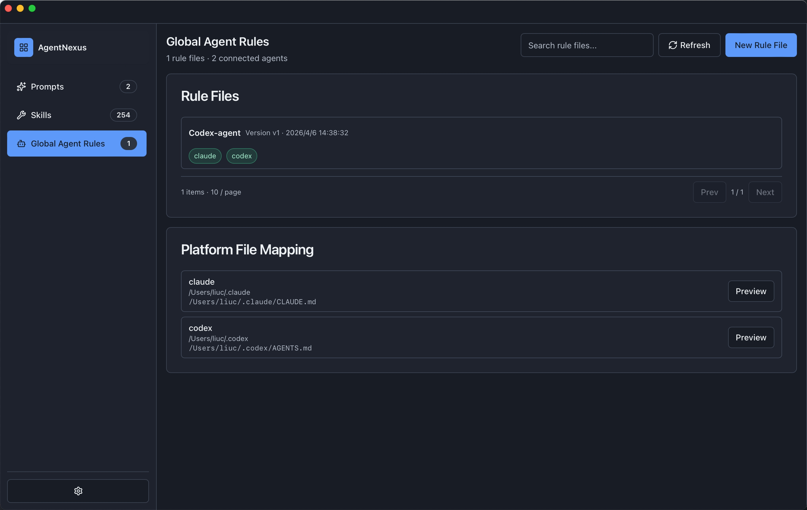
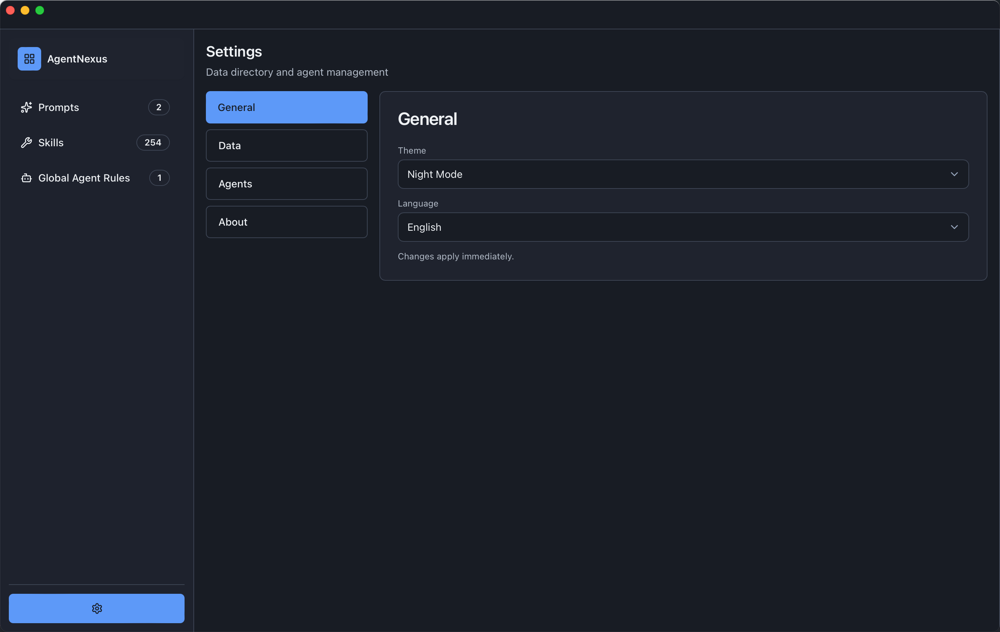
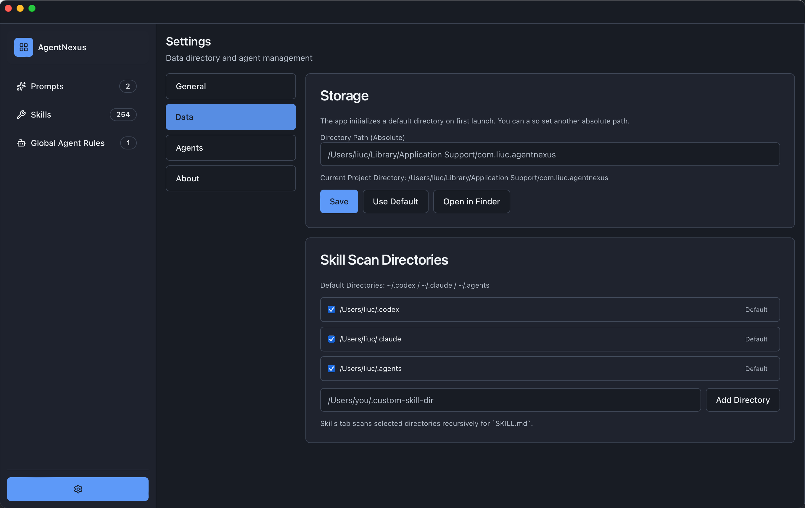
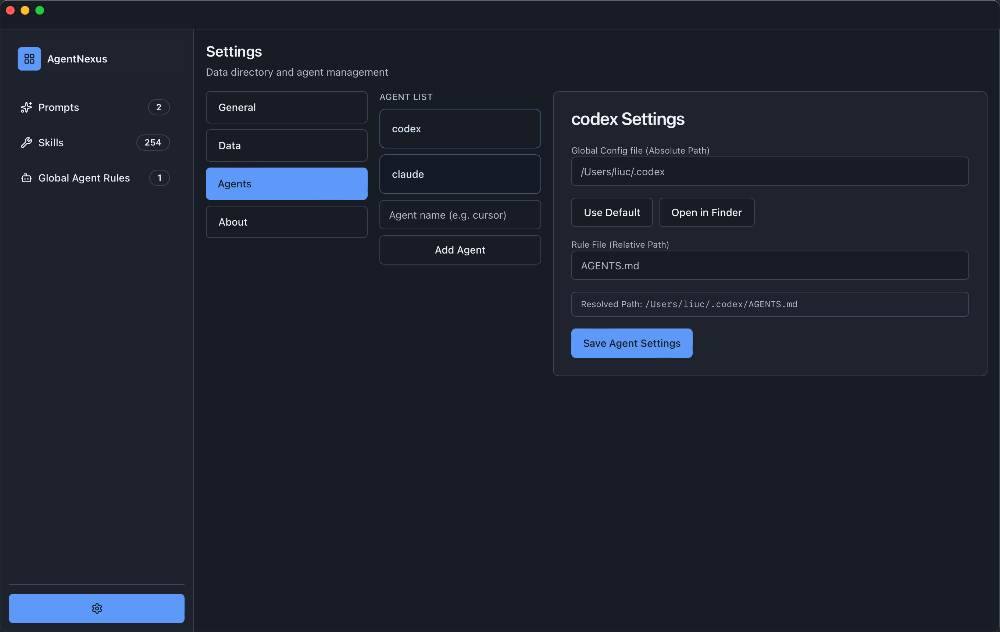
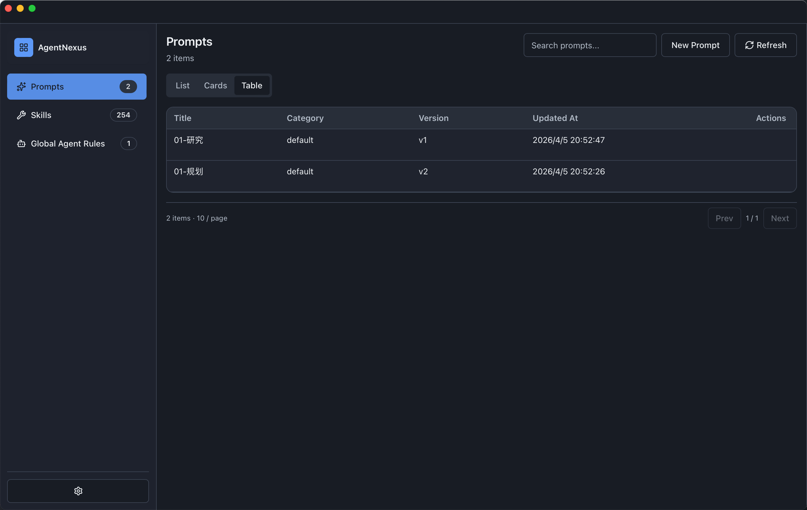
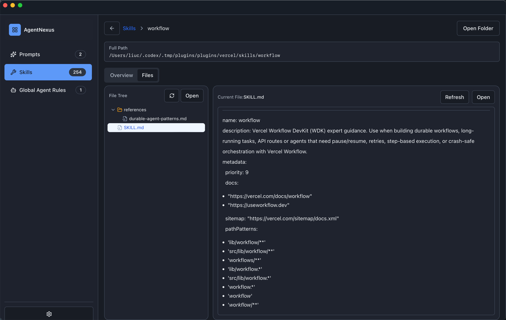

# AgentNexus

[简体中文](./README.md) · [English](./docs/README.en.md)

AgentNexus 是一个本地优先的 Agent 中控台（Control Plane）。
它的起点是解决一个实际痛点：当前 Agent 产品众多、配置分散，用户在迁移和日常管理时成本很高。

当前版本已实现 **全局 Agent 规则管理**，并在同一控制面逐步扩展 **Prompts、Skills、Spec** 能力。

---

## 核心价值

- 统一管理：把分散在不同 Agent 工具中的配置和规则拉回一个控制面
- 降低迁移成本：减少手工复制/对齐规则文件的重复劳动
- 降低运维成本：通过版本、分发状态、审计记录降低不可见风险

---

## 当前能力（V1）

### 1. 全局 Agent 规则管理

- 规则资产管理：创建、编辑、版本发布、版本回滚
- Agent 连接管理：按 Agent 类型配置根目录与规则文件路径
- 批量应用与状态追踪：支持分发任务状态查看与失败重试
- 分发模式：`copy` / `symlink`（可配置降级）
- 审计记录：关键动作（发布、应用、回滚等）可追踪

### 2. 单项目模式（默认 Workspace 隐式化）

- 启动时自动确保“默认项目”存在并激活
- UI 层不强调 Workspace 概念，按“当前项目目录”工作
- 减少用户在单项目场景下的心智负担

### 3. Settings / Storage

- 可配置当前项目目录（绝对路径）
- 支持恢复默认路径
- 支持在系统文件管理器中打开目录

### 4. Skills 能力

- 可配置 Skills 扫描目录（多目录）
- 扫描并识别 `SKILL.md`
- 展示技能详情并支持分发/卸载流程

### 5. Agent Connections

- 按 Agent 类型维护连接信息
- 配置 `root_dir` 与 `rule_file`
- 支持启停与连通性相关操作

### 6. Prompts（已接入基础能力）

- Prompt 资产管理与版本化能力
- 后续与 Agent 规则、Skills 做统一治理联动

---

## 路线图（Roadmap）

- 已完成：全局 Agent 规则管理主闭环
- 进行中：Prompts、Skills 体验完善与联动
- 下一步：引入 Spec 管理，形成 Rule / Prompt / Skill / Spec 一体化控制面

---

## 产品截图


### 1. 全局 Agent 规则页



### 2. Settings - General



### 3. Settings - Data / Storage / Skills



### 4. Agent Connections 配置



### 5. Prompts 列表与版本



### 6. Skill 详情



---

## 快速开始

### 环境要求

- Node.js（建议 LTS）
- pnpm
- Rust toolchain（Tauri 桌面端）

### 安装依赖

```bash
cd AgentNexus
pnpm install
```

### 本地开发（Web）

```bash
cd AgentNexus
pnpm dev
```

### 本地开发（Tauri 桌面端）

```bash
cd AgentNexus
pnpm tauri dev
```

### 构建

```bash
cd AgentNexus
pnpm build
```

### 测试

```bash
cd AgentNexus
pnpm test:run
```

### 类型检查

```bash
cd AgentNexus
pnpm typecheck
```

### GitHub 发布（macOS + 内置更新）

`AgentNexus` 已接入 Tauri Updater，更新源为：

- `https://github.com/lionellc/agentnexus/releases/latest/download/latest.json`

发布前需在 GitHub 仓库 Secrets 配置：

- `TAURI_SIGNING_PRIVATE_KEY_B64`
- `TAURI_SIGNING_PRIVATE_KEY_PASSWORD`

发布方式：

1. 更新 `src-tauri/tauri.conf.json` 与 `src-tauri/Cargo.toml` 版本号（如 `0.1.1`）
2. 打 tag：`v0.1.1`
3. 推送 tag：`git push origin v0.1.1`
4. GitHub Actions 执行 `.github/workflows/release.yml`，产出 DMG、updater 包和 `latest.json`

---

## 项目结构

```text
AgentNexus/
├── src/                         # React 前端控制面
│   ├── app/                     # Workbench 主入口
│   ├── features/                # agents / prompts / skills / settings
│   └── shared/                  # 类型、API、状态管理、通用组件
├── src-tauri/                   # Tauri + Rust 后端能力
│   ├── src/control_plane/       # 规则、提示词、技能、审计等命令
│   ├── src/execution_plane/     # 分发与扫描执行
│   └── src/db.rs                # SQLite 结构与迁移
└── .docs/                       # 产品与工程文档
```
