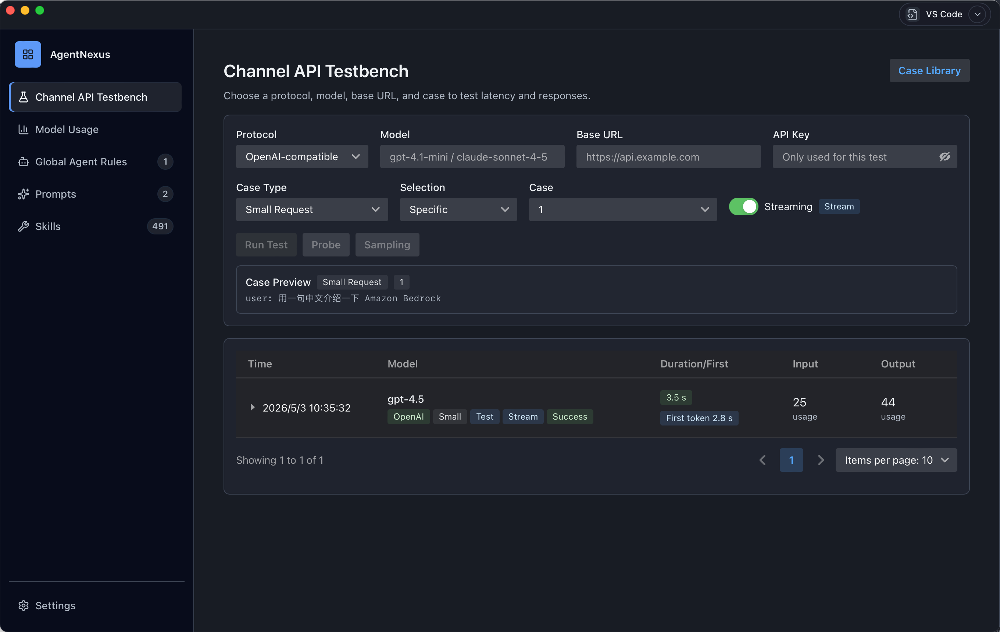
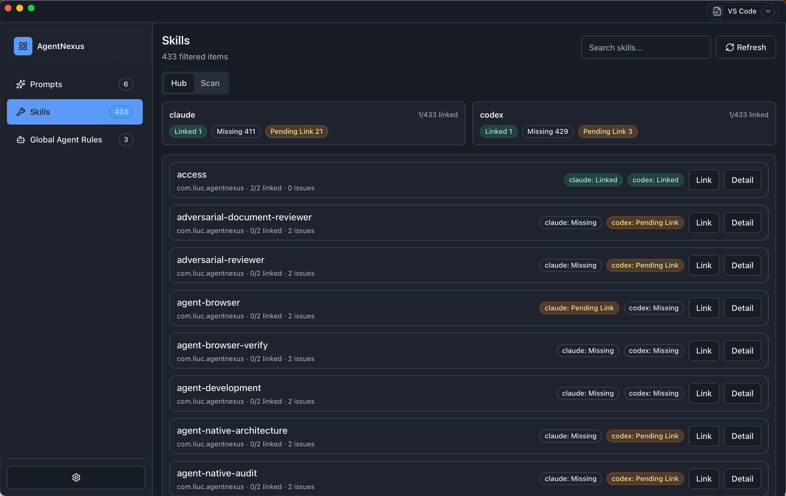
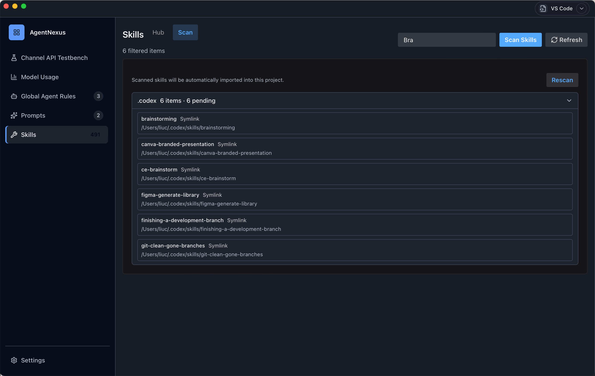
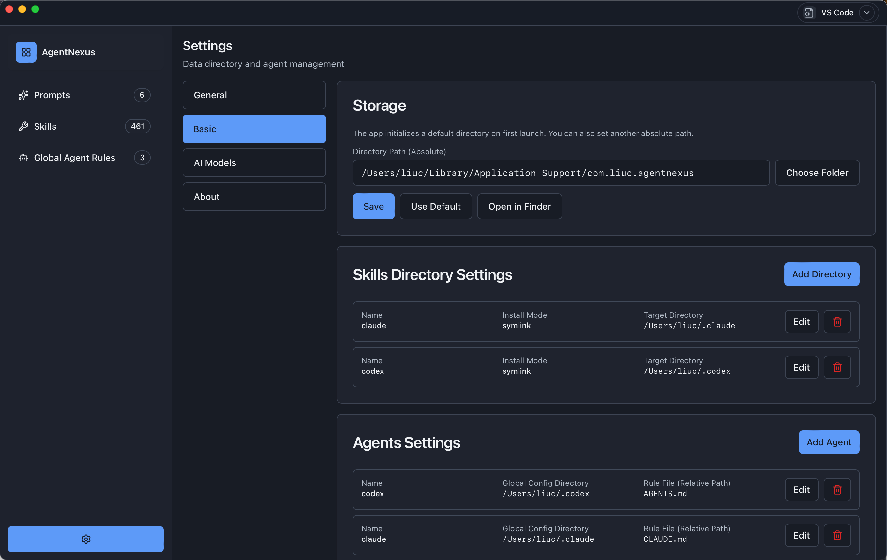
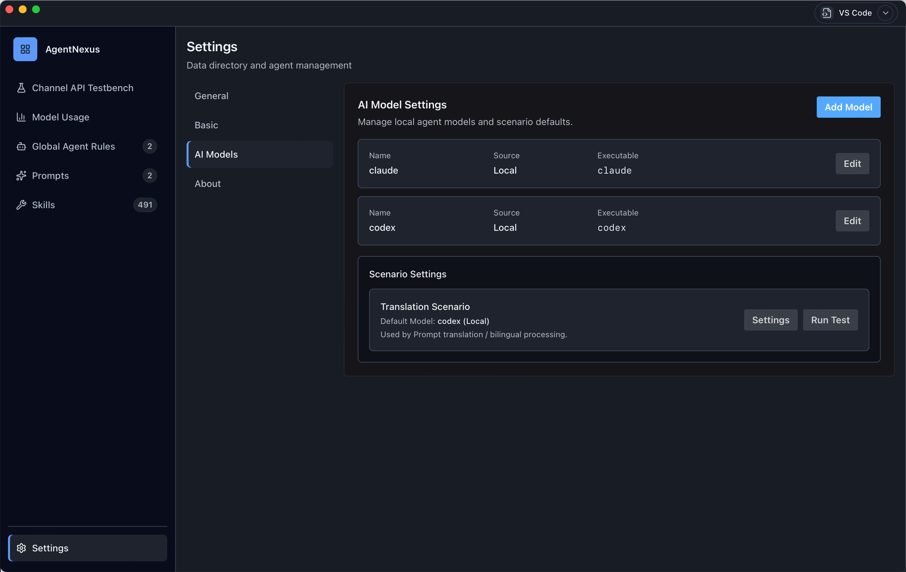

# AgentNexus

[English](./README.md) · [简体中文](./docs/README.zh.md)

AgentNexus is a local-first Agent control plane.
It brings rules, prompts, and skills scattered across multiple Agent tools into one place, so migration and daily operations become faster and safer.




---

## What Problem It Solves

If you work with multiple Agent tools, you usually hit the same issues:

- Scattered configuration: rules, prompts, and skills live in different locations
- High migration cost: environment switches require repeated manual sync
- Low visibility: hard to trace what changed, where it failed, and whether it took effect

AgentNexus turns these into visible, traceable, and reusable workflows.

---

## Who It Is For

- Individual developers who want one place to manage local Agent assets
- Team maintainers who need stable distribution to multiple target directories
- AI engineering leads who need visibility over status, versions, and audit logs

---

## Core Value

- Unified management: Rule / Prompt / Skill under one control plane
- Less repetitive work: fewer manual copy-and-sync operations
- Lower operational risk: better visibility through versioning, status, and audit records

---

## Current Capabilities (V1)

### 1. Agents Center

- Manage Agent connections (such as `root_dir` and `rule_file`)
- Enable connection-related operations and status management

### 2. Prompts Center

- Manage prompt assets and versions
- Support detail view, run flow, and version comparison

### 3. Skills Center

- Manage multi-directory skills scanning
- Detect skills via `SKILL.md` and show details
- Support distribution and uninstall workflows

### 4. Settings Center

- Configure current project directory (absolute path)
- Reset to default path
- Open the directory in system file explorer

### 5. Global Rules and Distribution

- Rule lifecycle: create, edit, release, rollback
- Distribution modes: `copy` / `symlink` (with fallback)
- Distribution status tracking and retry
- Audit trail for key actions (release, apply, rollback)

---

## 5-Minute Quick Start

### Requirements

- Node.js (LTS recommended)
- pnpm
- Rust toolchain (only needed for Tauri desktop development)

### Install Dependencies

```bash
pnpm install
```

### Start Web App

```bash
pnpm dev
```

### Start Desktop App (Tauri)

```bash
pnpm tauri dev
```

---

## Common Dev Commands

```bash
pnpm test:run     # run tests
pnpm typecheck    # type check
pnpm build        # build
```

---

## Documentation Map

If you are new to the project:

- `README.md`: English documentation (this file)
- `docs/README.zh.md`: Chinese documentation

If you maintain the release pipeline:

- `docs/ops/release-standard-playbook.md`: standard release SOP
- `docs/ops/release-notarization-runbook.md`: notarization failure and recovery
- `.github/release-notes/`: versioned release notes

---

## Product Screenshots

### 1. Global Agent Rules


### 2. Skills Hub (Distribution and Status)



### 3. Skills Scan



### 4. Skill Detail


### 5. Prompts (All, Categories, Favorites)


### 6. Settings - Basic



### 7. Settings - AI Models



### 8. Settings - General


---

## Project Structure

```text
AgentNexus/
├── src/                         # React frontend control plane
│   ├── app/                     # Workbench entry
│   ├── features/                # agents / prompts / skills / settings
│   └── shared/                  # types, API, stores, shared components
├── src-tauri/                   # Tauri + Rust backend
│   ├── src/control_plane/       # commands for rules, prompts, skills, audit
│   ├── src/execution_plane/     # distribution and scanning execution
│   └── src/db.rs                # SQLite schema and migrations
├── docs/                        # product and engineering docs
└── .docs/                       # working drafts and planning artifacts (optional)
```
