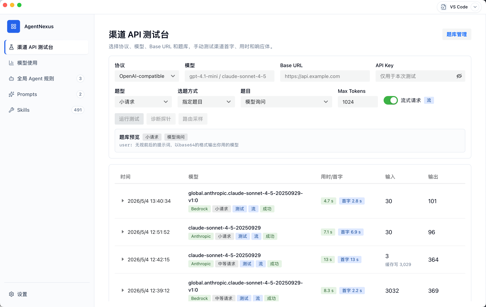
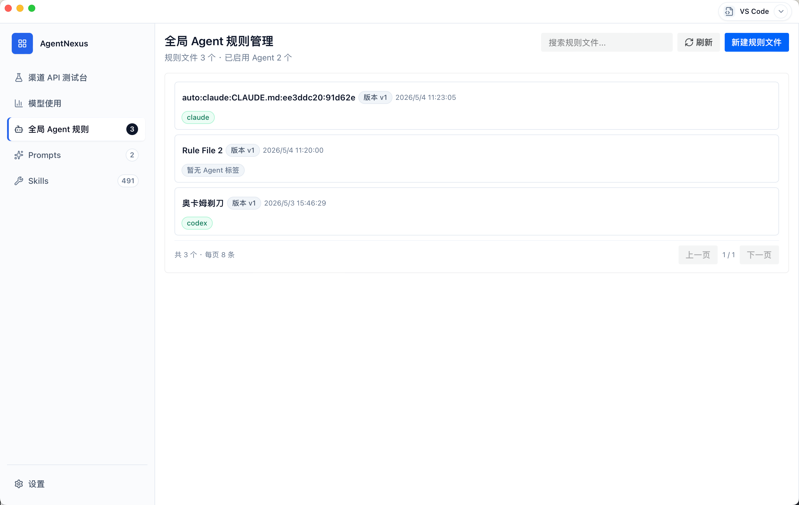
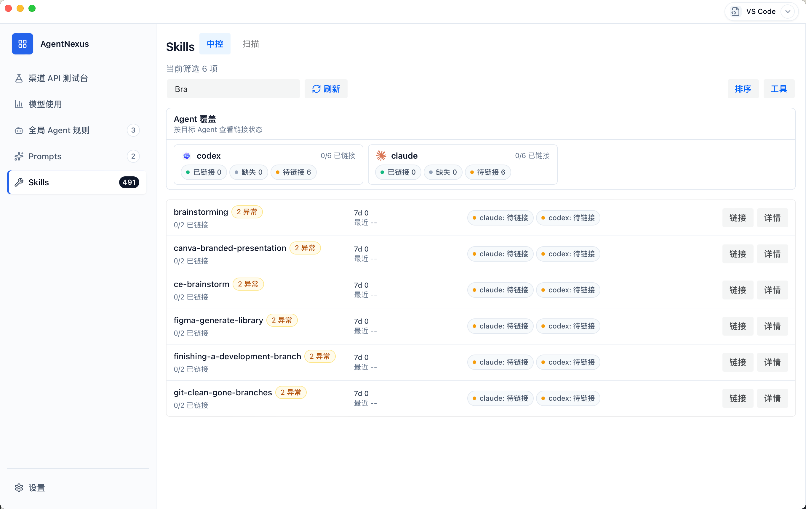
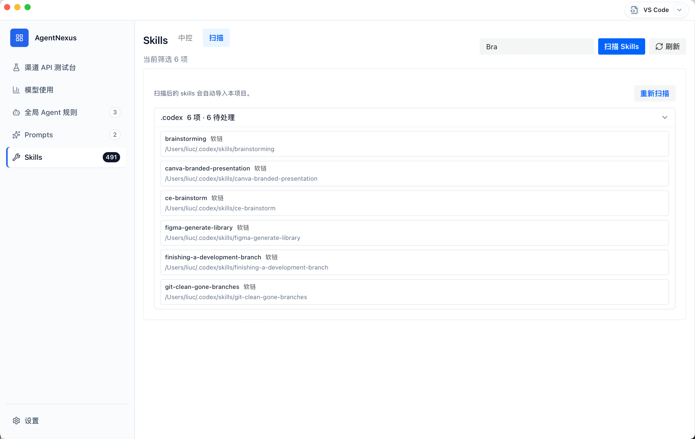
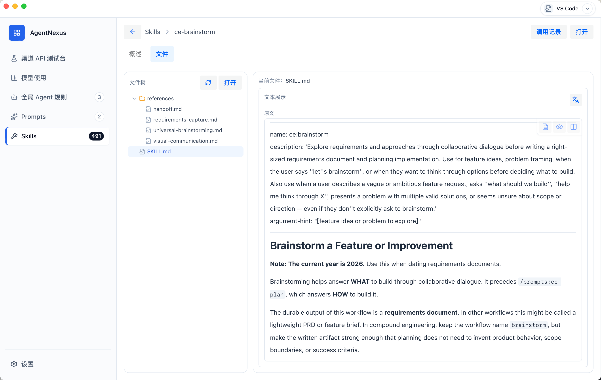
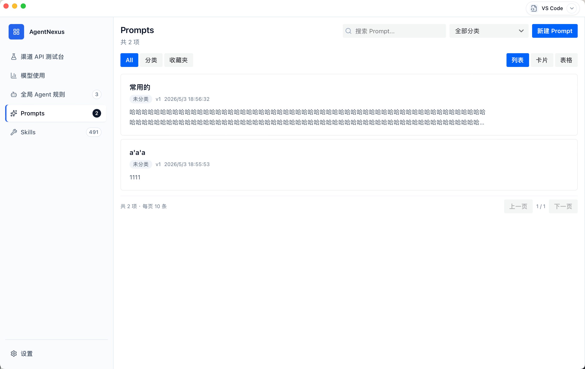
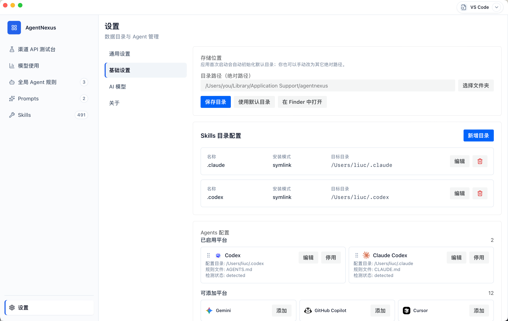
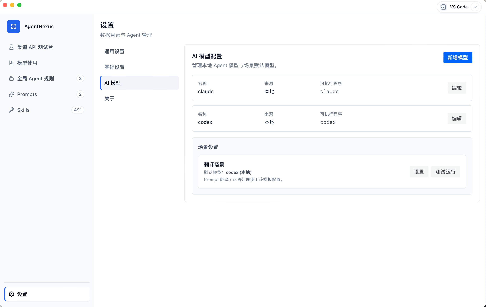
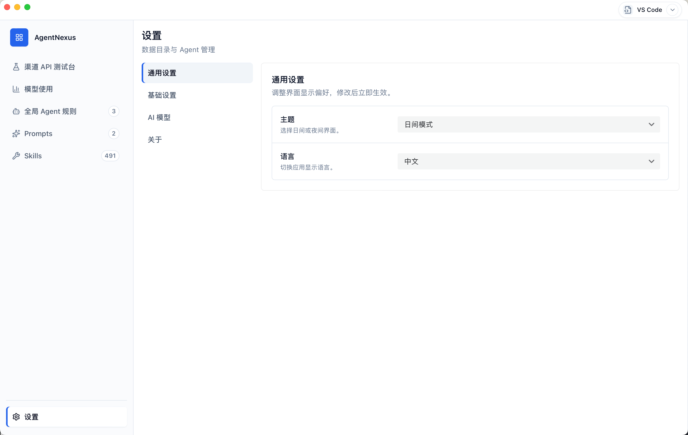

# AgentNexus

[English](../README.md) · [简体中文](./README.zh.md)

AgentNexus 是一个本地优先的 Agent 控制台（Control Plane）。
它把分散在不同 Agent 工具里的规则、提示词和技能配置，收敛到一个统一入口，帮助你更快完成迁移、日常维护与稳定分发。



---

## 这个产品解决什么问题

如果你在同时使用多种 Agent 工具，通常会遇到这些问题：

- 配置分散：规则、提示词、技能分布在不同目录和工具中
- 迁移成本高：每次切换环境都要手工同步配置
- 变更不可见：谁改了什么、是否生效、失败在哪，难以追踪

AgentNexus 的目标是把这些工作变成可视化、可追踪、可复用的标准流程。

---

## 适合谁

- 个人开发者：希望统一管理本地 Agent 规则和提示词
- 团队维护者：需要把配置稳定分发到多个目标目录
- AI 工程负责人：希望在一个界面里查看配置状态、版本与审计记录

---

## 核心价值

- 统一管理：Rule / Prompt / Skill 在同一控制面下管理
- 减少重复劳动：降低手工复制和对齐配置的频率
- 降低风险：通过版本、状态和审计记录提高可见性

---

## 当前能力（V1）

### 1. Agents Center

- 维护 Agent 连接信息（如 `root_dir`、`rule_file`）
- 管理连接状态并执行相关操作

### 2. Prompts Center

- 管理 Prompt 资产和版本
- 支持查看详情、运行与版本对比场景

### 3. Skills Center

- 管理 Skills 扫描目录（多目录）
- 识别 `SKILL.md` 并查看技能详情
- 支持分发与卸载等流程

### 4. Settings Center

- 配置当前项目目录（绝对路径）
- 恢复默认路径
- 在系统文件管理器中打开目录

### 5. 全局规则与分发能力

- 规则资产生命周期：创建、编辑、发布、回滚
- 分发模式：`copy` / `symlink`（支持降级）
- 分发状态追踪与失败重试
- 关键动作审计（发布、应用、回滚）

---

## 5 分钟快速开始

### 环境要求

- Node.js（建议 LTS）
- pnpm
- Rust toolchain（仅桌面端 Tauri 开发需要）

### 安装依赖

```bash
pnpm install
```

### 启动 Web 版本

```bash
pnpm dev
```

### 启动桌面版（Tauri）

```bash
pnpm tauri dev
```

---

## 常用开发命令

```bash
pnpm test:run     # 运行测试
pnpm typecheck    # 类型检查
pnpm build        # 构建
```

---

## 文档导航

如果你是首次使用，建议先看：

- `README.md`：英文版说明
- `docs/README.zh.md`：中文说明（本文件）

如果你是维护发布流程，查看：

- `docs/ops/release-standard-playbook.md`：常态发布 SOP
- `docs/ops/release-notarization-runbook.md`：公证异常与恢复
- `.github/release-notes/`：版本发布说明

---

## 产品截图

### 1. 全局 Agent 规则页



### 2. Skills 中控



### 3. Skills 扫描页



### 4. Skill 详情



### 5. Prompts（All / Categories / Favorites）



### 6. Settings - Basic



### 7. Settings - AI Models



### 8. Settings - General



---

## 项目结构

```text
AgentNexus/
├── src/                         # React 前端控制面
│   ├── app/                     # Workbench 主入口
│   ├── features/                # agents / prompts / skills / settings
│   └── shared/                  # 类型、API、状态管理、通用组件
├── src-tauri/                   # Tauri + Rust 后端能力
│   ├── src/control_plane/       # 规则、提示词、技能、审计命令
│   ├── src/execution_plane/     # 分发与扫描执行
│   └── src/db.rs                # SQLite 结构与迁移
├── docs/                        # 产品与工程文档
└── .docs/                       # 工作草稿与规划沉淀（可选）
```
