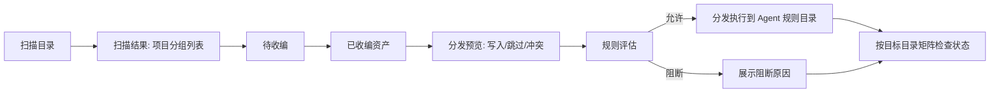

# Skills 供应链主壳需求

## Problem Frame
当前 Skills 页面把“资产浏览、规则编辑、分发治理”混在同一层，导致用户难以判断下一步动作。  
目标是把 Skills 心智统一为三阶段供应链：`扫描 -> 收编 -> 分发`，并明确“规则是准入策略，分发是执行动作”。  
同时满足使用频次现实：扫描/收编为低频可自动化，用户高频停留在分发运营与状态检查。

## Terminology & State Model
- 术语统一：`收编` 与 `纳管` 为同义词，均表示技能进入系统可治理状态（以下统一使用“收编”）。
- 主状态流：`待收编 -> 已收编 -> 待分发`，异常子态为 `待修复`（可叠加在主状态上）。
- 分发结果不使用单一“已分发”状态，改为“按目标目录逐项状态矩阵”。
- 展示分层：列表优先展示任务态（主状态流 + 待修复）；详情页再展示技术态（`source/sourceParent/isSymlink/statusByTool`）。

## Requirements

**信息架构与导航**
- R1. Skills 域采用双模式导航：`运营模式（默认）` 与 `配置模式（低频）`。
- R2. 运营模式采用混合布局：上半区为目标目录状态矩阵，下半区为 skills 列表与快捷分发操作。
- R2.0 skills 列表行右侧主操作固定为 `分发` + `详情`。
- R2.1 Skills 列表行不得平铺全部目标目录状态胶囊；默认仅展示聚合摘要（如 `已链接 2/5`），通过下拉展开查看目标目录明细状态。
- R2.2 行内下拉在目标目录较多时必须支持滚动与搜索，避免横向挤压。
- R2.3 目标目录明细采用“行内展开”交互：点击 `展开` 后在当前 skill 行下方展开状态明细，不使用右侧抽屉或弹层。
- R2.4 行内展开并发策略：同一时刻仅允许展开 1 行；展开新行时自动收起当前已展开行。
- R2.5 行内展开默认仅展示前 3 个目标目录状态，提供 `查看更多` 入口展开全部目录状态。
- R2.6 行内展开区采用双列布局：左侧目标目录状态，右侧可执行动作。
- R3. 配置模式承载扫描、收编、自动化策略、冲突规则；运营模式不展示低频配置表单。
- R4. 默认落点规则：进入 Skills 默认 `运营模式`；当存在待收编待处理项时显示显式提示与 `前往配置处理` 入口。
- R4.1 `运营 / 配置` 入口采用顶部次级 Tab，不使用齿轮入口或左侧二级导航。

**扫描与收编**
- R5. 扫描结果必须在同一列表中按项目分组展示（组头可折叠），并显示每组待收编数量；该“同一列表”仅适用于扫描/收编阶段，分发阶段使用独立视图。
- R6. 扫描结果默认进入“待收编”状态；扫描不等于收编，需用户显式触发收编。
- R7. 收编时必须保持原目录不移动；系统以原目录为唯一真源（source of truth），并建立资产映射与软链关系。
- R7.1 收编命名冲突处理：先判定是否为“同一个 skill”；若为同一个 skill，默认使用新收编覆盖现有；若不是同一个 skill，必须弹窗让用户选择处理方案（保留现有 / 覆盖现有 / 重命名新收编）。
- R7.2 “同一个 skill”判定规则：对该 skill 目录下全部文件执行逐文件 diff；diff 过程必须通过弹窗展示进度（总数、已比对数、当前文件、差异计数），并允许用户手动中断。
- R7.3 当用户中断 diff 时，不得自动覆盖；系统将该冲突标记为“待人工决策”，并直接进入冲突处理弹窗。
- R8. 扫描阶段必须覆盖关键状态：空结果、加载中、失败、部分成功、无权限目录，并提供对应动作（重试、查看失败原因、调整扫描目录）。
- R9. 当扫描结果规模较大时需要可用性保护：项目默认折叠、分页或虚拟滚动、组级懒加载，避免单页过载。

**分发与规则**
- R10. 仅允许“已收编”技能进入分发阶段；分发目标为用户配置的各 Agent 规则目录（可多选）。
- R10.1 点击 `分发` 后，目标目录默认预选“该 skill 上次成功分发过的目录”。
- R10.2 若不存在“上次成功分发目录”历史，默认不预选任何目标目录，由用户手动勾选。
- R10.3 若未选择任何目标目录，`确认分发` 按钮必须禁用，并在目标选择区域显示就地提示“请至少选择一个目录”。
- R10.4 分发执行完成后，先对当前 skill 行做局部乐观更新，再触发后台全量状态校准刷新矩阵与聚合摘要。
- R10.5 若后台校准结果与乐观更新不一致，仅在当前 skill 行显示“状态已校准”轻提示，不弹全局强提示。
- R10.6 分发弹窗采用两步结构：步骤1选择目标目录，步骤2预览并确认。
- R11. 必须显式区分规则与分发：规则只决定“是否允许”，分发只执行“如何落地”。
- R12. 分发前必须提供变更预览并确认后执行。预览最小契约包含：目标写入项、跳过项及原因、冲突项分类、可重试标识。
- R12.1 冲突分类采用细分 7 类：`规则阻断`、`名称冲突`、`目标不可写`、`源异常`、`权限不足`、`目标不存在`、`手动断链阻断`。
- R12.2 可重试判定采用严格口径：`名称冲突`、`源异常` 为可重试；`规则阻断`、`目标不可写`、`权限不足`、`目标不存在`、`手动断链阻断` 为不可重试。
- R13. 预览中的冲突项必须可操作：支持逐项决策、批量跳过、回到规则配置并保留当前上下文。
- R13.1 分发结果为部分失败时，默认主 CTA 为 `仅重试失败项`。
- R14. 规则阻断项不得进入执行，但必须在预览中可见并给出阻断原因。
- R14.1 点击 `规则阻断` 状态胶囊时，默认打开阻断原因明细，不直接跳配置页。

**可理解性与详情**
- R15. 每个技能必须提供可读链路视图：`扫描源 -> 资产库 -> Agent 规则目录`，并显示当前连通状态。
- R15.1 分发状态必须按目标目录矩阵展示（如 `CLAUDECODE / CODEX / CURSOR` 列），每列显示胶囊状态（示例：`已链接`）。
- R15.2 目标目录状态枚举统一为：`已链接(linked)`、`缺失(missing)`、`错误链接(wrong)`、`规则阻断(blocked)`、`手动断链(manual)`、`目录占位(directory)`。
- R15.3 列表层展示聚合摘要（如 `已链接 2/3` + 异常计数），详情层展示每目标目录明细与检查入口。
- R15.4 在行内展开区点击目标目录状态胶囊，默认打开该目标目录的“状态检查明细”视图。
- R15.5 “状态检查明细”默认采用精简密度：仅展示状态结论、原因、建议动作三项核心信息。
- R15.6 “状态检查明细”动作区默认采用“1 个主按钮（推荐动作）+ 更多操作”结构，不平铺全部操作按钮。
- R15.7 “状态检查明细”承载形态采用覆盖式小浮层（popover），保持当前行上下文。
- R15.8 运营模式顶部矩阵卡片点击行为为“仅过滤列表”，不自动打开目录详情。
- R16. 从项目分组列表进入详情后，返回列表时应保留分组上下文与滚动位置（同会话、同筛选条件范围内）。
- R17. 状态展示以任务语义为先（如待收编/待分发/待修复/已完成），技术状态作为二级信息；分发结果优先展示目标矩阵，不用单一“已分发”。

## Success Criteria
- 首次使用可用性：5 名新用户中至少 4 名（>=80%）可在 10 分钟内独立完成一次“扫描 -> 收编 -> 分发”闭环。
- 流程稳定性：分发预览确认后执行成功率 >=95%，并可准确区分成功/跳过/冲突。
- 分发可见性：目标矩阵状态检查准确率 >=95%，且用户可一眼识别每个配置目录是否 `已链接`。
- 高频效率：在运营模式完成“查看详情 + 发起一次分发”的中位操作步数 <=3。
- 理解成本：规则配置与分发执行混淆率低于 10%（通过任务回放或可用性测试记录）。
- 导航效率：从详情返回列表后，上下文恢复成功率 >=95%（同会话、同筛选条件）。
- 兼容性：旧有 Skills 浏览能力可继续使用，不出现功能回退。

## Scope Boundaries
- 不修改既有 `skills_*` 命令对外契约与返回结构。
- 不在本需求内引入自动漂移修复、自动回滚、时间线 Undo 等二期能力。
- 不在本需求内引入硬删除技能目录能力。
- 不改变设置页“扫描目录选择”已有入口和基本行为。
- 不新增 `skills_*` 对外字段；新增流程态通过现有字段组合与前端派生状态表达。

## Key Decisions
- 决策1：以“三阶段供应链主壳”替代当前“列表 + Manager 同层”组织方式。  
  原因：先统一心智，再承载现有能力，减少概念竞争。
- 决策2：采用“扫描先入收件箱、显式收编后纳管”的边界。  
  原因：解决“扫描即生效”的误解，降低误操作。
- 决策3：将“规则”定义为准入策略层，将“分发”定义为执行层。  
  原因：避免语义混淆，便于后续扩展策略与执行能力。
- 决策4：状态文案采用任务导向优先。  
  原因：降低用户理解成本，提升操作完成率。
- 决策5：收编冲突先做“同一 skill”判定；同 skill 直接覆盖，不同 skill 交由用户弹窗决策。  
  原因：在高频场景下减少无意义确认，同时保留冲突风险控制。
- 决策6：同一 skill 判定采用“全文件 diff”，并在比对时提供可中断的进度弹窗。  
  原因：判定结果可解释，且给用户随时止损能力。
- 决策7：分发预览冲突分类采用“细分 7 类”。  
  原因：提升冲突诊断精度，便于后续定向修复与批量策略。
- 决策8：可重试判定采用严格口径，仅 `名称冲突`、`源异常` 允许重试。  
  原因：避免把配置类或权限类问题错误地归入重试，减少无效重试噪音。
- 决策9：分发状态采用“按目标目录矩阵检查”而非单一“已分发”状态。  
  原因：用户分发目标可配置，必须按目录维度表达真实状态。
- 决策10：默认首页改为“运营模式混合布局”，skills 行内状态采用“摘要 + 下拉明细”而非平铺。  
  原因：匹配高频使用路径，兼顾多目标目录场景的信息密度与可读性。
- 决策11：目标目录状态明细采用行内展开。  
  原因：上下文连续，查看后可立即执行分发/详情，无需视线切换。
- 决策12：行内展开采用单展开策略（仅 1 行展开）。  
  原因：控制页面纵向膨胀，降低多行同时展开造成的信息噪声。
- 决策13：行内展开默认仅显示前 3 个目标目录状态，通过 `查看更多` 展开全部。  
  原因：兼顾首屏可读性与多目录场景完整信息访问。
- 决策14：分发弹窗默认预选“上次成功分发目录”。  
  原因：贴近用户高频重复分发路径，减少重复勾选操作。
- 决策15：无历史时默认不预选目录，由用户手动选择。  
  原因：避免首次分发误投递到不期望目录。
- 决策16：未选目录时禁用确认分发，并显示就地校验提示。  
  原因：把错误前移到操作前，减少无效提交和中断感。
- 决策17：分发完成采用“局部乐观更新 + 后台全量校准”。  
  原因：同时保证反馈速度与最终状态一致性。
- 决策18：校准不一致时仅做行内轻提示。  
  原因：避免打断主流程，同时保留状态变化可见性。
- 决策19：点击目标目录状态胶囊默认进入状态检查明细。  
  原因：优先支持“先看清问题再操作”的高频心智。
- 决策20：状态检查明细默认采用精简版（3 行核心信息）。  
  原因：降低阅读负担，保持高频检查与分发操作节奏。
- 决策21：状态检查明细动作区采用“主按钮 + 更多操作”。  
  原因：保证主路径清晰，同时保留次级操作入口。
- 决策22：skills 列表行主操作固定为 `分发 + 详情`。  
  原因：贴合高频任务，减少操作分叉。
- 决策23：行内展开区采用双列布局（左状态、右动作）。  
  原因：状态阅读与动作执行并排，决策成本更低。
- 决策24：状态检查明细承载为覆盖式小浮层。  
  原因：不跳上下文，信息密度高且打断小。
- 决策25：分发弹窗采用两步式（目标选择 -> 预览确认）。  
  原因：流程清晰，避免单页过载。
- 决策26：部分失败默认主 CTA 为 `仅重试失败项`。  
  原因：直接聚焦失败子集，减少重复执行成功项。
- 决策27：点击 `规则阻断` 默认打开阻断原因明细。  
  原因：先解释后引导修复，减少误跳配置页。
- 决策28：顶部矩阵卡片点击仅用于过滤列表。  
  原因：保持操作可预期，避免额外面板干扰。
- 决策29：`运营 / 配置` 采用顶部次级 Tab。  
  原因：入口清晰且与当前页面结构一致。

## Dependencies / Assumptions
- 设置页已提供可持久化的扫描目录选择能力（`selectedSkillScanDirectories`）。
- 现有后端已具备 `skills_scan`、`skills_manager_*`、`skills_distribute` 等能力基础。
- 现有数据结构可提供 `source/sourceParent/isSymlink/statusByTool` 等关键字段。
- 分发预览能力需要与执行语义一致；若现有接口不足，需在同一期补齐预览命令或等价 dry-run 能力。

## Alternatives Considered
- 方案A：仅优化现有 Skills Manager 文案，不改结构。  
  放弃原因：无法消除混层问题，用户仍需在同页切换多种心智。
- 方案B：完全复刻 Prompts 的三视角导航。  
  放弃原因：可复用但不足以表达“收编-分发”生命周期主线。

## Outstanding Questions

### Resolve Before Planning
- 无

### Deferred to Planning
- [Affects R9][Technical] 大规模数据下列表性能策略（分页/虚拟滚动/懒加载）的实现细节。
- [Affects R15][Needs research] 三段链路在列表与详情的最优信息密度与默认展开策略。

## Visual Aid

## Next Steps
-> /ce:plan for structured implementation planning
