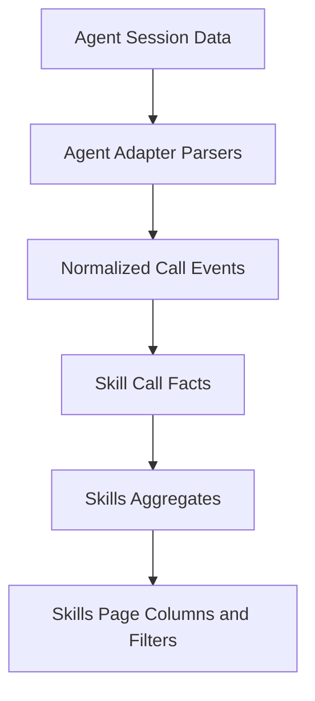

# Skills Session Usage Tracking Requirements

## Problem Frame
当前仓库中的 `usage/metrics` 机制存在两个根本问题：
1. 数据链路未接入真实业务触发，无法反映 skill 被 Agent 实际调用。
2. `last_used_at` 被分发动作更新，语义混淆为“操作过”而非“调用过”。

本次目标是把 Skills 页的“使用次数”统计收敛为可解释、可追溯、可扩展的真实调用口径：
- 以 session 解析作为主统计来源
- 按 Agent 适配解析器
- 使用独立调用事实表
- 在 Skills 页展示 `Total Calls`、`7d`、`Last Called At`
- 支持按 `agent/source` 过滤
- 彻底移除原 `usage/metrics` 功能，不保留兼容

## Requirements

**Session 解析与归一化**
- R1. 系统必须提供按 Agent 的 session 解析适配器机制，首期至少覆盖当前产品已管理的 Agent：Codex、Claude。
- R2. 系统必须以增量方式解析 session 数据，并保留每个 Agent 的解析进度（checkpoint），避免全量重复扫描。
- R3. 每次解析出的调用记录必须归一化为统一调用事件，至少包含：agent、session 标识、skill 标识、调用时间、结果状态、source。
- R4. 解析失败或低置信度记录不得阻断整体同步；系统必须保留失败计数与可排查信息。

**调用事实与统计口径**
- R5. 系统必须新增独立“skill 调用事实”存储，不与现有 `usage_events`/`ratings` 共用。
- R6. 调用事实写入必须具备幂等去重能力，重复解析同一调用不得重复计数。
- R7. 调用统计必须以调用事实为唯一来源；不得由分发、链接、卸载等运维动作推导调用次数。
- R8. `Total Calls`、`7d`、`Last Called At` 必须基于调用事实实时可计算，并可按 workspace 范围查询。

**Skills 页面体验**
- R9. Skills 页面必须新增三列：`Total Calls`、`7d`、`Last Called At`。
- R10. Skills 页面必须支持按 `agent` 和 `source` 过滤调用统计结果。
- R11. 当 skill 没有调用记录时，页面必须清晰显示零值状态（而非空白或误导性文案）。

**旧功能移除（无兼容）**
- R12. 系统必须移除原 `usage/metrics` 功能的对外能力面，包括旧命令、旧服务入口、旧类型定义与旧文案入口。
- R13. 系统必须移除旧存储对象 `usage_events` 与 `ratings`（含对应读写路径），不保留兼容读写。
- R14. 系统必须取消由分发链路更新 `skills_assets.last_used_at` 的行为，避免继续污染“调用”语义。

## Usage Signal Flow

## Success Criteria
- Skills 页面可稳定展示每个 skill 的 `Total Calls`、`7d`、`Last Called At`，并可按 `agent/source` 过滤。
- 对同一批 session 重复执行同步，不会造成统计重复增长。
- 运行分发、链接、卸载等运维动作后，调用统计不发生伪增长。
- 代码库中不再存在可执行的旧 `usage/metrics` 产品功能入口。

## Scope Boundaries
- 不引入云端遥测或远端聚合；仅处理本地可访问 session 数据。
- 不承诺首版覆盖“所有可能 Agent”；首版仅覆盖 Codex、Claude。
- 不在本阶段引入“调用质量评分”产品功能。

## Key Decisions
- `Session-first`：调用统计主来源采用 session 解析，而不是显式上报埋点。
- `Adapter-per-agent`：按 Agent 拆分解析适配器，避免单一解析器耦合多格式漂移。
- `Fact-table-separation`：调用事实独立存储，避免与旧 metrics 语义污染。
- `No-compat-removal`：旧 `usage/metrics` 完整下线，不做兼容保留。

## Dependencies / Assumptions
- 本地 Agent session 数据可被合法读取，且至少包含可识别的 skill 调用线索。
- 现有 skill 标识规则可与 session 中的调用标识建立稳定映射。

## Outstanding Questions

### Resolve Before Planning
- 无

### Deferred to Planning
- [Affects R2][Technical] 增量 checkpoint 的最小粒度（按文件、偏移、时间游标）如何选型最稳妥。
- [Affects R6][Technical] 去重键在“缺失 session 内唯一调用 ID”时的降级策略。
- [Affects R4][Needs research] 各 Agent session 格式中“skill 调用成功/失败”的可判定信号边界。

## Next Steps
-> /ce:plan for structured implementation planning
