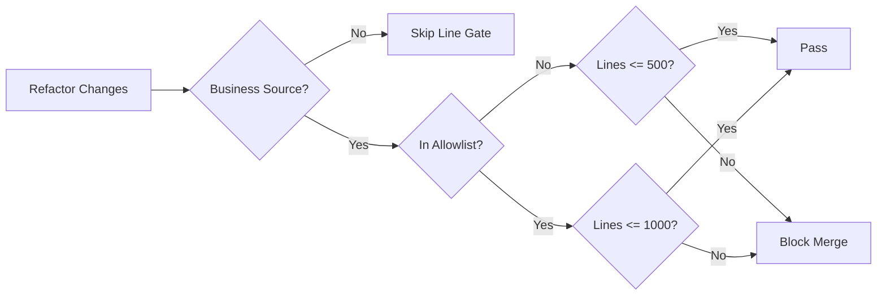

# Codebase Line Governance Requirements

## Problem Frame
项目经过连续迭代后，业务源码中出现大量超长文件，导致职责混杂、改动冲突频发、回归半径扩大、评审成本升高。当前团队已确认要执行一次性治理，并以文件行数作为长期工程约束。

当前业务源码基线（仅 `src/**` 与 `src-tauri/src/**`，不含测试）：
- `>=500` 行文件共 13 个
- `>1000` 行文件共 6 个
- 重点超长文件：`src/app/WorkbenchApp.tsx`（4481）、`src-tauri/src/control_plane/commands.rs`（3130）、`src-tauri/src/control_plane/skills_manager.rs`（2550）

## Requirements

**Scope And Threshold Policy**
- R1. 行数治理仅覆盖业务源码目录：`src/**` 与 `src-tauri/src/**`。
- R2. 长期采用双阈值治理：常规目标 `<=500` 行；复杂文件允许长期保留在 `<=1000` 行。
- R3. 复杂文件必须进入显式白名单（allowlist）管理；未进入白名单的文件不得超过 500 行。
- R4. 任意业务源码文件不得超过 1000 行（白名单与否均适用）。

**Merge Gate And Delivery Model**
- R5. 门禁必须阻断所有 `>1000` 行的业务源码变更。
- R6. 门禁必须阻断所有“非白名单且 `>500` 行”的业务源码变更。
- R7. 本次治理采用“一次性全仓达标”模式：治理完成时，所有业务源码必须满足 R2-R4。
- R8. 治理期间采用“原子切换 + 冻结窗口”：主干仅允许本次治理相关改动进入，直至切换完成。
- R9. 本次治理允许破坏式前后端契约调整，不要求向后兼容；但必须在同一切换窗口内完成前后端一致性收敛。

**Behavior Change Boundaries**
- R10. 本次治理允许小幅行为优化，包含前端交互与跨前后端的小范围契约修正。
- R11. 小幅行为优化不得演变为功能扩展；任何新增能力、产品流程改版、或信息架构重做均不在本次范围内。
- R12. 所有行为调整必须有回归验证，确保核心链路可用性不低于治理前基线。

**Decomposition And Extraction Standards**
- R13. 所有“拆分、抽取”动作必须遵循社区最佳实践，不允许以“仅搬运代码”替代结构治理。
- R14. 前端（React/TypeScript）拆分必须遵循“按领域/功能边界组织 + 组件职责单一 + 状态与副作用就近归属 + 明确公共接口”原则。
- R15. 后端（Rust/Tauri）拆分必须遵循“命令层、领域逻辑、存储访问分层 + 模块内聚、跨模块低耦合 + 公共模型与错误语义一致”原则。
- R16. 每次拆分抽取后必须保留或补齐对应验证（单元/集成/回归），并在评审中说明其与社区实践的对齐点。

## Governance Flow

## Success Criteria
- 治理完成时，`src/**` 与 `src-tauri/src/**` 所有业务源码文件满足双阈值规则，无 `>1000` 文件。
- 治理完成时，所有非白名单业务源码文件满足 `<=500` 行。
- 冻结窗口内完成一次原子切换，前后端运行链路在切换后保持可用。
- 本次治理涉及的行为优化均有对应回归验证结果，且无核心流程回退。
- 拆分抽取任务在设计与评审记录中均可追溯到社区最佳实践原则，不出现“纯搬文件但职责不清”的伪拆分。

## Scope Boundaries
- 不纳入测试文件、文档文件、锁文件、构建产物、自动生成文件。
- 不做大版本产品重构，不引入新的业务域能力。
- 不要求保留旧契约兼容层。

## Key Decisions
- `One-shot full compliance`: 采用一次性全仓达标，避免长期“边治理边欠账”。
- `Atomic switch with freeze`: 使用冻结窗口降低并行改动干扰，确保切换可控。
- `Long-term dual thresholds`: 采用 `500/1000` 双阈值，兼顾可维护性与复杂模块现实约束。
- `Breaking changes allowed`: 接受同窗口内破坏式契约收敛，降低双轨维护成本。
- `Community-practice-first decomposition`: 拆分与抽取以社区成熟实践为准绳，行数治理与结构治理同时达标。

## Dependencies / Assumptions
- 团队可执行冻结窗口，且治理期间的紧急需求可被延后或转移。
- CI/检查脚本可稳定获取文件行数并在合并前执行。
- 复杂文件白名单有明确 owner 与审批规则。

## Outstanding Questions

### Resolve Before Planning
- 无

### Deferred to Planning
- [Affects R3][Technical] 白名单准入/退出规则如何定义（复杂度指标、审批角色、复审周期）。
- [Affects R5][Technical] 门禁放在 pre-commit、CI、还是二者叠加，如何避免本地与 CI 口径不一致。
- [Affects R7][Needs research] 一次性切分顺序如何编排，才能最小化 `WorkbenchApp` 与 `control_plane` 系列文件的冲突风险。
- [Affects R12][Technical] 回归验证最小集合如何定义（前端核心路径、Tauri 命令回归、端到端冒烟）。
- [Affects R13-R16][Needs research] 结合本仓技术栈，社区最佳实践的可执行检查清单如何定义（架构边界、依赖方向、状态归属、错误语义、测试约束）。

## Next Steps
-> /ce:plan for structured implementation planning
