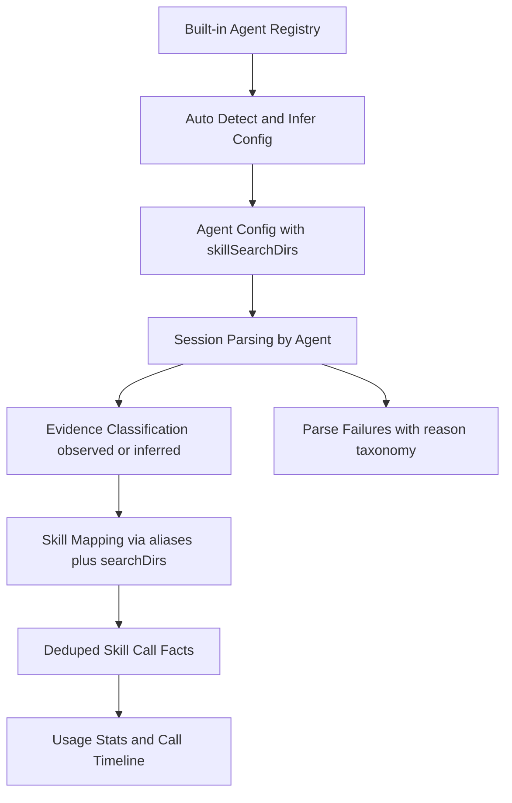

# Skills 调用记录分析优化 Requirements

## Problem Frame
当前“调用记录分析”存在三类核心问题：
1. Agent 配置仍以手工输入为主，用户需要自己命名和填路径，配置成本高且容易错。
2. 调用分析缺少“多 Skill 搜索目录”这一关键上下文，导致 token 映射不稳定。
3. “Skill 被调用”的判定规则解释性不足，出现 `skill-not-mapped` 等失败时难以定位与修复。

本次目标是把调用分析能力升级为“内置 Agent 卡片 + 自动推断配置 + 可解释的调用判定”：
- 用户不再手动命名 Agent。
- 系统内置常见 Agent，并自动推断默认配置。
- 平台 icon 复用既有视觉资产，避免重复设计与命名漂移。
- 每个 Agent 支持多个 Skill 搜索目录。
- 调用判定采用分层证据与置信度口径，结果可解释、可排障。

## Requirements

**内置 Agent 与免命名配置流**
- R1. 系统必须内置以下 14 个 Agent 预设类型：`claude`、`copilot`、`cursor`、`windsurf`、`kiro`、`gemini`、`trae`、`opencode`、`codex`、`roo`、`amp`、`openclaw`、`qoder`、`codebuddy`。
- R2. 平台 icon 必须复用 icon 映射（或同等既有映射源），保持视觉与命名一致。
- R3. Agent 配置主流程不得再要求用户手工输入 Agent 名称；用户从预设列表选择并启用/编辑。
- R4. 默认生效 Agent 必须仅包含 `codex`、`claude`、`gemini`；其余预设默认不生效，需由用户手动添加或启用。
- R5. 系统必须为每个预设 Agent 自动推断默认配置，至少包括：`rootDir`、`ruleFile`、`skillSearchDirs[]`。
- R6. 自动推断结果应允许用户手动修改，但必须保留“恢复默认/重新检测”能力。
- R7. 系统必须显式展示每个已启用 Agent 的检测状态（如已检测/未检测），并给出当前生效路径来源（推断或手工覆盖）。

**Skill 搜索目录（多目录）**
- R8. 每个 Agent 配置必须支持多个 Skill 搜索目录（`skillSearchDirs[]`），并支持新增、删除、启停。
- R9. 调用分析时，Skill 映射必须优先使用“当前 Agent 已启用的搜索目录集合”，而非仅依赖单一目录或名称猜测。
- R10. 多目录同时命中时，系统必须采用稳定的优先级规则，避免同一 token 在不同运行中映射到不同 Skill。
- R11. Agent 被启用用于分析时，至少需要一个有效的 Skill 搜索目录；否则应给出明确校验错误而非静默降级。

**Skill 调用判定算法（可解释）**
- R12. 系统必须把“Skill 被调用”定义为可追踪证据事件，而非纯文本关键词命中。
- R13. 调用证据必须区分强证据与弱证据，并输出统一来源标签（如 `observed` / `inferred`）与置信度。
- R14. 强证据至少应覆盖：显式 `use-skill` 命令、明确的 `SKILL.md` 链接/路径引用、可识别的调用输出信号。
- R15. 仅出现普通文本提及（未形成可解析调用证据）时，不得计为调用。
- R16. 解析失败必须采用标准化失败原因分类，并提供可排障信息；`skill-not-mapped` 需细化到“token 无效”“目录未命中”“别名冲突/缺失”等可操作语义。
- R17. 对异常 token（如多余括号、引号、转义残留）必须进行规范化清洗，避免把标点噪声当作 skill token。
- R18. 调用事实写入必须保持幂等去重，重复解析同一会话不得重复计数。

## Usage Analysis Flow

## Success Criteria
- 用户完成 Agent 配置时不再需要手工命名，能直接在内置卡片中启用并调整推断配置。
- 平台 icon 对齐，用户可在平台卡片中稳定识别目标 Agent。
- 首次进入时默认仅生效 `codex`、`claude`、`gemini`，其余平台可按需添加，不影响主流程。
- 每个 Agent 的调用分析可使用多个 Skill 搜索目录，且目录冲突下映射结果稳定。
- 调用记录可区分 `observed` 与 `inferred`，并携带可解释的证据与置信度。
- `skill-not-mapped` 类问题可从失败分类中快速定位根因，不再只看到不可操作的笼统报错。
- 重复执行分析任务后，统计结果不出现重复膨胀。

## Scope Boundaries
- 本阶段不引入云端遥测或远端日志聚合，仍以本地可访问会话数据为基础。
- 本阶段不要求覆盖所有未知第三方 Agent 日志格式；优先保证内置 Agent 列表的稳定性。
- 本阶段不扩展为“自动修复日志/会话文件”，仅做识别、归因与统计。

## Key Decisions
- 采用“内置 Agent 优先 + 免命名”作为默认产品交互，不再以自由文本新增作为主入口。
- 采用“14 平台预设 + 3 平台默认生效”的渐进启用策略，降低默认认知负担。
- 平台 icon 复用映射，避免维护两套视觉资产。
- 把 `skillSearchDirs[]` 升级为 Agent 配置的一等字段，作为调用映射核心输入。
- 采用“证据分层 + 置信度 + 失败分类”的调用判定口径，替代单一启发式文本匹配。
- 本轮能力以“预设能力全量可选、默认启用最小集”落地，不要求首屏同时激活全部平台。

## Dependencies / Assumptions
- 用户本机可访问各 Agent 的配置与 Skill 目录（至少可读）。
- 调用分析链路可持续读取本地会话记录并获取基础事件上下文。
- 现有 Skill 资产具备可用于映射的 identity/name/path 等别名信息。

## Outstanding Questions

### Resolve Before Planning
- 无

### Deferred to Planning
- [Affects R5][Technical] 各内置 Agent 的 `ruleFile` 默认值与推断优先级细则（按平台差异）如何定义与回退。
- [Affects R10][Technical] 多目录命中冲突的最终排序策略（目录优先级、最近使用、显式别名优先）如何权衡。
- [Affects R16][Needs research] 失败原因 taxonomy 的最小集合与 UI 展示粒度如何平衡可读性与排障效率。

## Next Steps
-> /ce:plan for structured implementation planning

## Implementation Status (2026-04-20)

- `ce:work` 已按计划 Unit 1-8 完成实施并通过关键回归。
- 交付清单与验收证据：`docs/ops/skills-usage-agent-presets-rollout-checklist.md`
- 当前边界保持不变：
  - 仅本地会话数据分析，不引入云端遥测。
  - 未覆盖日志格式统一落到 `agent-format-unsupported`，不做静默降级。
