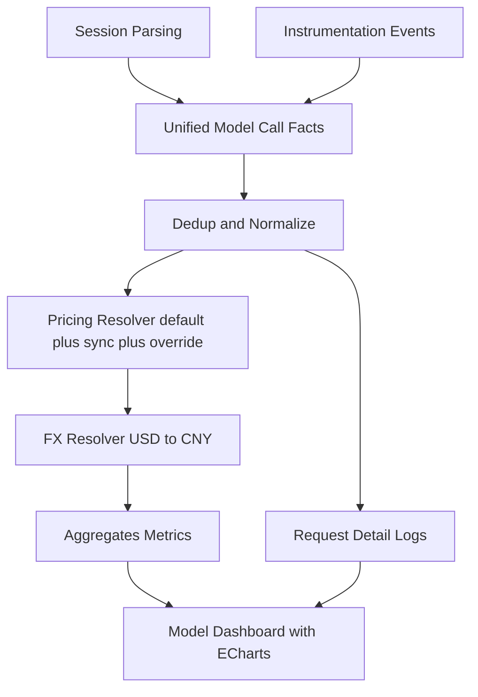

# 模型使用与成本看板 Requirements

## Problem Frame
当前 AgentNexus 已有的使用统计主要聚焦 Skill 维度，缺少“模型调用、Token 消耗、成本归集”的统一看板，导致以下问题：
1. 无法回答“哪个模型花费最高、增长最快、失败率异常”这类核心运营问题。
2. 成本口径缺少统一定价与汇率策略，跨时间与跨模型对比不可解释。
3. 只有聚合统计缺少请求级明细，定位异常成本和失败请求效率低。

本次目标是新增一个左侧导航独立模块，交付一期“模型使用与成本看板”：
- 覆盖全部 14 个预设 Agent 的模型调用数据。
- 采用“双来源融合”构建调用事实（session 解析 + 埋点事件）。
- 展示请求数、Token、成本、成功率/失败率，并提供请求明细筛选。
- 图表统一采用 Apache ECharts。
- 默认时间范围为最近 30 天。

## Requirements

**入口与范围**
- R1. 系统必须新增左侧导航独立入口（不放在 Skills 子 tab）用于模型看板。
- R2. 一期统计范围必须覆盖 14 个预设 Agent：`claude`、`copilot`、`cursor`、`windsurf`、`kiro`、`gemini`、`trae`、`opencode`、`codex`、`roo`、`amp`、`openclaw`、`qoder`、`codebuddy`。
- R3. 看板默认时间范围必须为最近 30 天，并提供常用切换（至少 7/30/90 天）。

**数据来源与融合**
- R4. 模型调用事实必须采用双来源融合：`session 解析` + `埋点事件`。
- R5. 融合后必须落统一事实口径，至少包含：`timestamp`、`agent`、`provider`、`model`、`status`、`inputTokens`、`outputTokens`、`source`。
- R6. 双来源写入必须具备幂等去重，重复采集同一请求不得重复计数或重复计费。
- R7. 任一来源临时不可用时，系统不得中断整体统计；需继续处理可用来源并暴露来源覆盖状态。

**缺失数据口径**
- R8. 缺失 `model` 或 `token` 的记录不得做成本估算（不使用推测值、均值或回填算法）。
- R9. 看板必须显式展示“数据不完整”计数，避免用户误以为已全量计费。

**定价、汇率与币种**
- R10. 系统必须内置模型默认单价表作为基础定价来源。
- R11. 系统必须支持在线价格源同步，并支持手动触发同步。
- R12. 系统必须支持手动覆盖模型单价，覆盖优先级高于在线同步和默认单价。
- R13. 在线价格同步失败时，系统必须自动回退到默认单价继续计算，并标记当前价格来源。
- R14. 价格同步策略必须包含每日自动同步 + 用户手动同步。
- R15. 成本展示必须同时支持 USD 与 CNY 两种币种。
- R16. 汇率获取失败时必须使用上次成功汇率快照，并显式标记“汇率过期”状态。

**指标与图表展示**
- R17. 看板一期必须展示以下核心指标：请求数、总 Token、总成本、成功率、失败率。
- R18. 图表库必须使用 Apache ECharts，不得使用 Recharts。
- R19. 看板图表必须至少覆盖：成本趋势、Token 趋势、模型成本分布、状态分布。
- R20. 图表与指标必须支持按时间范围联动刷新，并按筛选条件保持一致口径。

**请求明细**
- R21. 一期必须提供请求明细日志表。
- R22. 明细表必须支持按 `agent`、`model`、`status` 筛选，并支持时间范围筛选。
- R23. 明细表每条记录至少展示：时间、Agent、模型、状态、Input/Output Tokens、成本、数据来源。

## Usage and Cost Data Flow

## Success Criteria
- 用户可在独立入口查看最近 30 天模型请求数、Token、成本、成功率/失败率。
- 成本可在 USD/CNY 双币种下稳定展示，汇率异常时有清晰“过期”提示。
- 同一批数据重复同步后，统计结果不出现重复膨胀。
- 对缺失 `model/token` 的数据不做估算，并在界面中可见不完整计数。
- 请求明细可按 `agent/model/status` 快速筛选并回溯异常请求。

## Scope Boundaries
- 本阶段仅做本地数据源融合与看板展示，不引入云端集中遥测平台。
- 本阶段不做“缺失 token/model 的智能补算”。
- 本阶段不包含预算告警、阈值通知、自动优化建议等运营自动化能力。

## Key Decisions
- 入口形态采用左侧导航独立模块。
- 统计范围采用 14 预设 Agent 全量覆盖。
- 数据口径采用双来源融合，而不是单来源主从。
- 缺失关键字段不估算，只统计真实可计费数据。
- 定价策略采用“默认单价 + 在线同步 + 手动覆盖”三层模型。
- 同步失败回退默认单价，汇率失败回退最近快照并标记过期。
- 图表库锁定 Apache ECharts，默认时间范围锁定最近 30 天。

## Dependencies / Assumptions
- 现有 session 解析链路与埋点链路可产出可关联的请求级信号。
- 模型定价在线来源可被周期性拉取，且至少覆盖主流模型。
- 应用当前数据存储可承载请求级事实与聚合查询性能需求。

## Outstanding Questions

### Resolve Before Planning
- 无

### Deferred to Planning
- [Affects R6][Technical] 双来源去重键的最终组合与冲突处理规则（同秒多请求、重试请求）如何定义。
- [Affects R10-R14][Technical] 在线价格源的字段映射、版本化与生效时间策略如何落地。
- [Affects R21-R23][Technical] 明细日志保留周期与分页性能策略如何平衡存储成本与排障效率。

## Next Steps
-> /ce:plan for structured implementation planning
