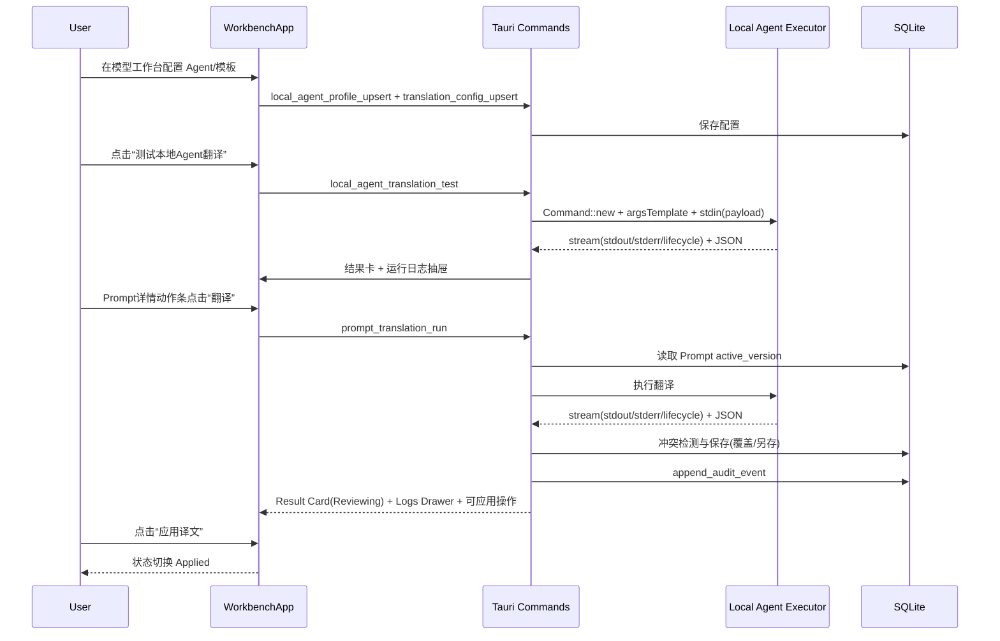
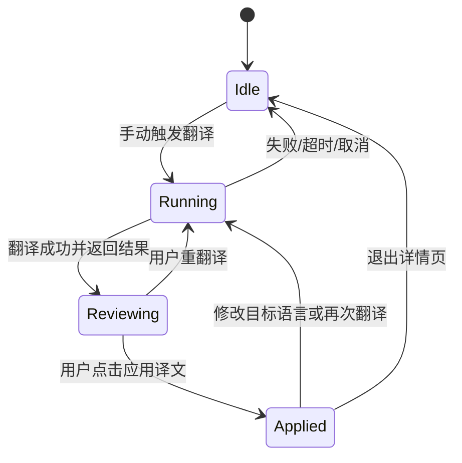
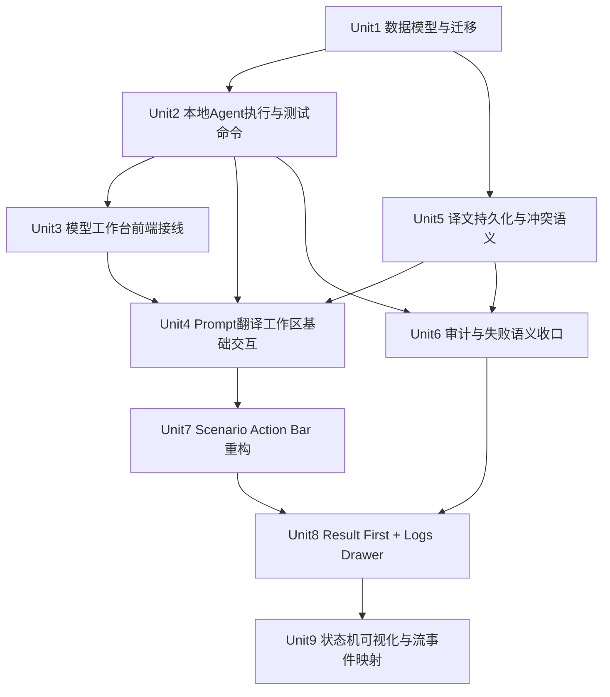

# feat: Local Agent Translation Workbench

## Overview

本计划分两段推进：
- Phase A（已完成）：桌面端“AI 模型工作台（本地 Agent 来源）+ Prompt 翻译闭环”落地，支持内置/自定义本地 Agent、翻译测试、译文资产化保存。
- Phase B（本次深化）：围绕 Prompt 翻译体验做交互重构，按 `Scenario Action Bar + Result First + 显式状态机` 收敛主路径，降低操作噪音并提升可理解性（see origin: docs/brainstorms/2026-04-11-local-agent-translation-workbench-requirements.md）。

| 模式 | 触发方式 | 对原文影响 | 产物 |
|---|---|---|---|
| 覆盖翻译 | 手动点击翻译后选择“覆盖” | 更新当前编辑内容 | 更新同语种译文记录 |
| 沉浸式翻译 | 手动点击翻译后选择“沉浸式” | 不直接改原文，行内双语展示 | 保存译文，可后续应用 |
| 重翻译 | 在已有译文上点击重翻译 | 由冲突弹窗决定覆盖/另存 | 新版或新分支译文 |

## Problem Frame

当前 AgentNexus 具备 Prompt 资产与版本能力，但缺少“可执行翻译”与“翻译结果治理”。本计划在不引入云 API Key 依赖的前提下，把本地 Agent 作为模型来源接入，形成“配置 -> 测试 -> 翻译 -> 保存/查看/重翻译 -> 审计”完整链路（see origin: docs/brainstorms/2026-04-11-local-agent-translation-workbench-requirements.md）。

## Requirements Trace

- R1-R4：设置中新增 AI 模型工作台；本地 Agent 来源支持内置 `codex/claude` + 自定义模板；翻译 Prompt 模板采用全局单模板。
- R5-R9：Prompt 编辑区手动触发翻译；先只支持翻译场景；目标语言使用预置下拉并可回显历史语言；支持覆盖/沉浸式；交互采用主路径工作区而非右侧侧栏。
- R10-R12：译文按 `Prompt版本+目标语言` 持久化；同键冲突时覆盖/另存二选一；支持查看既有译文与重翻译。
- R13-R15：本地 Agent 采用严格执行模式；输出严格 JSON；不可用时直接失败并给修复提示，不自动回退云模型。
- R16-R17：模型工作台提供翻译测试；V1 仅桌面端。
- R18：记录最小审计字段（时间、Prompt版本、语言、Agent、结果状态）。
- R19-R24：翻译主操作顺序固定；反馈采用“结果优先/日志次级”；流程阶段状态可见；运行输出抽屉支持流式与滚动；Prompt 主编辑区聚焦当前译文与当前动作；Settings 与 Prompts 页统一视觉语义。

## Scope Boundaries

- 不做本地 Model，仅做本地 Agent（see origin）。
- 不做自动翻译触发，仅保留手动触发（see origin）。
- 不做云模型自动兜底（see origin）。
- 不做 Web 端适配，限定 Tauri 桌面端（see origin）。
- 不把“总结”等场景纳入 V1（see origin）。

### Deferred to Separate Tasks

- 多场景 Prompt 模板覆盖（按场景/按 Prompt 覆写）延期到 V2。
- 审计归档与清理策略（TTL、冷存储）延期到运维治理专题。

## Context & Research

### Relevant Code and Patterns

- 设置分类 `model` 已启用，且与翻译测试弹窗联动：`src/app/WorkbenchApp.tsx`、`src/features/settings/components/ModelWorkbenchPanel.tsx`。
- Prompt 编辑与版本链路已完整：`prompt_*` 命令、`prompts_assets/prompts_versions`、前端详情/历史弹窗：`src-tauri/src/control_plane/commands.rs`、`src-tauri/src/db.rs`、`src/app/WorkbenchApp.tsx`。
- Tauri 命令注册与前端命令映射集中在 `src-tauri/src/lib.rs`、`src/shared/services/tauriClient.ts`。
- 审计复用 `audit_events` + `append_audit_event` + `audit_query`：`src-tauri/src/control_plane/commands.rs`。
- 迁移模式为 `migration_meta + run_*_once` 幂等补丁：`src-tauri/src/db.rs`。
- 本地进程调用已有 `Command::new` 非 shell 模式范式：`src-tauri/src/control_plane/commands.rs` (`skills_open`)。
- 公共文本展示组件已抽出，可复用于 Settings 与 Prompts：`src/features/common/components/TranslatableTextViewer.tsx`。

### Institutional Learnings

- 当前仓库无 `docs/solutions/` 可复用条目；本计划以 origin requirements 与现有代码模式为主。

### External References

- 本次不引入外部最佳实践研究。原因：仓内已具备命令注册、DB 迁移、Prompt 版本、审计四类直接模式，能够支撑 V1 方案。

## Key Technical Decisions

- 本地 Agent 工作台作为设置子类 `model` 独立实现，不复用 `agents`（后者继续服务全局规则文件分发）。
- 新增翻译专属数据模型，不污染现有 `prompts_assets/prompts_versions` 主模型。
- 本地 Agent 执行统一走“可执行程序 + 参数数组模板 + stdin 负载”，禁用整行 shell。
- 定义严格 JSON 输出协议与错误码分层；协议不合格即失败，不做容错猜测。
- 本地执行安全策略命中即拒绝执行并返回固定错误码，不进入“尽力执行”分支。
- 冲突策略固定为“同 `Prompt版本+目标语言` 命中时弹窗二选一（覆盖/另存）”，不做静默覆盖。
- 最小审计复用 `audit_events`，通过新 eventType 分类，不新增第二套审计存储。
- Prompt 详情页采用 `Scenario Action Bar` 主路径组织操作，避免并行分叉交互。
- 反馈层级固定为 `Result Card -> Runtime Logs Drawer`，业务结果优先于技术日志。
- 前端状态机采用 `Idle -> Running -> Reviewing -> Applied`，并与后端流式事件对齐。

## Open Questions

### Resolved During Planning

- 内置 `codex/claude` 预设模板占位符协议：
  - 占位符集合：`{{system_prompt}}`、`{{target_language}}`、`{{source_text}}`、`{{output_schema_json}}`。
  - 参数模板以“数组项”替换占位符，不允许拼接成 shell 字符串。
- 严格 JSON 协议与错误分层：
  - 成功协议最小字段：`translatedText`、`targetLanguage`。
  - 错误分层：`AGENT_UNAVAILABLE` / `AGENT_AUTH_REQUIRED` / `AGENT_EXEC_FAILED` / `AGENT_EXEC_FORBIDDEN` / `AGENT_TIMEOUT` / `AGENT_PROTOCOL_INVALID` / `TRANSLATION_CONFLICT`。
- 审计落库与查询：
  - 落库复用 `audit_events`；查询复用 `audit_query` 并按 eventType 过滤。
  - V1 保留策略：默认长期保留，不做 TTL 清理。
- “另存新译文”命名与排序：
  - 命名：`<语言名> · 译文 #N`（同键递增）。
  - 排序：`updated_at DESC`，默认选中最新记录。
- R21/R22 阶段状态与流式事件映射：
  - 状态映射：`Running` 由翻译请求发起直到请求结束；结束后按结果进入 `Reviewing`（成功）或保持 `Idle`（失败）；用户显式应用译文后进入 `Applied`。
  - 事件映射：`lifecycle` 用于阶段提示与耗时；`stdout/stderr` 仅进入日志抽屉，不直接污染结果卡主文案。
  - 超时与中断语义：超时归类 `AGENT_TIMEOUT` 并回到 `Idle`；用户主动关闭抽屉不应中断后台运行。

### Deferred to Implementation

- 内置 `codex/claude` 不同版本 CLI 的细节 flags 兼容矩阵（在实现中以适配器单测收敛）。
- 沉浸式“行内双语”最终渲染细节（按现有 Markdown 渲染器能力确定最小可行格式）。
- 历史译文二级入口的最终形态（下拉、弹层或独立对话框）在实现中按可用性测试收敛。

## Output Structure

```text
docs/plans/
  2026-04-11-001-feat-local-agent-translation-workbench-plan.md
src-tauri/src/control_plane/
  local_agent_translation.rs
src/features/prompts/components/
  (deprecated) PromptTranslationPanel.tsx
src/features/settings/components/
  ModelWorkbenchPanel.tsx
src/features/common/components/
  TranslatableTextViewer.tsx
src/shared/types/
  translation.ts
```

## High-Level Technical Design

> *This illustrates the intended approach and is directional guidance for review, not implementation specification. The implementing agent should treat it as context, not code to reproduce.*





## Implementation Units



- [x] **Unit 1: 译文与模型配置数据模型、迁移基线**

**Goal:** 新增本地 Agent 翻译所需表结构与幂等迁移，保持现有 Prompt 表不回归。

**Requirements:** R1-R4, R10-R12, R18

**Dependencies:** None

**Files:**
- Modify: `src-tauri/src/db.rs`
- Modify: `src-tauri/src/domain/models.rs`
- Test: `src-tauri/src/db.rs`

**Approach:**
- 新增并迁移以下结构（workspace 级）：
  - `local_agent_profiles`：模型来源（内置/自定义）与命令模板。
  - `translation_configs`：全局翻译 Prompt 模板与默认参数。
  - `prompt_translations`：译文资产（`prompt_id + prompt_version + target_language + variant_no`）。
- 迁移函数遵循 `migration_meta + run_*_once` 幂等模式，兼容已有用户 DB。
- 对 `prompt_translations` 增加组合索引，保障按 Prompt 版本和语言快速检索。

**Patterns to follow:**
- `src-tauri/src/db.rs` 中 `run_agent_connection_rule_file_migration_once`
- `src-tauri/src/db.rs` 中 `prompts_assets/prompts_versions` 版本化模式

**Test scenarios:**
- Happy path: 全新数据库启动后自动创建三张新表与索引。
- Edge case: 老数据库重复启动时迁移仅执行一次，不重复 `ALTER/INSERT`。
- Integration: 迁移后 `prompt_list/prompt_update/prompt_versions` 结果与现状一致。

**Verification:**
- 新老数据库均可完成启动；`migration_meta` 有新迁移标记；现有 Prompt 功能回归通过。

- [x] **Unit 2: 本地 Agent 执行器、安全约束与“翻译测试”命令**

**Goal:** 提供安全可控的本地 Agent 翻译执行能力与工作台测试入口。

**Requirements:** R2-R4, R13-R17

**Dependencies:** Unit 1

**Files:**
- Create: `src-tauri/src/control_plane/local_agent_translation.rs`
- Modify: `src-tauri/src/control_plane/mod.rs`
- Modify: `src-tauri/src/lib.rs`
- Modify: `src-tauri/src/domain/models.rs`
- Modify: `src-tauri/src/security.rs`
- Modify: `src-tauri/src/error.rs`
- Test: `src-tauri/src/control_plane/local_agent_translation.rs`

**Approach:**
- 新增命令：
  - `local_agent_profile_list/upsert/delete`
  - `translation_config_get/update`
  - `local_agent_translation_test`
- 执行器规则：
  - 强制 `Command::new` + args 数组，不接受 shell 字符串。
  - 自定义模板仅允许定义占位符数组，不允许重定向与管道语法。
  - 统一安全执行策略（测试命令与正式翻译命令共用）：固定临时 `cwd`、最小环境变量白名单、禁止继承敏感 env、拒绝文件/网络导向参数模式（如 `--output/-o`、路径型占位符）。
  - 执行超时、stdout 长度上限、stderr 截断回传。
  - 仅接受严格 JSON；解析失败映射 `AGENT_PROTOCOL_INVALID`。
  - 安全策略命中直接返回 `AGENT_EXEC_FORBIDDEN`，且不启动子进程。
- 内置 `codex/claude` 作为预设模板，允许用户在 UI 编辑后覆盖。

**Execution note:** 先写协议解析与错误映射失败用例，再实现执行器。

**Patterns to follow:**
- `src-tauri/src/control_plane/commands.rs` 的 `skills_open`（非 shell 进程调用）
- `src-tauri/src/control_plane/agent_rules_v2.rs` 的输入校验与 normalize 模式

**Test scenarios:**
- Happy path: 内置 profile + 合法 JSON 输出，测试命令返回成功结果。
- Edge case: 自定义模板缺少必需占位符时保存失败。
- Error path: 可执行不存在/未授权/超时/退出码非 0 分别映射到稳定错误码。
- Error path: 模板命中禁用模式（重定向/管道/文件输出参数）时返回 `AGENT_EXEC_FORBIDDEN` 且不启动子进程。
- Error path: stdout 非 JSON 或缺 `translatedText` 字段返回协议错误。
- Integration: UI 调用测试命令时可得到“错误码+可操作提示”结构。

**Verification:**
- 工作台可保存 profile/config 并执行测试；失败场景均有可区分错误码与提示；安全拒绝场景可验证“无子进程执行副作用”。

- [x] **Unit 3: 设置页 AI 模型工作台前端接线**

**Goal:** 在设置中落地 `model` 分类，支持本地 Agent 选择、模板编辑、测试执行。

**Requirements:** R1-R4, R16, R17

**Dependencies:** Unit 2

**Files:**
- Create: `src/features/settings/components/ModelWorkbenchPanel.tsx`
- Modify: `src/app/WorkbenchApp.tsx`
- Modify: `src/features/shell/types.ts`
- Modify: `src/shared/services/tauriClient.ts`
- Modify: `src/shared/services/api.ts`
- Create: `src/shared/types/translation.ts`
- Modify: `src/shared/types/index.ts`
- Test: `src/app/WorkbenchApp.model-workbench.test.tsx`
- Test: `src/shared/services/tauriClient.test.ts`

**Approach:**
- 启用 `settingCategoryKeys` 中的 `model`，新增模型工作台面板。
- UI 提供：
  - 模型来源选择（本地 Agent）。
  - 内置 `codex/claude` 与自定义 profile 管理。
  - 全局翻译 Prompt 模板编辑。
  - 测试输入区（源文本/目标语言）与执行结果展示。
- 前端 API 映射新增 translation 相关命令与类型定义。

**Patterns to follow:**
- `src/app/WorkbenchApp.tsx` 现有 `settingsCategory === "agents"` 分支
- `src/shared/services/api.ts` 既有 command wrapper 风格

**Test scenarios:**
- Happy path: `model` 分类可见，保存 profile 后刷新仍回显。
- Edge case: 自定义 profile 输入非法时按钮禁用并提示。
- Error path: 测试命令失败时展示可操作修复文案，不触发云模型回退。
- Integration: 设置页保存后，Prompt 翻译入口读取到同一配置。

**Verification:**
- 从设置页可完成“配置-测试-持久化回显”闭环。

- [x] **Unit 4: Prompt 编辑区翻译入口与统一工作区（基础版）**

**Goal:** 在 Prompt 详情页提供手动翻译、译文查看、重翻译与应用（覆盖/沉浸式）能力，并与设置页复用公共文本展示交互。

**Requirements:** R5-R9, R11, R12

**Dependencies:** Unit 2, Unit 3, Unit 5

**Files:**
- Modify: `src/app/WorkbenchApp.tsx`
- Create: `src/features/common/components/TranslatableTextViewer.tsx`
- Test: `src/app/WorkbenchApp.prompts.test.tsx`

**Approach:**
- 在 Prompt 详情增加“翻译”触发按钮（手动触发，不自动翻译）。
- 使用统一工作区替代右侧侧栏：
  - 目标语言：预置下拉，可回显当前语言。
  - 文本展示：原文/Markdown/分栏三种模式。
  - 操作：翻译、查看运行输出、原文/译文切换。
- 沉浸式翻译以行内双语形式渲染，不强制改写原文内容。

**Execution note:** 先补 UI 行为测试（触发、运行输出、模式切换）再接事件处理。

**Patterns to follow:**
- `src/app/WorkbenchApp.tsx` 现有 `promptDetail`、`versionModal` 交互组织方式
- `src/features/common/components/MarkdownEditor.tsx` 作为双语展示容器基底

**Test scenarios:**
- Happy path: 手动点击翻译后在统一工作区展示译文并可切换原文/译文。
- Edge case: 目标语言为空或非法时阻断触发并提示。
- Error path: 翻译失败时展示失败结果且可打开运行输出。
- Integration: 设置页与 Prompt 页共用组件交互语义，行为一致。

**Verification:**
- 用户在 Prompt 页面完成“触发翻译 -> 查看译文/输出 -> 应用结果”闭环。

- [x] **Unit 5: 译文资产持久化、冲突分支与版本隔离语义**

**Goal:** 实现 `Prompt版本+目标语言` 维度的译文保存、查询与冲突处理。

**Requirements:** R10-R12, R13-R15

**Dependencies:** Unit 1, Unit 2

**Files:**
- Modify: `src-tauri/src/control_plane/local_agent_translation.rs`
- Modify: `src-tauri/src/lib.rs`
- Modify: `src/shared/services/tauriClient.ts`
- Modify: `src/shared/services/api.ts`
- Modify: `src/shared/stores/promptsStore.ts`
- Test: `src-tauri/src/control_plane/local_agent_translation.rs`
- Test: `src/shared/stores/promptsStore.translation.test.ts`

**Approach:**
- 新增命令：
  - `prompt_translation_list`
  - `prompt_translation_run`（含策略参数：`overwrite | save_as`）
  - `prompt_translation_retranslate`
- 冲突语义：
  - 若命中同 `prompt_id + prompt_version + target_language` 且策略未指定，返回 `TRANSLATION_CONFLICT`。
  - UI 弹窗选择后带策略重试。
- 另存策略：自动分配 `variant_no` 并生成 `语言 · 译文 #N` 名称。
- 版本隔离：只读写当前 Prompt 版本，禁止跨版本覆盖。

**Execution note:** 先覆盖冲突分支测试，再接入 UI 交互。

**Patterns to follow:**
- `src-tauri/src/control_plane/commands.rs` 的 `prompt_restore_version`（版本推进方式）
- `src-tauri/src/control_plane/commands.rs` 的 `prompt_list/prompt_versions` 数据组织

**Test scenarios:**
- Happy path: 首次翻译保存成功并可按 `prompt_version+language` 查询。
- Edge case: 同语言多译文时按 `updated_at DESC` 排序，默认选中最新。
- Error path: Prompt 不存在/版本不匹配返回稳定错误码。
- Error path: `prompt_translation_run/retranslate` 命中执行安全策略时返回 `AGENT_EXEC_FORBIDDEN`，并与测试命令路径错误语义一致。
- Integration: 旧 Prompt 版本译文与新版本译文互不覆盖。
- Integration: 冲突弹窗分别选择“覆盖/另存”后数据形态符合预期。

**Verification:**
- 同一 Prompt 的不同版本同语种译文可独立查看；冲突分支行为稳定可复测；翻译正式路径不绕过执行安全策略。

- [x] **Unit 6: 最小审计闭环与失败语义统一**

**Goal:** 将模型测试、翻译执行、覆盖/另存、失败结果统一纳入审计并形成稳定用户提示。

**Requirements:** R15, R18

**Dependencies:** Unit 2, Unit 5

**Files:**
- Modify: `src-tauri/src/control_plane/local_agent_translation.rs`
- Modify: `src-tauri/src/control_plane/commands.rs`
- Modify: `src/shared/services/api.ts`
- Modify: `src/app/WorkbenchApp.tsx`
- Test: `src-tauri/src/control_plane/local_agent_translation.rs`
- Test: `src/app/WorkbenchApp.prompts.translation.test.tsx`

**Approach:**
- 统一 eventType：
  - `local_agent_translation_test`
  - `prompt_translation_run`
  - `prompt_translation_conflict_overwrite`
  - `prompt_translation_conflict_save_as`
- 审计 payload 最小字段固定：`triggeredAt`、`promptId`、`promptVersion`、`targetLanguage`、`agentType`、`status`。
- 前端错误文案按错误码映射，附下一步动作（安装/登录/检查模板/重试）。

**Patterns to follow:**
- `src-tauri/src/control_plane/commands.rs` 的 `append_audit_event` 与 `audit_query`
- 现有 `TauriClientError(code,message)` 前端错误处理模式

**Test scenarios:**
- Happy path: 测试翻译与正式翻译都写入审计，字段完整。
- Error path: `AGENT_UNAVAILABLE` 与 `AGENT_AUTH_REQUIRED` 提示可操作步骤。
- Error path: 安全策略拒绝与协议失败都写入 `status=failed` 审计事件并包含错误码。
- Integration: UI 失败提示与审计状态一致（成功/失败）。

**Verification:**
- `audit_query` 可回查翻译相关事件；成功失败链路字段完整且一致；可验证“失败时未触发云回退调用”。

### Phase B（本次规划）：交互重构与体验收敛

- [ ] **Unit 7: Scenario Action Bar（主操作条）重构**

**Goal:** 在 Prompt 详情页建立单主路径翻译操作顺序，减少并行分叉交互。

**Requirements:** R9, R19, R24

**Dependencies:** Unit 4

**Files:**
- Modify: `src/app/WorkbenchApp.tsx`
- Modify: `src/features/common/components/TranslatableTextViewer.tsx`
- Test: `src/app/WorkbenchApp.prompts.test.tsx`

**Approach:**
- 将主操作固定为 `目标语言 -> 翻译 -> 查看运行输出 -> 应用译文`，按顺序排列。
- 历史译文与低频动作移入二级层级（下拉或弹层），主编辑区只保留当前译文与当前动作。
- 统一按钮禁用规则：Running 时禁止重复翻译，允许查看输出与浏览内容。

**Patterns to follow:**
- `src/features/settings/components/ModelWorkbenchPanel.tsx` 中翻译场景卡片的主动作组织方式
- `src/app/WorkbenchApp.tsx` 现有 `promptDetail` 工具条布局

**Test scenarios:**
- Happy path: 动作条按固定顺序呈现并可完成一次翻译与应用。
- Edge case: 无译文时“应用译文”禁用且文案明确。
- Error path: Running 中重复点击“翻译”不会触发并发请求。
- Integration: 目标语言切换后翻译请求与结果语言一致。

**Verification:**
- 用户在单一路径下完成翻译主任务，无需跨区域寻找关键按钮。

- [ ] **Unit 8: Result First + Runtime Logs Drawer 分层反馈**

**Goal:** 把业务结果与技术日志分层展示，提升可读性并保留排障能力。

**Requirements:** R20, R22, R24

**Dependencies:** Unit 6, Unit 7

**Files:**
- Modify: `src/app/WorkbenchApp.tsx`
- Modify: `src/features/common/components/TranslatableTextViewer.tsx`
- Test: `src/app/WorkbenchApp.prompts.test.tsx`
- Test: `src/app/WorkbenchApp.model-workbench.test.tsx`

**Approach:**
- 引入结果卡作为主反馈层：成功/失败、核心文案、下一步动作。
- `stdout/stderr/lifecycle` 统一进入运行输出抽屉，默认折叠，仅在用户主动查看时展开。
- 抽屉保持流式追加、自动滚动 stderr 到最新，避免覆盖业务结果区域。

**Execution note:** 先补跨页面一致性测试，再做 UI 重排，避免 Settings 与 Prompts 语义漂移。

**Patterns to follow:**
- `src/app/WorkbenchApp.tsx` 现有 `modelTestOutputSheet` 抽屉结构
- 现有 `modelTestStderrRef` 自动滚动处理

**Test scenarios:**
- Happy path: 翻译成功后先展示结果卡，日志抽屉可按需查看完整输出。
- Edge case: 输出超长时抽屉可滚动且不撑坏主布局。
- Error path: 翻译失败时结果卡显示失败原因，日志仍可查看上下文。
- Integration: Settings 测试与 Prompt 翻译共用同一抽屉组件与层级语义。

**Verification:**
- “结果是否可用”在主视图可一眼判断；日志仅作为次级排障入口存在。

- [ ] **Unit 9: 翻译状态机可视化与事件映射收口**

**Goal:** 将翻译流程阶段显式化，并与后端流式事件口径一致。

**Requirements:** R21, R22

**Dependencies:** Unit 8

**Files:**
- Modify: `src/app/WorkbenchApp.tsx`
- Modify: `src/shared/types/translation.ts`
- Modify: `src/shared/services/api.ts`
- Test: `src/app/WorkbenchApp.prompts.test.tsx`

**Approach:**
- 在前端建立状态机枚举：`Idle | Running | Reviewing | Applied`。
- 生命周期事件映射：
  - 请求开始 -> `Running`
  - 收到成功结果 -> `Reviewing`
  - 用户应用译文 -> `Applied`
  - 错误/超时/取消 -> `Idle`
- 在 UI 显示阶段标签与耗时，保持状态与按钮可用性一致。

**Patterns to follow:**
- `src/app/WorkbenchApp.tsx` 现有 `modelTestRunning`、`modelTestResult` 状态驱动模式
- `src-tauri/src/control_plane/local_agent_translation.rs` 生命周期事件语义

**Test scenarios:**
- Happy path: 状态按 `Idle -> Running -> Reviewing -> Applied` 演进，且耗时持续更新。
- Edge case: 用户只查看结果不应用时停留 `Reviewing`，不误报 `Applied`。
- Error path: 超时与协议错误均回落到 `Idle`，并保留失败结果卡与日志入口。
- Integration: `lifecycle/stdout/stderr` 事件不会造成状态抖动或重复跳转。

**Verification:**
- 运行中“卡顿感”转化为“可见阶段感”，用户可明确知道当前进展和下一步。

## System-Wide Impact

- **Interaction graph:** 设置页模型配置、Prompt 编辑页动作条/结果卡/日志抽屉、Tauri 本地命令执行器、SQLite 译文资产与审计形成四层联动。
- **Error propagation:** 本地 Agent 执行错误统一映射 AppError code，前端按 code 渲染修复建议。
- **State lifecycle risks:** 翻译执行成功但落库失败会造成“看见结果未保存”；需明确 `Reviewing` 与 `Applied` 分离状态，避免误导。
- **API surface parity:** 新增 translation 命令需同步 `lib.rs` 注册与 `tauriClient.ts` CommandMap，避免前后端脱节。
- **Integration coverage:** 需覆盖“设置页配置 -> Prompt 页触发 -> 结果卡/日志抽屉 -> DB 落库 -> 审计查询”跨层场景。
- **Unchanged invariants:** 现有 `prompt_create/update/list/versions/restore/render` 行为保持不变；global agent rules 分发链路不受影响。

## Risks & Dependencies

| Risk | Mitigation |
|------|------------|
| 本地 Agent CLI 参数在不同版本不一致 | 内置模板可编辑；通过 `local_agent_translation_test` 先验校验并给修复提示 |
| 自定义模板绕过文本处理边界 | 安全策略前置拒绝（参数模式拦截 + 最小环境 + 固定 `cwd`），违规请求直接失败并审计 |
| 冲突分支 UI 复杂度提升导致误操作 | 固定二选一弹窗 + 默认取消安全路径 + 明确展示目标版本与语言 |
| WorkbenchApp 继续膨胀 | 进一步下沉动作条/结果卡/状态机到可复用组件，避免继续堆叠在 `WorkbenchApp.tsx` |
| 译文数据增长导致查询退化 | 建立组合索引并按 `updated_at DESC` 分页加载 |
| 状态机与流式事件映射不一致 | 统一事件到状态转换表并补充状态跳转测试，禁止隐式状态写入 |

## Documentation / Operational Notes

- 更新 `docs/README.en.md`：补充本地 Agent 翻译工作台入口、协议要求、失败排查。
- 在设置页文案明确“仅桌面端支持本地 Agent 翻译”。
- 提供面向用户的错误提示映射表（不可用/未登录/协议错误/超时）。
- 在产品文案中统一“翻译状态”术语（Idle/Running/Reviewing/Applied）对应的中文表达，避免跨页面命名漂移。

## Sources & References

- **Origin document:** `docs/brainstorms/2026-04-11-local-agent-translation-workbench-requirements.md`
- Related code:
  - `src/app/WorkbenchApp.tsx`
  - `src/shared/services/tauriClient.ts`
  - `src/shared/services/api.ts`
  - `src-tauri/src/lib.rs`
  - `src-tauri/src/db.rs`
  - `src-tauri/src/control_plane/commands.rs`
  - `src-tauri/src/control_plane/agent_rules_v2.rs`
  - `src-tauri/src/security.rs`
