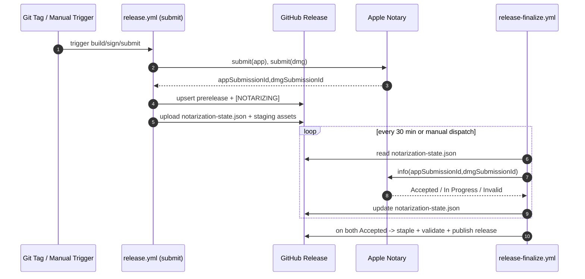

# refactor: decouple notarization submit and finalize workflows

## Overview

将当前单工作流内的“构建 + 公证提交 + 长等待 + staple + release”拆分为两个阶段：
- `submit`：完成构建、签名、公证提交、发布 `prerelease`（带 `[NOTARIZING]` 标记）并落状态。
- `finalize`：按 `schedule(30m)` 或手动触发，读取状态并轮询 notary，达成双 `Accepted` 后收尾并转正式 release。

该方案保持 `app + dmg` 双公证，不引入外部状态存储，避免单 job 长等待触发 6h 超时。

## Problem Frame

当前 `release.yml` 在同一 job 内等待 notary 完成，排队时间不可控，导致发布失败概率高且恢复路径依赖 rerun（见 origin）。
计划目标是把等待从关键路径剥离，让发布可恢复、可重试、可审计，并保持现有分发契约。

## Requirements Trace

- R1,R2: 拆分 submit/finalize 两阶段。
- R3,R8,R9: 幂等与并发治理，禁止重复 submit 叠加队列。
- R4: submission 状态写入 GitHub Release 作为唯一状态源。
- R5,R6: submit 即公开 prerelease，finalize 完成后转正式 release。
- R7: finalize 支持 `schedule(30m) + workflow_dispatch`。
- R10,R11,R12: Invalid/Rejected 诊断、瞬时错误重试、分阶段错误可观测。
- SC1-SC4: 跨周期完成、去重提交、状态可见、失败可诊断。

## Scope Boundaries

- 不改变应用业务逻辑和产物类型（仍为 `.app.tar.gz/.sig`、`agentnexus.zip`、`agentnexus_*.dmg`、`latest.json`）。
- 不引入 S3/DB 等外部状态存储。
- 不迁移 self-hosted runner（作为后续备选）。
- 不扩展到非 macOS 发布流水线。

## Context & Research

### Relevant Code and Patterns

- 现有单体流程：`.github/workflows/release.yml`
- 现有 notary helper（内联 shell）可复用：
  `notary_preflight` / `notary_submit_with_retry` / `notary_wait_for_result` / `notary_dump_log`
- 现有 release 更新模式：`gh release view/upload/edit/create`

### Institutional Learnings

- `docs/solutions/workflow-issues/agentnexus-notarization-in-progress-github-6h-timeout-2026-04-13.md`
  已明确建议“提交与等待解耦”，并强调不要通过重复 rerun 叠加 submission。

### External References

- 暂不新增外部方案依赖，优先沿用仓内既有 notary 与 release 操作模式。

## Key Technical Decisions

- 使用 `release.yml` 作为 submit 主入口（保持 tag 触发兼容），新增 `release-finalize.yml` 负责收尾。
  理由：最小化对现有触发方式的迁移成本。
- notary 状态采用 release asset `notarization-state.json`（而非 release body 文本）。
  理由：结构化、可机读、易幂等更新，减少文本解析脆弱性。
- submit 阶段发布 `prerelease` 并添加 `[NOTARIZING]` 标记及风险说明。
  理由：满足“尽早可见”同时控制误用风险。
- finalize 以“短轮询窗口 + 下次 schedule 续跑”替代无限等待。
  理由：控制单次执行时长并保障跨周期推进。
- finalize 并发按 tag 互斥。
  理由：避免重复收尾、资产覆盖冲突和状态回写竞争。

## Open Questions

### Resolved During Planning

- 状态载体：`notarization-state.json` release asset（而非 body）。
- finalize 触发：`schedule(30m) + workflow_dispatch`。
- 对外可见策略：submit 即公开，但为 `prerelease + [NOTARIZING]`。

### Deferred to Implementation

- `notarization-state.json` 精确字段约定（是否记录 run_id、asset checksum、last_error_history）。
- finalize 单次轮询窗口参数（例如 10/15/20 分钟）与退避常量具体值。
- 是否在 finalize 结束后保留或删除 `notarization-state.json`（保留审计 vs 降噪）。

## High-Level Technical Design

> *This illustrates the intended approach and is directional guidance for review, not implementation specification. The implementing agent should treat it as context, not code to reproduce.*

## Implementation Units

- [ ] **Unit 1: 提取公证状态与公共 helper 契约**

**Goal:** 将 release 状态读写与 notary 调用 helper 从 workflow 内联脚本抽离，建立 submit/finalize 共享契约。

**Requirements:** R3, R4, R10, R11, R12

**Dependencies:** None

**Files:**
- Create: `.github/scripts/notary_helpers.sh`
- Create: `.github/scripts/release_state.sh`
- Create: `.github/scripts/tests/release_state_contract_test.sh`
- Modify: `.github/workflows/release.yml`

**Approach:**
- 将现有内联 notary helper 抽离成可 source 的脚本。
- 在 `release_state.sh` 中封装：创建状态、读取状态、原子更新状态、状态校验。
- 定义统一状态结构（tag、app/dmg submission id、各自状态、最近检查时间、错误摘要）。

**Patterns to follow:**
- `.github/workflows/release.yml` 中已有 `notary_*` 函数及 `gh release` 调用模式。

**Test scenarios:**
- Happy path: 初始化状态文件后可读回 app/dmg submission id 与 phase。
- Edge case: 缺失字段或非法状态值时，状态校验失败并给出可读错误。
- Error path: 目标 release 不存在或无权限上传 asset 时，返回明确失败码与错误上下文。
- Integration: `release_state.sh` 与 `gh release upload --clobber` 配合更新同名状态 asset 后，读取端可获得最新值。

**Verification:**
- submit/finalize 均可复用同一 helper 完成状态读写与 notary 查询，不再复制内联脚本。

- [ ] **Unit 2: submit 工作流重构为“构建+提交+发布预发布态”**

**Goal:** 让 tag 触发路径只负责构建、签名、公证提交与状态发布，不再等待 notary 结果。

**Requirements:** R1, R3, R4, R5, R9, R12, SC2, SC3

**Dependencies:** Unit 1

**Files:**
- Modify: `.github/workflows/release.yml`
- Create: `.github/workflows/tests/release_submit_contract_test.sh`

**Approach:**
- 保留现有构建与签名流程。
- 对 app 与 dmg 执行 submit，记录 submission id 到 `notarization-state.json`。
- 创建或更新 release 为 `prerelease`，标题/说明带 `[NOTARIZING]` 与“公证中，暂勿生产使用”。
- 上传阶段性产物与状态资产，供 finalize 下载后执行 staple 与最终资产覆盖发布。

**Execution note:** 该单元中低复杂度整理项（文案、字段对齐、脚本引用替换）可委托 GPT 5.3 Spark 子代理执行，关键流程拼接与契约校验由主代理收口。

**Patterns to follow:**
- `.github/workflows/release.yml` 当前 `Resolve release metadata` 与 `Create or update GitHub release` 逻辑。

**Test scenarios:**
- Happy path: tag 触发后生成 release（prerelease）并上传状态 asset，状态含 app/dmg submission id。
- Edge case: release 已存在时走 update 分支，不重复创建且状态资产可覆盖更新。
- Error path: app submit 成功但 dmg submit 失败时，工作流明确失败并标记失败阶段。
- Integration: submit 完成后，finalize 可仅凭 release + 状态资产定位并继续流程（无需 rerun submit）。

**Verification:**
- submit job 不包含长期 wait；执行时长与公证排队长度解耦。

- [ ] **Unit 3: 新增 finalize 工作流（定时/手动）完成轮询与收尾**

**Goal:** 基于 release 状态资产轮询 notary，完成 staple、校验、资产更新与发布状态切换。

**Requirements:** R2, R3, R6, R7, R8, R10, R11, R12, SC1, SC4

**Dependencies:** Unit 1, Unit 2

**Files:**
- Create: `.github/workflows/release-finalize.yml`
- Create: `.github/workflows/tests/release_finalize_contract_test.sh`

**Approach:**
- 触发：`schedule(30m)` + `workflow_dispatch`（支持指定 tag）。
- 仅处理处于 `[NOTARIZING]` 的目标 release，读取 `notarization-state.json`。
- 下载 submit 上传的阶段性产物，作为本阶段 staple 的输入。
- 轮询 app/dmg submission：
  - `Accepted`: 更新状态并在双 accepted 时进入收尾。
  - `In Progress`: 本次记录状态后退出，由下次 schedule 续跑。
  - `Invalid/Rejected`: 拉取 notary log，更新状态并 fail。
- 双 accepted 后执行 staple 与验证，更新最终资产，移除 `[NOTARIZING]` 并切换为正式 release。
- 使用 tag 级并发锁，保证同 tag 单活跃 finalize。

**Execution note:** 低复杂度任务（状态字段映射、日志文案统一、测试数据样例）可委托 GPT 5.3 Spark 子代理；并发锁与收尾状态机由主代理负责。

**Patterns to follow:**
- 现有 `notary_wait_for_result`、`notary_dump_log` 与 `gh release upload/edit` 调用风格。

**Test scenarios:**
- Happy path: app/dmg 均 accepted 时，release 从 prerelease + `[NOTARIZING]` 转为正式状态。
- Edge case: 仅 app accepted、dmg in-progress 时，状态部分更新并安全退出等待下一轮。
- Error path: 任一 submission invalid/rejected 时拉取 log 并失败，错误日志含 submission id 与 label。
- Integration: schedule 与手动触发都能读取同一状态资产并维持幂等推进。

**Verification:**
- finalize 可跨多次执行推进同一 tag，不依赖 submit rerun。

- [ ] **Unit 4: 回归防护与运维文档更新**

**Goal:** 为两阶段工作流补充最小可执行回归防护和人工恢复手册，降低故障恢复成本。

**Requirements:** R3, R8, R9, R10, R11, SC2, SC4

**Dependencies:** Unit 2, Unit 3

**Files:**
- Create: `docs/ops/release-notarization-runbook.md`
- Modify: `README.md`
- Modify: `docs/README.en.md`
- Create: `.github/workflows/tests/release_end_to_end_recovery_test.sh`

**Approach:**
- 明确“禁止 rerun submit 作为默认恢复手段”的操作指引。
- 给出 finalize 失败分支（网络瞬断/invalid/rejected）的人工恢复路径。
- 记录状态资产字段解释与手工核查步骤，保证可审计性。

**Patterns to follow:**
- `docs/solutions/workflow-issues/agentnexus-notarization-in-progress-github-6h-timeout-2026-04-13.md` 的问题分解与恢复叙述方式。

**Test scenarios:**
- Happy path: 按 runbook 执行可完成“查看状态 -> 手动触发 finalize -> 验证发布状态”。
- Edge case: 状态资产缺失时 runbook 提供可执行的重建步骤。
- Error path: finalize 失败后 runbook 能定位到 notary log 与对应 submission。
- Integration: README 与 runbook 的触发入口、脚本路径、状态文件名保持一致。

**Verification:**
- 新同学可按文档完成一次从 submit 到 finalize 的演练，无额外口头知识依赖。

## System-Wide Impact

- **Interaction graph:** tag push/workflow_dispatch -> `release.yml(submit)` -> GitHub Release + `notarization-state.json` -> `release-finalize.yml`(schedule/manual) -> staple/promote。
- **Error propagation:** submit 与 finalize 分离上报；失败信息必须带 tag + artifact label（app/dmg）+ submission id。
- **State lifecycle risks:** 状态资产竞争写入、同 tag 并发 finalize、旧状态覆盖新状态。
- **API surface parity:** 对外 release URL 与资产命名保持兼容；仅新增中间态标识。
- **Integration coverage:** 跨工作流状态交接、release 状态切换、invalid/rejected 诊断链路必须被覆盖。
- **Unchanged invariants:** 仍保留 macOS 产物集合与现有签名/公证链路，不改变应用更新协议字段。

## Risks & Dependencies

| Risk | Mitigation |
|------|------------|
| finalize 并发导致状态回写冲突 | 按 tag 设置 workflow concurrency；状态更新采用读取-校验-覆盖流程 |
| 状态资产缺失或格式漂移 | 在 finalize 开始执行强校验；失败时给出重建指引与阻断发布 |
| 长时间 In Progress 导致多轮无进展 | 单次执行限时并落检查时间，依赖 schedule 续跑；保留手动触发 |
| invalid/rejected 诊断信息不足 | 失败路径强制抓取 notary log 并输出 submission id 与 artifact label |
| 资产中间态被误用 | submit 阶段固定 `prerelease + [NOTARIZING]` 提示，finalize 后统一切正 |

## Documentation / Operational Notes

- 更新发布文档，新增“两阶段发布”说明与恢复流程。
- 约定排障顺序：先查 `notarization-state.json`，再查 finalize 日志，最后查 notary log。
- 在后续 `ce:work` 执行中，低复杂度子任务可按用户要求委托 GPT 5.3 Spark 子代理并由主代理收敛结果。

## Sources & References

- **Origin document:** `docs/brainstorms/2026-04-13-release-notarization-submit-finalize-decoupling-requirements.md`
- Related code: `.github/workflows/release.yml`
- Institutional context: `docs/solutions/workflow-issues/agentnexus-notarization-in-progress-github-6h-timeout-2026-04-13.md`
