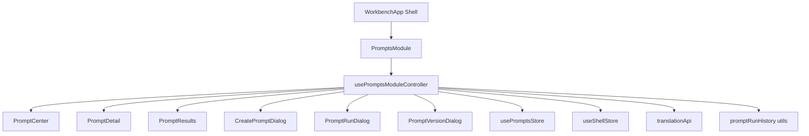

# refactor: Extract Prompts Module from WorkbenchApp

## Overview

在不改变 Prompts 功能行为的前提下，把 `src/app/WorkbenchApp.tsx` 中 Prompts 相关状态、交互与弹窗拆分到 `features/prompts`，将 `WorkbenchApp` 收敛为壳层编排（模块切换与装配），降低后续维护和回归风险。

## Problem Frame

当前 Prompts 业务（列表浏览、详情编辑、翻译、复制运行、版本历史）仍集中在 `src/app/WorkbenchApp.tsx`，导致单文件复杂度和变更爆炸半径持续上升。该重构目标是结构解耦，而不是产品行为改版；既有交互与验收口径保持不变（see origin: docs/brainstorms/2026-04-11-prompts-category-favorites-browsing-requirements.md）。

## Requirements Trace

- R1. 行为冻结：Prompts 现有功能与语义保持不变（重点覆盖 origin 的 R2/R6-R12/R17）。
- R2. 边界重构：Prompts 逻辑从 `WorkbenchApp` 迁出到 `features/prompts`，`WorkbenchApp` 仅保留壳层编排。
- R3. 契约稳定：不修改 `shared/services`、Tauri 命令、`usePromptsStore` 对外契约。
- R4. 回归可控：测试覆盖至少维持当前基线，并补齐拆分后关键边界测试。

## Scope Boundaries

- 不做 UI 视觉重设计，不改变文案与交互顺序。
- 不改 Prompts 的数据模型、后端命令和数据库结构。
- 不在本次重构中拆分 `skills/agents/settings` 模块。
- 不处理 `promptsStore` 中遗留 `promptViewMode` 字段语义漂移问题（仅避免触碰）。

### Deferred to Separate Tasks

- 统一处理 `shellStore` 与 `promptsStore` 的视图模式字段收敛。
- 按同样模式继续拆分 `skills/agents/settings`。

## Context & Research

### Relevant Code and Patterns

- 当前入口装配：`src/App.tsx` -> `src/app/WorkbenchApp.tsx`。
- 现有模块化样式：`features/*` 负责模块 UI，`shared/*` 负责基础设施。
- Prompts 主逻辑集中区域：
  - Prompt 纯函数与浏览上下文持久化 helper：`src/app/WorkbenchApp.tsx`（`normalizePromptCategoryKey`、`readPromptBrowseContext` 等）。
  - Prompt 主渲染块：`promptResultsContent`、`promptCenter`、`promptDetail`。
  - Prompt 弹窗块：`createPromptOpen`、`promptRunOpen`、`versionModalOpen` 对应 Dialog。
- 可复用组件与基础能力：
  - `src/features/common/components/DataTable.tsx`
  - `src/features/common/components/TranslatableTextViewer.tsx`
  - `src/shared/utils/promptRunHistory.ts`

### Institutional Learnings

- `docs/plans/2026-04-11-002-feat-prompts-category-favorites-browsing-plan.md` 提供行为冻结线：`All/Categories/Favorites`、域内搜索、批量后可选跳转、workspace 级浏览上下文恢复。
- `docs/plans/2026-04-11-001-feat-local-agent-translation-workbench-plan.md` 提供翻译区不变量：手动触发、结果优先、状态机语义不改。
- `docs/solutions/` 无与 Prompts 拆分直接相关条目（仅有 release/notarization 主题，不作为本计划依据）。

### External References

- 本次不做外部研究。原因：本仓已具备可复用的结构模式、行为基线和测试夹具，且本任务是仓内重构而非新能力设计。

## Key Technical Decisions

- 采用“模块容器 + 控制器 Hook + 展示组件 + 弹窗组件”分层：
  - 容器：编排数据和回调。
  - 控制器 Hook：聚合 state/effect/handlers。
  - 展示组件：仅接收 props 渲染。
  - 弹窗组件：独立边界，减少主容器 JSX 体积。
- 迁移顺序重排为“先抽 helper，再落 `PromptsModule` 最小壳并接线，最后迁移内部实现”，避免迁移中出现双状态源。
- 状态所有权固定：
  - `WorkbenchApp` 继续持有跨模块状态：`activeModule`、sidebar/mobile pane、语言/主题、模型测试输出相关状态。
  - `PromptsModule` 持有 prompt 域状态：浏览上下文、详情编辑、翻译流程、运行弹窗、版本弹窗。
  - `translationTargetLanguage` 在本次重构保持由 `WorkbenchApp` 单一持有并下发给 `PromptsModule`，避免与 Settings 场景分裂。
- 保留 `usePromptsStore` 与 `useShellStore` 现有使用方式，不在本次引入新全局状态层。
- 以特征回归测试作为拆分护栏，采用“先表征（characterization）后迁移”执行姿态。
- 允许短期“兼容适配层”：`PromptsModule` 初期接收壳层透传回调；在最终单元中删除适配层并收敛为模块内控制器。

## Open Questions

### Resolved During Planning

- 采用“新建计划文件”，不复用旧功能计划：旧计划面向功能迭代，本次面向架构拆分。
- `docs/brainstorms/2026-04-11-prompts-category-favorites-browsing-requirements.md` 作为行为基线来源文档。
- 计划深度定为 Standard（单模块重构、跨多个子文件、但不触达后端契约）。

### Deferred to Implementation

- `PromptsModule` 内部最终再拆分粒度（按实际冲突与可读性微调）。
- 是否将 `PromptTranslationPanel` 直接纳入 `PromptDetail` 还是继续以 `TranslatableTextViewer` 为主（以最小行为差异为准）。

## Output Structure

```text
src/features/prompts/
  module/
    PromptsModule.tsx
    usePromptsModuleController.ts
  components/
    PromptCenter.tsx
    PromptResults.tsx
    PromptDetail.tsx
  dialogs/
    CreatePromptDialog.tsx
    PromptRunDialog.tsx
    PromptVersionDialog.tsx
  hooks/
    usePromptTranslation.ts
    usePromptRun.ts
  utils/
    promptBrowseContext.ts
    promptCategory.ts

src/app/
  WorkbenchApp.tsx

src/app/
  WorkbenchApp.prompts.test.tsx

src/features/prompts/
  module/PromptsModule.test.tsx
  dialogs/PromptRunDialog.test.tsx
```

## High-Level Technical Design

> *This illustrates the intended approach and is directional guidance for review, not implementation specification. The implementing agent should treat it as context, not code to reproduce.*



## Implementation Units

- [ ] **Unit 1: 行为冻结与拆分基线建立**

**Goal:** 在开始拆分前锁定 Prompts 当前行为，确保后续迁移可判定“无行为变化”。

**Requirements:** R1, R4

**Dependencies:** None

**Files:**
- Modify: `src/app/WorkbenchApp.prompts.test.tsx`
- Create: `src/features/prompts/module/PromptsModule.test.tsx`

**Approach:**
- 把现有 `WorkbenchApp.prompts.test.tsx` 作为 characterization 基线，不删减覆盖域。
- 新增 `PromptsModule` 级别测试骨架，复用现有 store mock 风格，提前约束迁移后行为一致性。
- 明确“必须保持”的关键断言：scope 切换、域内搜索、批量动作、复制运行、版本对比入口。

**Execution note:** 先补失败测试或空测试骨架，再迁移生产代码。

**Patterns to follow:**
- `src/app/WorkbenchApp.prompts.test.tsx` 的 `vi.hoisted` store mock 与 aria-label 交互断言模式。
- `src/features/common/components/DataTable.test.tsx` 的表格交互断言模式。

**Test scenarios:**
- Happy path: `All/Categories/Favorites` 切换后列表内容与当前行为一致。
- Edge case: `Categories` 下域内搜索不跨域混入。
- Error path: 复制失败 toast 行为保持一致。
- Integration: `PromptsModule` 接入 store mock 后，批量动作按钮与回调链路可触发。
- Integration: 版本弹窗对比与恢复入口仍可达并触发既有回调链路。
- Integration: workspace 切换后 browse context 恢复与失效回退保持现状。

**Verification:**
- 现有 Prompts 回归测试仍通过；新增模块测试可在迁移早期运行并稳定复现当前行为。

- [ ] **Unit 2: 抽离 Prompts 纯函数与上下文 helper**

**Goal:** 把不依赖 React 生命周期的逻辑先迁出，缩小主文件体积并降低后续冲突。

**Requirements:** R1, R2

**Dependencies:** Unit 1

**Files:**
- Create: `src/features/prompts/utils/promptCategory.ts`
- Create: `src/features/prompts/utils/promptBrowseContext.ts`
- Modify: `src/app/WorkbenchApp.tsx`
- Create: `src/features/prompts/utils/promptCategory.test.ts`
- Create: `src/features/prompts/utils/promptBrowseContext.test.ts`

**Approach:**
- 迁出并复用以下逻辑：分类归一化、browse scope 解析、workspace 级 browse context 读写。
- 保持 storage key 和 fallback 规则不变，避免历史数据失效。
- `WorkbenchApp` 先以导入方式使用新 helper，不立即改 UI 结构。

**Patterns to follow:**
- `src/shared/utils/promptRunHistory.ts` 的 localStorage 容错写法。
- `src/shared/utils/template.test.ts` 的纯函数单测结构。

**Test scenarios:**
- Happy path: 有效 browse context 可正确解析与持久化。
- Edge case: 非法 JSON / 非法 scope 自动回退默认值。
- Error path: localStorage 写入失败时不抛异常，返回安全回退。
- Integration: 迁移后 `WorkbenchApp` 的 browse scope 初始化行为与迁移前一致。

**Verification:**
- helper 单测覆盖正常/异常路径；`WorkbenchApp` 不出现 browse context 行为回归。

- [ ] **Unit 3: 先落 PromptsModule 最小壳并完成壳层接线**

**Goal:** 在不迁移内部细节前先建立稳定模块边界，确保后续拆分只有模块内改动。

**Requirements:** R1, R2, R3

**Dependencies:** Unit 2

**Files:**
- Create: `src/features/prompts/module/PromptsModule.tsx`
- Modify: `src/app/WorkbenchApp.tsx`
- Test: `src/features/prompts/module/PromptsModule.test.tsx`
- Test: `src/app/WorkbenchApp.prompts.test.tsx`

**Approach:**
- 先让 `activeModule === "prompts"` 分支挂载 `PromptsModule`，但初期仅做转发，不改业务实现。
- `PromptsModule` 只消费壳层透传的 prompt 相关数据/回调，不新增第二套状态源。
- 明确 `translationTargetLanguage` 由壳层持有并透传，防止与 Settings 相关状态冲突。

**Patterns to follow:**
- `src/features/shell/AppShell.tsx` 的壳层装配职责边界。
- `src/features/settings/components/ModelWorkbenchPanel.tsx` 的 props 驱动边界。

**Test scenarios:**
- Happy path: Prompts 模块入口接线后，原有页面主路径可用。
- Edge case: 从 prompts 切到其他模块再返回，页面状态行为不变。
- Error path: `PromptsModule` 渲染异常不影响 `skills/agents/settings` 壳层切换。
- Integration: 壳层与模块透传接口一致，无重复状态读写。

**Verification:**
- `WorkbenchApp` 已通过模块边界接入 Prompts，且关键回归测试仍通过。

- [ ] **Unit 4: 抽离主视图组件与 Prompts 控制器**

**Goal:** 将 Prompt 列表/详情主视图和核心状态管理迁入模块内部，保持回调契约稳定。

**Requirements:** R1, R2, R3, R4

**Dependencies:** Unit 3

**Files:**
- Create: `src/features/prompts/components/PromptResults.tsx`
- Create: `src/features/prompts/components/PromptCenter.tsx`
- Create: `src/features/prompts/components/PromptDetail.tsx`
- Create: `src/features/prompts/module/usePromptsModuleController.ts`
- Create: `src/features/prompts/hooks/usePromptRun.ts`
- Create: `src/features/prompts/hooks/usePromptTranslation.ts`
- Modify: `src/features/prompts/module/PromptsModule.tsx`
- Modify: `src/app/WorkbenchApp.tsx`
- Test: `src/features/prompts/module/PromptsModule.test.tsx`
- Test: `src/app/WorkbenchApp.prompts.test.tsx`

**Approach:**
- `usePromptsModuleController` 聚合 prompt 域 `useState/useEffect/handlers`，`PromptsModule` 只做装配。
- `PromptResults/PromptCenter/PromptDetail` 组件化后统一接收控制器 view model，禁止组件层直连全局 store。
- 保持 `translationApi`、`promptRunHistory`、`usePromptsStore` 调用路径不变。
- 迁移期间保留必要兼容 props，确保可分批合入后仍可运行。

**Execution note:** 先迁移列表/详情主路径，再迁移翻译与版本的复杂状态分支。

**Patterns to follow:**
- `src/features/prompts/components/PromptTranslationPanel.tsx` 的组件边界定义方式。
- `src/features/common/components/SectionTitle.tsx` 的模块内容编排模式。

**Test scenarios:**
- Happy path: list/gallery/table 与详情编辑主路径迁移后行为一致。
- Edge case: Categories/Favorites 下的筛选、分页、空态行为一致。
- Error path: 翻译运行失败后状态回退、提示文案与原行为一致。
- Integration: workspace context 读取/写入/失效回退在模块化后保持一致。
- Integration: 翻译冲突策略分支（覆盖/另存）路径可达并与当前语义一致。

**Verification:**
- 主视图与控制器迁移完成后，Prompts 关键路径回归通过且无双状态源。

- [ ] **Unit 5: 迁移 Prompt 弹窗、删除兼容层并完成收口**

**Goal:** 完成复杂弹窗迁移并移除过渡适配层，使 `WorkbenchApp` 只保留壳层职责。

**Requirements:** R2, R3, R4

**Dependencies:** Unit 4

**Files:**
- Create: `src/features/prompts/dialogs/CreatePromptDialog.tsx`
- Create: `src/features/prompts/dialogs/PromptRunDialog.tsx`
- Create: `src/features/prompts/dialogs/PromptVersionDialog.tsx`
- Create: `src/features/prompts/dialogs/PromptRunDialog.test.tsx`
- Modify: `src/features/prompts/module/PromptsModule.tsx`
- Modify: `src/app/WorkbenchApp.tsx`
- Test: `src/app/WorkbenchApp.prompts.test.tsx`
- Test: `src/features/prompts/module/PromptsModule.test.tsx`

**Approach:**
- 迁移创建/复制运行/版本历史三个弹窗到 `features/prompts/dialogs`。
- 移除 `WorkbenchApp` 中 prompt 相关过渡 props 与兼容逻辑，收敛为壳层路由。
- 保持 `showDetailPanel`、sidebar、settings/skills/agents 分支不变。
- 回滚策略采用“原子提交可逆”方式：每个单元保持独立提交边界，可按单元回退而不引入长期双路径。

**Patterns to follow:**
- `src/features/shell/AppShell.tsx` 的壳层装配职责边界。
- `src/shared/utils/promptRunHistory.ts` 的变量历史存取规则。

**Test scenarios:**
- Happy path: 版本弹窗单版本预览、双版本对比、恢复版本流程保持一致。
- Edge case: 复制运行弹窗变量历史回填与无变量直复制路径保持一致。
- Error path: render/clipboard/translation 失败路径提示与状态回退保持一致。
- Integration: `WorkbenchApp` 壳层只负责模块选择，Prompts 业务闭环在模块内完成。
- Integration: `translationTargetLanguage` 仅由壳层状态驱动，模块内不存在并行副本状态。

**Verification:**
- `WorkbenchApp.tsx` 明显收敛为壳层；Prompts 回归测试与模块测试通过；兼容层可按计划移除。

## System-Wide Impact

- **Interaction graph:** `WorkbenchApp -> PromptsModule -> (usePromptsStore/useShellStore/translationApi/promptRunHistory)`；仅重排边界，不改底层依赖。
- **Error propagation:** Prompt 内部错误继续通过 toast 暴露，不改变现有错误语义。
- **State lifecycle risks:** 拆分时需防止 effect 触发顺序变化导致翻译状态、分页、浏览上下文恢复异常。
- **State ownership:** `translationTargetLanguage` 与模型测试输出相关状态在本次仍由壳层单一持有，Prompts 模块仅消费，不重复持有。
- **API surface parity:** `promptApi/translationApi` 入参与返回保持不变。
- **Integration coverage:** 必须覆盖“浏览域 + 批量动作 + 复制运行 + 版本对比 + 翻译”跨层组合路径。
- **Unchanged invariants:** All/Categories/Favorites 语义、域内搜索、可选跳转、历史译文与版本恢复能力均保持现状。

## Risks & Dependencies

| Risk | Mitigation |
|------|------------|
| 拆分后状态同步顺序变化导致行为回归 | 先做 characterization 测试，再按单元渐进迁移，单元完成后立即回归测试 |
| 组件拆分引入 props 过深与回调错连 | 通过 `usePromptsModuleController` 统一导出 view model，组件层只消费明确接口 |
| Dialog 迁移导致交互细节缺失（aria、按钮语义） | 保持原有 DOM 语义和文案，新增 dialog 级单测覆盖关键动作 |
| 同期多人改 `WorkbenchApp.tsx` 冲突 | 先迁出 utils 与组件，再统一收口壳层接入，减少长生命周期大冲突 |

## Definition of Done

- `src/app/WorkbenchApp.prompts.test.tsx` 全量通过，且新增用例覆盖：
  - 版本弹窗对比/恢复
  - 翻译冲突与失败路径
  - workspace browse context 恢复与回退
- `src/features/prompts/module/PromptsModule.test.tsx` 与 dialog 级测试通过。
- 上述测试包含“单一状态源”断言：`translationTargetLanguage` 不出现壳层/模块双写。
- TypeScript 类型检查通过，且不存在 `PromptsModule` 与壳层双状态源。
- `WorkbenchApp` 中不再保留 Prompts 业务大块 JSX（仅保留壳层选择与模块装配）。

## Documentation / Operational Notes

- 本计划落地后，建议补一条 `docs/solutions/`：总结“单文件工作台向模块容器拆分”的操作模板与回归清单。
- 若后续继续拆 `skills/agents/settings`，复用本计划的单元节奏与测试护栏。
- 迁移采用原子单元提交策略，发现回归时按单元提交粒度回退，不引入长期运行时分叉。

## Sources & References

- **Origin document:** `docs/brainstorms/2026-04-11-prompts-category-favorites-browsing-requirements.md`
- Related plans:
  - `docs/plans/2026-04-11-002-feat-prompts-category-favorites-browsing-plan.md`
  - `docs/plans/2026-04-11-001-feat-local-agent-translation-workbench-plan.md`
- Related code:
  - `src/app/WorkbenchApp.tsx`
  - `src/app/WorkbenchApp.prompts.test.tsx`
  - `src/features/prompts/components/PromptTranslationPanel.tsx`
  - `src/shared/utils/promptRunHistory.ts`
