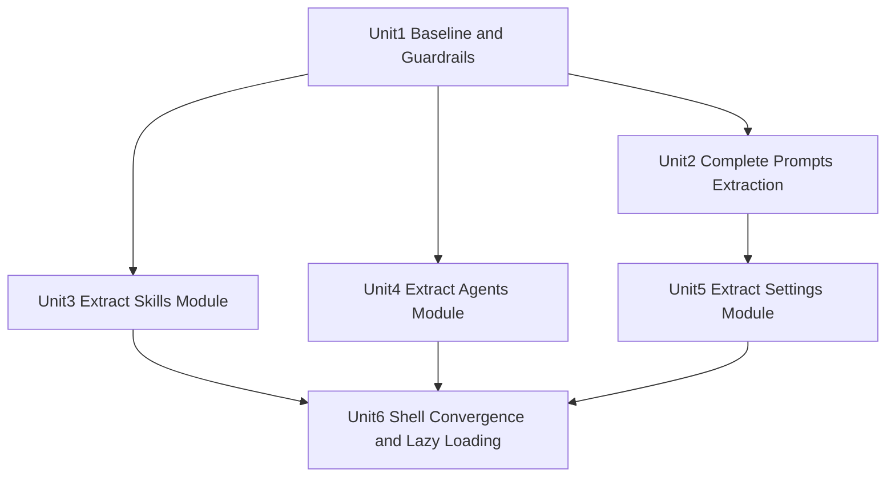

# refactor: Complete WorkbenchApp Modularization

## Overview

在保持当前功能语义不变的前提下，完成 `src/app/WorkbenchApp.tsx` 的收口重构：从“超大组件”收敛到“壳层 + 模块控制器 + 展示组件 + 对话框”的边界化结构，并引入可量化的行数与渲染性能目标。当前基线为 `5042` 行，目标收口到 `<= 2200` 行。

## Problem Frame

`WorkbenchApp` 目前仍混合承载 `prompts/skills/agents/settings` 四个域的大量状态、副作用、异步调用与 JSX 分支，已产生以下持续风险：

- 单文件改动冲突频繁，回归半径大。
- 状态订阅过宽导致非必要重渲染。
- 模块代码无法独立测试与演进。
- 经过多轮抽离后（6134 -> 5042）降幅不足，说明仅靠局部搬运无法达成壳层化目标。

本计划将延续已启动的 Prompts 拆分路线（see origin: docs/plans/2026-04-14-001-refactor-workbench-prompts-module-extraction-plan.md），并完成剩余模块与壳层收口。

## Requirements Trace

- R1. 保持现有业务行为与交互语义不变（Prompts/Skills/Agents/Settings 现有能力不回归）。
- R2. `WorkbenchApp` 只保留壳层编排职责（模块切换、全局布局、少量跨模块状态）。
- R3. `WorkbenchApp` 行数从 5042 收敛到 `<= 2200`，并建立后续防回涨护栏。
- R4. 参考 Vercel React 最佳实践落地关键规则：`async-parallel`、`bundle-conditional`/`bundle-dynamic-imports`、`rerender-dependencies`、`rerender-functional-setstate`。
- R5. 不改变 `shared/services/api`、`shared/stores`、Tauri 命令层对外契约。
- R6. 模块级与壳层级测试覆盖补齐，确保拆分后回归可控。

## Scope Boundaries

- 不引入产品新功能，不改变交互文案与信息架构。
- 不重写状态管理体系（不替换 Zustand，不新增全局状态框架）。
- 不调整后端接口、数据库结构、Tauri IPC 契约。
- 不做视觉重设计。

### Deferred to Separate Tasks

- 将 `translationTargetLanguage` 进一步从壳层下沉为独立共享上下文（本计划先保持单一来源不变）。
- `skills` 与 `agents` 领域的体验升级（仅做结构重构，不做体验改版）。

## Context & Research

### Relevant Code and Patterns

- 主入口：`src/App.tsx`、`src/app/WorkbenchApp.tsx`。
- 已落地模块化样例：
  - `src/features/prompts/module/PromptsModule.tsx`
  - `src/features/prompts/module/usePromptsModuleController.ts`
  - `src/features/prompts/hooks/usePromptRun.ts`
- 现有可复用 UI 组合边界：
  - `src/features/settings/components/ModelWorkbenchPanel.tsx`
  - `src/features/agents/RichTextEditor.tsx`
- 现有壳层回归基线：
  - `src/app/WorkbenchApp.prompts.test.tsx`
  - `src/app/WorkbenchApp.agents.test.tsx`

### Institutional Learnings

- `docs/plans/2026-04-14-001-refactor-workbench-prompts-module-extraction-plan.md` 已确认“壳层编排 + 模块闭环”方向正确，但仅覆盖 Prompts。
- `docs/plans/2026-04-11-001-feat-local-agent-translation-workbench-plan.md` 与 `docs/brainstorms/2026-04-11-local-agent-translation-workbench-requirements.md` 约束了翻译状态机与日志语义，重构时不可破坏。
- `docs/solutions/` 当前无 Workbench 架构拆分专门条目，可在本次收口后补齐。

### External References

- Vercel React Best Practices（规则集）
  - 异步并行：`async-parallel`
  - 包体与按需加载：`bundle-conditional`、`bundle-dynamic-imports`
  - 重渲染控制：`rerender-dependencies`、`rerender-functional-setstate`
  - 条件渲染可读性：`rendering-conditional-render`

## Key Technical Decisions

| Decision | Why |
|---|---|
| 继续采用“壳层 + 模块容器 + 控制器 Hook + 展示组件 + Dialog”分层 | 已在 Prompts 验证可行，能最小化行为漂移并降低并行改动冲突 |
| 先补“线性护栏”（行数目标 + 测试基线），再拆 `skills/agents/settings` | 避免继续做“搬文件但不收口”的无效重构 |
| 模块拆分后默认使用按需加载（`React.lazy` + `Suspense`）承载重模块 | 降低主包初始体积与无关模块渲染成本，对齐 `bundle-dynamic-imports` |
| `WorkbenchApp` 保留少量跨模块全局状态（语言、主题、壳层布局、活动模块） | 保证切换一致性，避免过早引入跨模块状态耦合 |
| 异步初始化与刷新流程统一并行化（`Promise.all`） | 对齐 `async-parallel`，缩短设置/模块切换加载时间 |

## Open Questions

### Resolved During Planning

- 是否在原计划（001）上继续追加：不追加，采用新计划单独收口“全量模块化完成态”，避免混淆已完成与未完成范围。
- 是否把性能规则纳入本次计划：纳入，作为验收硬约束而非建议。

### Deferred to Implementation

- `skills` 模块内部最终组件粒度（`center/detail/tree` 的拆分边界）在实现阶段按冲突与可读性微调。
- `React.lazy` 的切分粒度（按模块或按对话框）在实现阶段结合打包结果确定。

## Output Structure

```text
src/features/skills/
  module/
    SkillsModule.tsx
    useSkillsModuleController.ts
  components/
    SkillsCenter.tsx
    SkillDetail.tsx
  hooks/
    useSkillsModuleState.ts

src/features/agents/
  module/
    AgentsModule.tsx
    useAgentsModuleController.ts
  components/
    AgentsCenter.tsx
  dialogs/
    AgentVersionDialog.tsx
    AgentRuleEditorDialog.tsx
    AgentDistributionDialog.tsx
    AgentMappingPreviewDialog.tsx

src/features/settings/
  module/
    SettingsModule.tsx
    useSettingsModuleController.ts
  components/
    GeneralSettingsPanel.tsx
    DataSettingsPanel.tsx
    AgentConnectionsPanel.tsx
    AboutPanel.tsx

src/features/common/hooks/
  useRuntimeOutputSheet.ts

src/app/
  WorkbenchApp.tsx
  WorkbenchApp.skills.test.tsx
  WorkbenchApp.settings.test.tsx
```

## High-Level Technical Design

> *This illustrates the intended approach and is directional guidance for review, not implementation specification. The implementing agent should treat it as context, not code to reproduce.*



## Implementation Units

- [ ] **Unit 1: 建立收口护栏与基线快照**

**Goal:** 用可度量指标把“重构完成态”定义清楚，避免继续只做结构搬运。

**Requirements:** R1, R3, R6

**Dependencies:** None

**Files:**
- Modify: `src/app/WorkbenchApp.tsx`
- Modify: `src/app/WorkbenchApp.prompts.test.tsx`
- Modify: `src/app/WorkbenchApp.agents.test.tsx`
- Create: `src/app/WorkbenchApp.settings.test.tsx`
- Create: `src/app/WorkbenchApp.skills.test.tsx`

**Approach:**
- 固化四域壳层回归基线（prompts/skills/agents/settings 的入口与关键动作可达）。
- 在计划执行期间持续记录 `WorkbenchApp` 行数与分区迁移进度。
- 约束收口目标：最终 `WorkbenchApp` 只保留壳层编排与跨模块状态。

**Execution note:** 先补 characterization 覆盖再持续拆分，禁止“先删后补测”。

**Patterns to follow:**
- `src/app/WorkbenchApp.prompts.test.tsx` 的 `vi.hoisted` store mock 模式。
- `src/app/WorkbenchApp.agents.test.tsx` 的复杂模块交互断言方式。

**Test scenarios:**
- Happy path: 四个模块切换后均能渲染主容器与核心操作入口。
- Edge case: 从任一模块切换到其他模块再返回，状态不出现明显错乱（选中项/视图模式）。
- Error path: store action reject 时 toast 错误路径仍可触发。
- Integration: `AppShell` 与各模块容器透传契约可正常工作。

**Verification:**
- 形成稳定壳层回归基线，后续模块拆分不再依赖手工冒烟。

- [ ] **Unit 2: 完成 Prompts 域残留逻辑下沉**

**Goal:** 清除 Prompts 在 `WorkbenchApp` 中残留的大块翻译/版本/详情副作用逻辑，Prompts 真正闭环到模块内。

**Requirements:** R1, R2, R5, R6

**Dependencies:** Unit 1

**Files:**
- Modify: `src/app/WorkbenchApp.tsx`
- Modify: `src/features/prompts/module/PromptsModule.tsx`
- Modify: `src/features/prompts/module/usePromptsModuleController.ts`
- Create: `src/features/prompts/hooks/usePromptTranslation.ts`
- Modify: `src/features/prompts/components/PromptDetail.tsx`
- Test: `src/features/prompts/module/PromptsModule.test.tsx`
- Test: `src/app/WorkbenchApp.prompts.test.tsx`

**Approach:**
- 将 Prompt 翻译状态机（running/reviewing/result/elapsed）迁入 `features/prompts/hooks`。
- 将 Prompt 版本弹窗与详情编辑关联状态迁入 Prompts 控制器。
- 保持 `translationApi` 与译文资产语义不变（see origin: docs/brainstorms/2026-04-11-local-agent-translation-workbench-requirements.md）。

**Patterns to follow:**
- `src/features/prompts/hooks/usePromptRun.ts` 的“状态 + handler 打包返回”模式。
- `src/features/prompts/dialogs/PromptVersionDialog.tsx` 的展示边界模式。

**Test scenarios:**
- Happy path: 翻译运行完成后进入 reviewing 状态并刷新译文。
- Edge case: 目标语言切换后状态清理与译文回显仍正确。
- Error path: 翻译失败时结果卡、toast、运行输出状态回退一致。
- Integration: PromptDetail -> hooks -> translationApi 调用链在模块内闭环，Workbench 不再持有重复状态。

**Verification:**
- `WorkbenchApp` 中 Prompts 专属状态显著收缩，Prompts 相关逻辑主要位于 `features/prompts/*`。

- [ ] **Unit 3: 抽离 Skills 模块（列表/树/详情）**

**Goal:** 将 `skillsCenter` 与技能文件树相关状态、行为、视图迁入 `features/skills`。

**Requirements:** R1, R2, R3, R6

**Dependencies:** Unit 1

**Files:**
- Create: `src/features/skills/module/SkillsModule.tsx`
- Create: `src/features/skills/module/useSkillsModuleController.ts`
- Create: `src/features/skills/hooks/useSkillsModuleState.ts`
- Create: `src/features/skills/components/SkillsCenter.tsx`
- Create: `src/features/skills/components/SkillDetail.tsx`
- Modify: `src/app/WorkbenchApp.tsx`
- Test: `src/features/skills/module/SkillsModule.test.tsx`
- Test: `src/app/WorkbenchApp.skills.test.tsx`

**Approach:**
- 下沉技能扫描、文件树展开、文件读取、详情翻译等状态与 handlers。
- 模块内部做派生数据 memo，壳层仅负责注入共享依赖（语言、workspace、通用 toast）。
- 按 `rerender-dependencies` 约束 effect 依赖最小化，减少跨域重渲染。

**Patterns to follow:**
- `src/features/prompts/module/PromptsModule.tsx` 的容器模式。
- `src/features/settings/components/ModelWorkbenchPanel.tsx` 的 props 边界。

**Test scenarios:**
- Happy path: Skills 列表 -> 详情 -> 文件切换主路径可用。
- Edge case: 文件树为空、读取失败、切换 skill 后状态重置正确。
- Error path: 读取/打开失败时错误反馈与禁用态正确。
- Integration: `skillsApi` 读树与读文件调用链在模块内可达，壳层无重复读写。

**Verification:**
- `skillsCenter` 主 JSX 与核心 handlers 从 `WorkbenchApp` 移除。

- [ ] **Unit 4: 抽离 Agents 模块（中心区 + 四个对话框）**

**Goal:** 将 `agentsCenter` 与 Agent 相关对话框全部迁入 `features/agents`，切断 Workbench 中的大块业务 JSX。

**Requirements:** R1, R2, R3, R5, R6

**Dependencies:** Unit 1

**Files:**
- Create: `src/features/agents/module/AgentsModule.tsx`
- Create: `src/features/agents/module/useAgentsModuleController.ts`
- Create: `src/features/agents/components/AgentsCenter.tsx`
- Create: `src/features/agents/dialogs/AgentVersionDialog.tsx`
- Create: `src/features/agents/dialogs/AgentRuleEditorDialog.tsx`
- Create: `src/features/agents/dialogs/AgentDistributionDialog.tsx`
- Create: `src/features/agents/dialogs/AgentMappingPreviewDialog.tsx`
- Modify: `src/app/WorkbenchApp.tsx`
- Test: `src/features/agents/module/AgentsModule.test.tsx`
- Test: `src/app/WorkbenchApp.agents.test.tsx`

**Approach:**
- 迁移资产管理、版本对比、分发应用、映射预览等状态与弹窗。
- 保留 `useAgentRulesStore` 调用契约；仅重排职责边界，不改调用语义。
- 对高交互回调优先使用函数式 state 更新，降低闭包陈旧风险（`rerender-functional-setstate`）。

**Patterns to follow:**
- `src/features/agents/RichTextEditor.tsx` 的编辑器边界复用。
- `src/features/prompts/dialogs/*` 的对话框拆分方式。

**Test scenarios:**
- Happy path: 版本查看/对比/恢复与规则分发流程可用。
- Edge case: 无目标 Agent、无版本、无映射文件时空态与禁用态正确。
- Error path: 分发失败、读取失败、保存失败提示保持一致。
- Integration: agents 模块内对 `useAgentRulesStore` 的读写链路正确，Workbench 不直接操纵细节状态。

**Verification:**
- `WorkbenchApp` 底部 Agent 相关多个 Dialog 块整体迁出。

- [ ] **Unit 5: 抽离 Settings 模块并对齐翻译工作台语义**

**Goal:** 将 `settingsCenter` 按分类面板拆分为可维护组件，保留现有翻译工作台行为一致。

**Requirements:** R1, R2, R3, R4, R5, R6

**Dependencies:** Unit 2

**Files:**
- Create: `src/features/settings/module/SettingsModule.tsx`
- Create: `src/features/settings/module/useSettingsModuleController.ts`
- Create: `src/features/settings/components/GeneralSettingsPanel.tsx`
- Create: `src/features/settings/components/DataSettingsPanel.tsx`
- Create: `src/features/settings/components/AgentConnectionsPanel.tsx`
- Create: `src/features/settings/components/AboutPanel.tsx`
- Modify: `src/features/settings/components/ModelWorkbenchPanel.tsx`
- Modify: `src/app/WorkbenchApp.tsx`
- Test: `src/features/settings/module/SettingsModule.test.tsx`
- Test: `src/app/WorkbenchApp.settings.test.tsx`

**Approach:**
- 以 `settingsCategory` 为边界拆分面板，减少单组件条件分支堆叠。
- 将模型测试与运行输出相关状态整理到 settings 控制器，保持与 prompts 翻译语义一致（结果优先、日志次级）。
- 异步读取配置采用并行拉取（`async-parallel`），避免串行等待。

**Patterns to follow:**
- `src/features/settings/components/ModelWorkbenchPanel.tsx` 现有 API。
- `docs/brainstorms/2026-04-11-local-agent-translation-workbench-requirements.md` 的状态机与日志语义约束。

**Test scenarios:**
- Happy path: 各分类面板可切换，保存配置路径可达。
- Edge case: 无 workspace、连接为空、profile 缺失时回退逻辑正确。
- Error path: 配置保存失败/测试失败时状态与提示一致。
- Integration: 设置面板与 `translationApi`、`useSettingsStore` 联动不回归。

**Verification:**
- `settingsCenter` 巨型条件渲染从 Workbench 移除，`ModelWorkbenchPanel` 仅保留展示职责。

- [ ] **Unit 6: 壳层收口与性能规则落地（最终交付态）**

**Goal:** 将 `WorkbenchApp` 收敛为壳层编排，并落地关键性能规则，完成行数目标与稳定验收。

**Requirements:** R2, R3, R4, R6

**Dependencies:** Unit 2, Unit 3, Unit 4, Unit 5

**Files:**
- Modify: `src/app/WorkbenchApp.tsx`
- Create: `src/features/common/hooks/useRuntimeOutputSheet.ts`
- Modify: `src/App.tsx`
- Modify: `src/main.tsx`
- Test: `src/app/WorkbenchApp.prompts.test.tsx`
- Test: `src/app/WorkbenchApp.skills.test.tsx`
- Test: `src/app/WorkbenchApp.agents.test.tsx`
- Test: `src/app/WorkbenchApp.settings.test.tsx`

**Approach:**
- `WorkbenchApp` 只保留：模块切换、壳层布局、主题/语言、最小跨模块状态注入。
- 对重模块采用条件加载/惰性加载（`bundle-conditional`、`bundle-dynamic-imports`）。
- 清理壳层冗余订阅与无效依赖，减少模块切换时无关重渲染。

**Patterns to follow:**
- 现有 `AppShell` 的中心区注入模型。
- 已完成的 `PromptsModule` 接线方式。

**Test scenarios:**
- Happy path: 四域切换与核心主路径全通过。
- Edge case: 快速切换模块与移动端开关下不出现卡死或状态串线。
- Error path: 模块懒加载失败时有可见降级提示（至少不阻塞其他模块）。
- Integration: 壳层到模块的数据注入契约保持稳定，运行输出抽屉在各调用点可复用。

**Verification:**
- `src/app/WorkbenchApp.tsx` 行数 `<= 2200`。
- 主要业务代码已迁入 `features/*`，壳层职责清晰。
- 四域回归测试通过，且不新增跨域耦合。

## System-Wide Impact

- **Interaction graph:** `WorkbenchApp shell -> PromptsModule/SkillsModule/AgentsModule/SettingsModule -> stores/apis`。
- **Error propagation:** 模块内部错误统一通过 toast 与结果卡反馈；壳层只处理全局不可恢复错误。
- **State lifecycle risks:** 模块切换时需避免遗留定时器/监听器未释放，特别是翻译流式输出与版本弹窗。
- **API surface parity:** `usePromptsStore`、`useSkillsStore`、`useAgentRulesStore`、`useSettingsStore` 与 `translationApi` 调用签名保持不变。
- **Integration coverage:** 重点覆盖“模块切换 + 弹窗 + 异步执行 + 错误回退”的跨层组合路径。
- **Unchanged invariants:** Prompts 分类/收藏浏览、Agent 规则分发、Settings 翻译工作台核心语义不变。

## Risks & Dependencies

| Risk | Mitigation |
|------|------------|
| 模块拆分后行为回归（尤其翻译与版本链路） | 先以壳层回归测试锁行为，再分单元迁移并逐单元回归 |
| 状态下沉导致 effect 触发顺序变化 | 控制器 Hook 内统一副作用入口，优先使用 primitive dependencies |
| 多文件并行改造带来冲突 | 按模块分阶段落地，尽量减少跨模块共享写入面 |
| 行数下降但复杂度未下降（伪拆分） | 将“状态所有权”和“副作用归属”纳入每单元验收，不只看搬文件 |

## Documentation / Operational Notes

- 完成后补充一条 `docs/solutions/`，沉淀 Workbench 大组件拆分模板与回归清单。
- 若后续继续做性能专项，可在此基础上追加包体分析与渲染剖析，不与本次结构重构耦合。

## Sources & References

- **Origin plan:** `docs/plans/2026-04-14-001-refactor-workbench-prompts-module-extraction-plan.md`
- Requirements baseline:
  - `docs/brainstorms/2026-04-11-prompts-category-favorites-browsing-requirements.md`
  - `docs/brainstorms/2026-04-11-local-agent-translation-workbench-requirements.md`
- Related code:
  - `src/app/WorkbenchApp.tsx`
  - `src/features/prompts/module/PromptsModule.tsx`
  - `src/features/settings/components/ModelWorkbenchPanel.tsx`
  - `src/app/WorkbenchApp.prompts.test.tsx`
  - `src/app/WorkbenchApp.agents.test.tsx`
- External guidance:
  - Vercel React Best Practices rule set (`async-*`, `bundle-*`, `rerender-*`, `rendering-*`)
