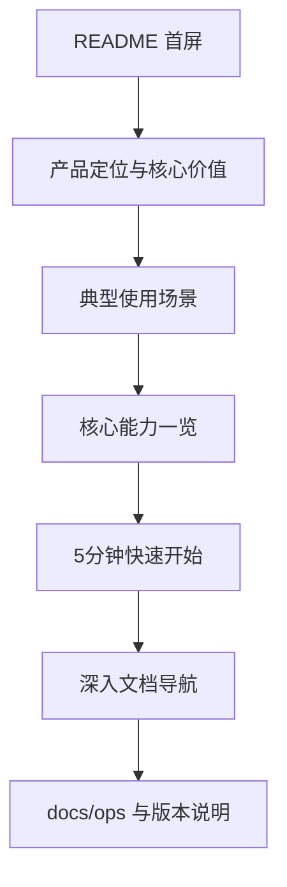

# refactor: README 用户化产品说明重写计划

## Overview

将当前偏工程/发布操作导向的 README 重写为“面向用户的产品说明”，突出 AgentNexus 的用户价值、适用场景、核心能力与最短上手路径；发布与运维细节继续沉淀在 `docs/ops/`，README 仅保留必要入口链接。

## Problem Frame

当前 `README.md` 与 `docs/README.zh.md` 虽然信息完整，但“产品说明”与“发布SOP”混排，用户首次阅读时难以快速回答三个问题：
1) 这是什么产品；2) 解决什么问题；3) 我该怎么开始。

本次计划目标是在不改变产品能力与工程流程的前提下，重构 README 信息架构，让文档优先服务用户决策与上手路径，同时保持中英文口径一致。

## Requirements Trace

- R1. README 首屏必须在短时间内清晰表达 AgentNexus 的定位、目标用户与核心价值。
- R2. README 主体结构应按“价值 -> 场景 -> 能力 -> 上手 -> 深入文档”组织，而非按工程实现细节组织。
- R3. 发布、公证、排障等流程性内容不在 README 展开，统一下沉到 `docs/ops/` 并由 README 提供入口。
- R4. 中文主 README 与英文 README 在信息结构和能力口径上保持可对齐。
- R5. 上手命令与仓库脚本保持一致，避免文档与实际运行方式漂移。

## Scope Boundaries

- 不修改应用代码、CLI 命令、构建流程与发布 workflow。
- 不新增官网、产品营销页或视频素材。
- 不重写 `docs/ops/` 既有 runbook 的流程内容。

### Deferred to Separate Tasks

- 若后续需要“面向外部官网”的品牌文案与视觉包装，另开独立任务。
- 若后续需要自动化文档 lint（链接检查、章节一致性校验），另开独立任务。

## Context & Research

### Relevant Code and Patterns

- 当前中文 README：`README.md`
- 当前英文 README：`docs/README.zh.md`
- 发布说明样例：`.github/release-notes/v0.1.1.md`
- 发布与公证长期文档沉淀：`docs/ops/release-standard-playbook.md`、`docs/ops/release-notarization-runbook.md`
- 实际脚本来源：`package.json`

### Institutional Learnings

- 仓内既有经验已明确“发布常态流程与异常处理应留在 `docs/ops`，README 以入口/概览为主”，可直接复用该分层策略以避免文档职责重叠。

### External References

- 无（本计划以仓内文档分层经验与当前产品信息为主，不依赖外部框架新约束）。

## Key Technical Decisions

- 决策1：README 采用“用户旅程式结构”而非“工程任务式结构”。
  - 理由：先帮助用户判断“是否适合我”，再引导“如何开始”。
- 决策2：README 只保留最小可运行上手路径，复杂发布细节改为链接跳转。
  - 理由：降低首读认知负担，同时保持可追溯。
- 决策3：中英文 README 维持章节映射与术语一致，避免双语语义漂移。
  - 理由：减少维护成本，提升对外一致性。
- 决策4：增加一份文档验收清单作为“测试文件”，在实施时用于逐项核对口径与链接。
  - 理由：文档改造也需要可重复验收，避免仅靠主观阅读。

## Open Questions

### Resolved During Planning

- 是否保留发布流程说明在 README：保留入口链接，不保留流程正文。
- 是否覆盖英文版：覆盖，且结构保持对齐。
- 是否变更现有截图资产：本次不新增截图，仅复用现有资产。

### Deferred to Implementation

- 各章节具体文案语气与长度在实际改写时根据阅读流畅性微调。
- 是否新增“常见问题（FAQ）”章节，视改写后篇幅与信息密度决定。

## High-Level Technical Design

> *This illustrates the intended approach and is directional guidance for review, not implementation specification. The implementing agent should treat it as context, not code to reproduce.*

## Implementation Units

- [x] **Unit 1: README 信息架构与文案框架重排**

**Goal:** 先确定用户导向的信息结构与章节骨架，作为中英文改写的共同蓝图。

**Requirements:** R1, R2, R4

**Dependencies:** None

**Files:**
- Modify: `README.md`
- Modify: `docs/README.zh.md`
- Create: `docs/qa/readme-user-facing-acceptance.md`

**Approach:**
- 将 README 主结构固定为“定位/价值、场景、能力、快速开始、文档入口”。
- 将“发布、公证、排障”从正文改为 docs 链接入口。
- 在验收清单中定义双语对齐项、链接可达项、命令一致性项。

**Patterns to follow:**
- `README.md`
- `docs/README.zh.md`
- `docs/ops/release-standard-playbook.md`

**Test scenarios:**
- Happy path: 新用户阅读前 2 个章节即可明确“产品定位 + 解决问题”。
- Edge case: 仅需本地开发的用户无需滚动到发布章节也能完成上手。
- Error path: README 内所有跳转链接指向存在的文档路径。
- Integration: 中文与英文 README 章节顺序和能力点一一对应。

**Verification:**
- 两份 README 的目录结构可对齐，且文档验收清单可逐项打勾。

- [x] **Unit 2: 中文 README 改写为产品说明主入口**

**Goal:** 完成 `README.md` 用户导向改写，确保中文读者可快速理解并上手。

**Requirements:** R1, R2, R3, R5

**Dependencies:** Unit 1

**Files:**
- Modify: `README.md`
- Modify: `docs/qa/readme-user-facing-acceptance.md`

**Approach:**
- 压缩工程细节叙述，突出“用户价值 + 场景 + 能力闭环”。
- 快速开始仅保留必要命令，并与 `package.json` 当前脚本一致。
- 发布相关内容改为“去哪里看”的入口，而非“怎么做完整流程”。

**Patterns to follow:**
- `README.md`
- `package.json`
- `docs/ops/release-standard-playbook.md`

**Test scenarios:**
- Happy path: 用户按 README 的最短路径可完成依赖安装与本地启动。
- Edge case: 对 Tauri 桌面开发有需求的用户可在快速开始中找到清晰分支路径。
- Error path: 若用户误入发布场景，README 提供明确的 `docs/ops` 导航而非缺失信息。
- Integration: README 中提及命令与 `package.json` 中真实脚本名一致。

**Verification:**
- 中文 README 可独立承担产品入口角色，且不再承载长篇发布 SOP。

- [x] **Unit 3: 英文 README 同步对齐与语义校准**

**Goal:** 完成 `docs/README.zh.md` 的结构与语义对齐，保证双语一致。

**Requirements:** R4, R5

**Dependencies:** Unit 1, Unit 2

**Files:**
- Modify: `docs/README.zh.md`
- Modify: `docs/qa/readme-user-facing-acceptance.md`

**Approach:**
- 按中文新版结构逐段映射英文内容，避免遗漏能力或新增未定义能力。
- 统一关键术语（如 control plane、distribution、auditability）。
- 保持截图与链接路径与中文版一致。

**Patterns to follow:**
- `docs/README.zh.md`
- `README.md`
- `.github/release-notes/v0.1.1.md`

**Test scenarios:**
- Happy path: 英文用户可从首屏理解产品定位与价值。
- Edge case: 双语切换时同一能力点能在对应章节找到。
- Error path: 英文版不存在中文专有描述导致的断链或语义缺失。
- Integration: 两份 README 的标题层级与链接目标保持一致。

**Verification:**
- 中英文 README 对齐完成，双语读者得到等价信息。

- [x] **Unit 4: 文档验收与回归检查收口**

**Goal:** 用显式清单完成文档质量回归，确保改写后可维护、可验证。

**Requirements:** R3, R4, R5

**Dependencies:** Unit 2, Unit 3

**Files:**
- Modify: `README.md`
- Modify: `docs/README.zh.md`
- Modify: `docs/qa/readme-user-facing-acceptance.md`

**Approach:**
- 对照清单逐项核对：用户定位清晰度、双语对齐、链接可达、命令一致性、ops 分层。
- 将不通过项回写到 README 对应段落，形成闭环修订。

**Patterns to follow:**
- `docs/plans/2026-04-13-001-refactor-release-notarization-submit-finalize-decoupling-plan.md`
- `docs/ops/release-notarization-runbook.md`

**Test scenarios:**
- Happy path: 清单所有必过项（定位、场景、快速开始、文档入口）全部通过。
- Edge case: 仓库新读者仅阅读 README 即可定位下一步文档入口。
- Error path: 清单发现断链或命令不一致时可追溯到具体章节并修复。
- Integration: README 与 `docs/ops` 分层职责清晰且无重复 SOP 正文。

**Verification:**
- 验收清单可作为后续 README 迭代的基线复用。

## System-Wide Impact

- **Interaction graph:** `README.md` / `docs/README.zh.md` -> `docs/ops/*` -> `.github/release-notes/*`（用户从入口文档跳转到流程文档与版本信息）。
- **Error propagation:** 若 README 链接或命令失真，会直接放大用户上手失败率与认知偏差。
- **State lifecycle risks:** 双语改写不同步会造成长期维护漂移。
- **API surface parity:** 不改变任何代码 API、脚本命令、发布接口，仅调整文档呈现。
- **Integration coverage:** 需覆盖“README 命令与脚本一致”“README 与 docs/ops 分层一致”“中英文链接一致”。
- **Unchanged invariants:** `pnpm` 开发/构建/测试命令与 release workflow 行为保持不变。

## Risks & Dependencies

| Risk | Mitigation |
|------|------------|
| 文案改写后信息过于营销化，丢失可执行信息 | 固定“快速开始 + 文档入口”为必备章节并纳入验收清单 |
| 中文先改、英文滞后导致双语漂移 | 将英文对齐作为独立 implementation unit，并在清单中设置双语一致性检查 |
| 发布内容移出 README 后用户找不到入口 | 在 README 保留明确的 `docs/ops` 链接与适用场景说明 |

## Documentation / Operational Notes

- 本计划是文档重构，不触发发布流程、数据库迁移或运行时配置变更。
- 实施完成后可把 `docs/qa/readme-user-facing-acceptance.md` 作为后续版本的文档回归基线。

## Sources & References

- Related code: `README.md`
- Related code: `docs/README.zh.md`
- Related code: `package.json`
- Related docs: `docs/ops/release-standard-playbook.md`
- Related docs: `docs/ops/release-notarization-runbook.md`
- Related release notes: `.github/release-notes/v0.1.1.md`
- Related plan: `docs/plans/2026-04-13-001-refactor-release-notarization-submit-finalize-decoupling-plan.md`
