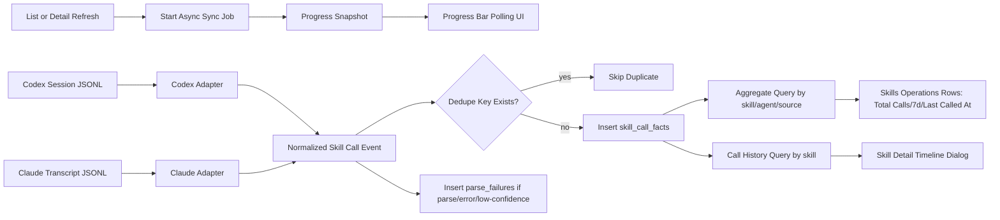

# feat: Skills 会话调用事实统计替换实施计划

## Overview

将 Skills 页“使用次数”从旧 `usage/metrics` 埋点体系切换为 `session-first` 调用事实体系：
- 按 Agent 适配解析 Codex/Claude session
- 增量同步并持久化 checkpoint
- 以独立 fact table 聚合 `Total Calls`、`7d`、`Last Called At`
- Skills 页支持 `agent/source` 过滤
- Skills 列表页提供“刷新分析”按钮与进度条，分析过程非阻塞
- Skill 详情页提供“调用记录”入口，弹窗按时间轴展示每次调用，并支持带进度条的刷新
- 完整移除旧 `metrics` 命令、旧表、旧前端契约与旧文案入口

## Problem Frame

当前实现的主要偏差：
- 旧 `metrics` 链路未绑定真实 skill 调用触发，统计结果不可信。
- `skills_distribute` 与 `metrics_ingest_usage_event` 会更新 `skills_assets.last_used_at`，把“运维动作”误写成“调用行为”。

本计划以 requirements 为唯一事实来源（see origin: `docs/brainstorms/2026-04-18-skills-session-usage-requirements.md`），目标是把调用统计收敛为“可解释、可追溯、可幂等”。

## Requirements Trace

- R1-R4: 建立 Codex/Claude 解析适配器、增量 checkpoint、统一调用事件、失败不阻断且可排查
- R5-R8: 新增独立调用事实存储、去重幂等、聚合唯一来源、支持 workspace 维度统计
- R9-R11: Skills 页面增加 `Total Calls`/`7d`/`Last Called At` 与 `agent/source` 过滤，零值清晰展示
- R12-R14: 下线旧 `usage/metrics` 命令与类型、移除 `usage_events/ratings`，停止分发链路写 `last_used_at`
- R15: Skill 详情页增加“调用记录入口”，点击后弹窗按时间轴展示调用记录
- R16: 调用记录弹窗提供刷新按钮，刷新过程需展示分析进度条
- R17: Skills 列表页提供刷新按钮，刷新过程需展示分析进度条
- R18: 分析过程必须非阻塞，前端可持续交互并看到实时进度
- Success Criteria: 重复同步不重复计数；运维动作不再导致伪增长；代码中不保留可执行旧入口

## Scope Boundaries

- 仅处理本地可访问 session 文件，不引入云端遥测。
- 首版仅覆盖 Codex 与 Claude 两类 Agent。
- 不在本阶段恢复或替代“评分（ratings）”产品能力。
- 不做从旧 `usage_events` 到新 fact table 的历史回灌。
- 不引入 WebSocket 或远端任务调度系统，首版采用本地命令轮询进度。

### Deferred to Separate Tasks

- 扩展更多 Agent（如 Cursor、Gemini）的 adapter 与格式映射。
- 增加“调用质量评分/失败诊断看板”等二阶分析面板。

## Context & Research

### Relevant Code and Patterns

- 旧 metrics 写读与 `last_used_at` 污染点：`src-tauri/src/control_plane/commands.rs`
- 旧表定义：`src-tauri/src/db.rs`
- Tauri 命令注册面：`src-tauri/src/lib.rs`
- 前端旧契约与命令映射：`src/shared/types/settings.ts`, `src/shared/services/tauriClient.ts`, `src/shared/services/api.ts`, `src/shared/services/settingsService.ts`
- Skills 运营视图入口：`src/app/WorkbenchApp.tsx`, `src/features/skills/components/SkillsOperationsPanel.tsx`
- Skills 详情视图入口：`src/features/skills/components/SkillsCenter.tsx`
- Skills 运营行模型：`src/shared/types/skillsManager.ts`, `src/shared/stores/skillsStore.ts`
- 现有测试基线：`src/features/skills/components/__tests__/SkillsOperationsPanel.test.tsx`, `src/app/WorkbenchApp.skills-operations.test.tsx`, `src/shared/stores/__tests__/skillsStore.operations.test.ts`, `src/shared/stores/__tests__/skillsStore.manager.test.ts`

### Institutional Learnings

- Skills 相关改造优先遵循“壳层薄、领域层收敛”以降低 `WorkbenchApp` 回归半径：`docs/solutions/best-practices/workbenchapp-modularization-best-practice-2026-04-14.md`
- 同主题 ideation 已明确“session parser + checkpoint + dedupe + UI 三列”方向：`docs/ideation/2026-04-18-skills-usage-count-ideation.md`
- 仓内旧命令契约文档仍含 `metrics.*`，需同步收敛：`.docs/06-应用内命令契约草案.md`

### External References

- 无。该需求的关键约束与数据来源均可由仓内代码与本机 session 样本确认，当前不引入额外外部研究。

## Key Technical Decisions

- 决策1：新增独立数据面 `skill_call_facts + skill_call_sync_checkpoints + skill_call_parse_failures`。
  - 理由：与旧 `usage_events/ratings` 彻底隔离，避免语义污染（R5, R13）。
- 决策2：增量同步粒度采用“按 session 文件 + byte offset checkpoint”。
  - 理由：JSONL 追加写场景下稳定且高效，避免全量重扫（R2）。
- 决策3：去重键优先使用显式调用标识，缺失时降级为 `agent + session + event_ref + normalized_skill + called_at` 指纹。
  - 理由：满足“无唯一调用 ID”场景下的幂等要求（R6）。
- 决策4：结果状态采用 `success|failed|unknown`，并记录 `confidence` 与失败明细。
  - 理由：不同 Agent session 信号粒度不一致，需要保留低置信与排障证据（R3, R4）。
- 决策5：Skills 页统计严格来自 fact table，不从分发/链接动作推导。
  - 理由：阻断伪增长与口径漂移（R7, R14）。
- 决策6：同步任务采用“后台异步 job + 前端轮询进度”模式，而非阻塞式命令。
  - 理由：满足列表页与详情弹窗都要展示分析进度且不阻塞交互（R16, R17, R18）。
- 决策7：详情页调用记录采用“按 skill 维度查询调用明细 + 前端时间轴渲染”。
  - 理由：调用记录需可追溯到每次调用，并与统计口径同源（R15）。
- 决策8：移除旧 metrics 全链路（命令、服务、类型、文案、表）且不做兼容回读。
  - 理由：requirements 已明确 `No-compat-removal`（R12, R13）。

## Open Questions

### Resolved During Planning

- [Affects R2] checkpoint 粒度：按文件记录 `byte_offset + file_size + updated_at`，文件裁剪/回滚时自动回退全文件重扫。
- [Affects R6] 去重降级：无显式调用 ID 时使用稳定事件引用（line/offset/index）与归一化字段生成 `dedupe_key`。
- [Affects R4] 成败判定边界：仅在明确成功/失败信号出现时写 `success|failed`，其余统一标 `unknown` 并附 `confidence < 1`。
- [Affects R16-R18] 进度呈现协议：后端返回 `totalFiles/processedFiles/parsedEvents/currentSource/status`，前端以轮询驱动进度条。

### Deferred to Implementation

- Codex/Claude 具体“skill 调用信号”规则表（正则与字段优先级）需根据样本测试微调。
- 首次全量同步的默认回溯窗口（全历史 vs 最近 N 天）在实现阶段结合性能基线确定。

## Output Structure

```text
src-tauri/src/control_plane/
  skills_usage.rs
src/shared/types/
  skillsUsage.ts
src/features/skills/components/
  SkillUsageTimelineDialog.tsx
src/shared/stores/__tests__/
  skillsStore.usage.test.ts
src/features/skills/components/__tests__/
  SkillUsageTimelineDialog.test.tsx
```

## High-Level Technical Design

> *This illustrates the intended approach and is directional guidance for review, not implementation specification. The implementing agent should treat it as context, not code to reproduce.*



## Implementation Units

- [x] **Unit 1: 数据模型迁移与旧表下线**

**Goal:** 建立新调用事实存储并下线旧 `usage_events/ratings` 表，确保重复启动迁移幂等。

**Requirements:** R5, R6, R13

**Dependencies:** None

**Files:**
- Modify: `src-tauri/src/db.rs`
- Modify: `src-tauri/src/domain/models.rs`
- Test: `src-tauri/src/db.rs`

**Approach:**
- 在 `db.rs` 增加新表：
  - `skill_call_facts`
  - `skill_call_sync_checkpoints`
  - `skill_call_parse_failures`
- 增加一次性 migration 标记并执行：
  - 建新表 migration
  - 旧表清理 migration（drop `usage_events`/`ratings`）
- 保留 `skills_assets.last_used_at` 字段只读兼容，不再作为调用口径字段。

**Execution note:** 先补 migration characterization 测试再改 bootstrap，避免破坏现有启动流程。

**Patterns to follow:**
- `src-tauri/src/db.rs` 现有 `run_*_migration_once` 结构

**Test scenarios:**
- Happy path: 新数据库初始化后存在 `skill_call_*` 三表且 migration 标记写入成功。
- Edge case: 重复启动不会重复执行 drop/create，schema 保持稳定。
- Error path: 旧表不存在时执行 drop migration 不报错。
- Integration: 含旧表的历史数据库升级后，旧表被移除且新表可写。

**Verification:**
- 启动后 schema 仅保留新调用事实相关表，不存在 `usage_events` 与 `ratings`。

- [x] **Unit 2: Codex/Claude 解析适配器与事件归一化**

**Goal:** 构建按 Agent 的 session 解析器，输出统一调用事件并保留低置信/失败证据。

**Requirements:** R1, R3, R4

**Dependencies:** Unit 1

**Files:**
- Create: `src-tauri/src/control_plane/skills_usage.rs`
- Modify: `src-tauri/src/control_plane/mod.rs`
- Modify: `src-tauri/src/domain/models.rs`
- Test: `src-tauri/src/control_plane/skills_usage.rs`

**Approach:**
- 定义统一解析输出模型：`agent/sessionId/skillIdentity/calledAt/resultStatus/source/confidence/rawRef`。
- 实现 Codex adapter：基于 rollout JSONL 解析 `session_meta`、消息内容、工具调用上下文。
- 实现 Claude adapter：基于 transcript JSONL 解析 `user/tool_use/tool_result` 线索，并从 `cwd/filePath/command` 关联 workspace。
- 解析失败与低置信事件写入 `skill_call_parse_failures`，不阻断整体同步。

**Technical design:** *(directional guidance)*

```text
for each agent_adapter:
  discover session files
  for each file new segment (checkpoint-based):
    parse records -> extract candidate skill calls
    normalize -> classify status/confidence
    emit normalized events + parse errors
```

**Patterns to follow:**
- `src-tauri/src/execution_plane/skills.rs` 的目录发现与规范化思路
- `src-tauri/src/control_plane/commands.rs` 的错误封装与参数校验风格

**Test scenarios:**
- Happy path: Codex 样本含 skill 调用时可输出标准化事件。
- Happy path: Claude 样本含工具/消息线索时可输出标准化事件。
- Edge case: 事件缺少唯一 ID 时仍能生成稳定 `event_ref`。
- Error path: 非法 JSON 行写入 parse failure 且同步继续。
- Integration: 不同 adapter 输出字段结构一致，可被同一入库逻辑消费。

**Verification:**
- 两类 adapter 均可稳定产出统一事件，并对低置信/异常记录留痕。

- [x] **Unit 3: 后台分析任务、进度查询与调用查询命令**

**Goal:** 提供非阻塞的 `skills_usage_*` 后端能力：启动分析即返回、可轮询进度、可查询统计与调用明细。

**Requirements:** R2, R5, R6, R7, R8, R10, R15, R16, R17, R18

**Dependencies:** Unit 1, Unit 2

**Files:**
- Modify: `src-tauri/src/control_plane/skills_usage.rs`
- Modify: `src-tauri/src/lib.rs`
- Test: `src-tauri/src/control_plane/skills_usage.rs`

**Approach:**
- 新增命令：
  - `skills_usage_sync_start`（启动后台分析任务并返回 `jobId`）
  - `skills_usage_sync_progress`（按 `jobId` 返回进度快照）
  - `skills_usage_query_stats`（返回每个 skill 的 `totalCalls/last7d/lastCalledAt`）
  - `skills_usage_query_calls`（返回单个 skill 的调用明细，按时间倒序）
- 同步任务在后台执行增量解析与入库，前端通过轮询获取进度，不阻塞主线程交互。
- 入库继续使用唯一索引 + `dedupe_key` 保证幂等。
- 查询层支持 `agent/source` 过滤，调用明细返回时间轴渲染所需字段（时间、agent、source、状态、置信度、session 引用）。

**Execution note:** 优先实现“非阻塞启动 + 进度单调推进 + 结果一致”集成测试，再接入前端。

**Patterns to follow:**
- `src-tauri/src/control_plane/skills_manager.rs` 的命令组织与状态查询模式

**Test scenarios:**
- Happy path: 启动任务后立即返回 `jobId`，随后轮询可看到进度增长直到完成。
- Edge case: 重复执行分析，调用总数保持幂等不重复增长。
- Edge case: 文件追加新事件时仅增量增长并体现在进度统计。
- Error path: 部分文件解析失败时任务状态为 completed-with-errors，失败计数可见。
- Integration: `skills_usage_query_calls` 与 `skills_usage_query_stats` 在同一过滤条件下口径一致。

**Verification:**
- 后端命令同时满足“可进度化非阻塞分析”与“统计/明细查询”两类消费场景。

- [x] **Unit 4: 前端契约与 Store 任务进度模型改造**

**Goal:** 建立新的 usage 契约与 Store 状态，承载列表刷新进度、详情弹窗刷新进度、统计与明细数据。

**Requirements:** R8, R9, R10, R11, R15, R16, R17, R18

**Dependencies:** Unit 3

**Files:**
- Create: `src/shared/types/skillsUsage.ts`
- Modify: `src/shared/types/index.ts`
- Modify: `src/shared/types/skillsManager.ts`
- Modify: `src/shared/services/tauriClient.ts`
- Modify: `src/shared/services/api.ts`
- Modify: `src/shared/stores/skillsStore.ts`
- Create: `src/shared/stores/__tests__/skillsStore.usage.test.ts`

**Approach:**
- 新增 `skillsUsage` 类型与命令映射，移除对旧 `metrics_*` 的前端引用。
- Store 新增两类同步任务状态：`listSyncJob` 与 `detailSyncJob`（或统一 job 并区分触发源）。
- Store 新增调用明细缓存（按 `skillId + filters`）与时间轴数据选择器。
- `SkillsManagerOperationsRow` 扩展三项统计字段，默认零值回退，避免空白态误导。

**Patterns to follow:**
- `src/shared/stores/skillsStore.ts` 现有 selector 与异步状态管理结构

**Test scenarios:**
- Happy path: 启动刷新后，Store 先进入 running，再按轮询更新 progress，完成后刷新统计。
- Edge case: 无调用记录 skill 返回 `0/0/--` 且调用明细列表为空数组。
- Edge case: 切换 `agent/source` 过滤时统计与明细同步收敛。
- Error path: 任务失败时进度状态进入 failed 且不清空上一次成功数据。
- Integration: 列表刷新与详情刷新并发触发时，状态互不覆盖且最终数据一致。

**Verification:**
- Store 可稳定支持“非阻塞进度 + 统计 + 时间轴明细”一体化 UI 消费。

- [x] **Unit 5: Skills 列表页刷新按钮与进度条交互落地**

**Goal:** 在运营列表页增加“刷新分析”按钮与进度条，分析期间页面可继续操作，避免卡死。

**Requirements:** R9, R10, R11, R17, R18

**Dependencies:** Unit 4

**Files:**
- Modify: `src/features/skills/components/SkillsOperationsPanel.tsx`
- Modify: `src/app/WorkbenchApp.tsx`
- Modify: `src/features/skills/components/__tests__/SkillsOperationsPanel.test.tsx`
- Modify: `src/app/WorkbenchApp.skills-operations.test.tsx`

**Approach:**
- 在运营面板顶部增加“刷新分析”入口，触发 `skills_usage_sync_start`。
- 通过轮询进度更新列表页进度条（百分比 + 当前阶段文案），任务完成后自动刷新统计。
- 保持现有运营动作（链接/断链/详情）在分析期间仍可用，仅对重复刷新按钮做去抖/禁用。

**Patterns to follow:**
- `src/features/skills/components/SkillsOperationsPanel.tsx` 现有分页与筛选布局
- `src/app/WorkbenchApp.tsx` 现有 Skills 模块加载与后台刷新时机

**Test scenarios:**
- Happy path: 点击刷新后出现进度条并持续更新，完成后三列统计刷新。
- Edge case: 分析进行中切换分页/筛选，进度展示持续且不重置。
- Edge case: 再次点击刷新时正确阻止重复启动或复用当前任务。
- Error path: 分析失败时显示错误状态并允许再次刷新。
- Integration: 分析期间执行分发/链接动作，UI 不冻结且统计不产生伪增长。

**Verification:**
- 列表页刷新流程实现“可感知进度、非阻塞交互、结果一致”。

- [x] **Unit 6: Skill 详情页调用记录入口与时间轴弹窗**

**Goal:** 在 Skill 详情页增加“调用记录”入口，弹窗以时间轴展示调用历史，并支持带进度条的刷新分析。

**Requirements:** R15, R16, R18

**Dependencies:** Unit 4, Unit 5

**Files:**
- Create: `src/features/skills/components/SkillUsageTimelineDialog.tsx`
- Modify: `src/features/skills/components/SkillsCenter.tsx`
- Modify: `src/app/WorkbenchApp.tsx`
- Create: `src/features/skills/components/__tests__/SkillUsageTimelineDialog.test.tsx`
- Modify: `src/app/WorkbenchApp.skills-operations.test.tsx`

**Approach:**
- 在详情页头部或操作区加入“调用记录”按钮，打开弹窗。
- 弹窗内容：时间轴列表（调用时间、agent、source、状态、session 引用），支持滚动与空态。
- 弹窗内“刷新分析”按钮触发后台任务并展示进度条，完成后重新拉取时间轴数据。

**Patterns to follow:**
- `src/features/skills/components/SkillDistributionDialog.tsx` 的弹窗交互结构
- `src/features/skills/components/SkillStatusPopover.tsx` 的状态反馈样式

**Test scenarios:**
- Happy path: 点击入口打开弹窗并按时间倒序渲染调用记录时间轴。
- Edge case: 无调用记录时显示明确空态文案，不出现空白区域。
- Edge case: 弹窗打开时切换语言/过滤，时间轴展示与格式保持一致。
- Error path: 弹窗刷新任务失败时保留旧记录并展示可重试提示。
- Integration: 弹窗刷新完成后，详情弹窗时间轴与列表页三列统计口径一致。

**Verification:**
- 详情页可独立完成“查看历史 -> 刷新分析 -> 观察进度 -> 获取新记录”闭环。

- [x] **Unit 7: 旧 metrics 能力面彻底移除与文档收敛**

**Goal:** 下线旧 `usage/metrics` 对外能力面与文档入口，确保仓内不存在可执行旧路径。

**Requirements:** R12, R13, R14

**Dependencies:** Unit 1, Unit 3, Unit 4

**Files:**
- Modify: `src-tauri/src/control_plane/commands.rs`
- Modify: `src-tauri/src/lib.rs`
- Modify: `src/shared/types/settings.ts`
- Modify: `src/shared/services/settingsService.ts`
- Modify: `src/shared/types/store.ts`
- Modify: `.docs/06-应用内命令契约草案.md`
- Modify: `.docs/01-v1-验收清单.md`
- Modify: `.docs/02-v1-测试矩阵.md`
- Modify: `.docs/03-v1-性能与稳定性基线.md`

**Approach:**
- 删除后端 `metrics_*` 命令实现与注册。
- 删除前端旧 metrics 类型、服务入口、模块残留枚举（如 `AppModule` 中 `metrics`）。
- 移除 `skills_distribute` 对 `skills_assets.last_used_at` 的写入。
- 文档中把旧 `metrics` 契约/验收项更新为新的 session usage 口径。

**Test scenarios:**
- Happy path: 全仓不再引用 `metrics_ingest_usage_event/metrics_query_overview/metrics_query_by_asset/metrics_submit_rating`。
- Edge case: 历史 workspace 升级后无旧命令可调用，应用仍可正常启动。
- Error path: 旧调用路径触发时返回“命令不存在”且不影响新链路。
- Integration: 分发操作执行后，调用统计字段不被更新。

**Verification:**
- 代码、数据库、文档三层都不再暴露旧 metrics 语义入口。

## System-Wide Impact

- **Stakeholders:** Skills 运维用户、前端维护者、Tauri/SQLite 维护者。
- **Interaction graph:** `list/detail refresh -> async sync job -> parser -> fact tables -> stats/calls query -> skills store -> list progress bar / timeline dialog`
- **Error propagation:** 解析异常只写 failure 表并计数，不中断同步命令；前端展示可降级。
- **State lifecycle risks:** checkpoint 漂移、重复入库、任务并发与进度轮询状态漂移需显式处理。
- **API surface parity:** 新增 `skills_usage_sync_start/progress/query_stats/query_calls`；移除 `metrics_*` 命令。
- **Integration coverage:** 必测“重复同步幂等”“进度条单调更新”“详情时间轴与列表统计同源”“运维动作不影响统计”。
- **Unchanged invariants:** Skills 分发/链接/扫描主流程与错误语义保持不变。

## Risks & Dependencies

| Risk | Mitigation |
|------|------------|
| session 格式漂移导致解析误判 | adapter 分层 + `unknown` 状态 + failure 表留痕，快速补规则 |
| 首次同步扫描成本高 | checkpoint 增量机制 + 首次同步摘要反馈 + 后续仅增量读取 |
| skill 标识映射不稳定导致统计丢失 | 统一 identity 归一化并保留 `raw skill token` 供回溯修复 |
| 旧 metrics 清理不彻底 | 代码检索门禁（命令名/类型名/表名）+ 文档同步改造 |
| UI 过滤与运营状态互相干扰 | Store 层合并口径，组件层只消费只读行模型 |
| 轮询进度导致 UI 抖动或状态穿透 | 统一 job 状态机、最小刷新间隔与触发源隔离（list/detail） |

## Alternative Approaches Considered

- 方案A：保留 `metrics`，仅补埋点触发。
  - 放弃原因：仍无法解决 `last_used_at` 污染和口径混用，违背 R12-R14。
- 方案B：单一通用 parser 覆盖所有 Agent。
  - 放弃原因：格式漂移风险高，维护成本不可控，违背 `adapter-per-agent` 决策。
- 方案C：直接沿用 `last_used_at` 展示最近调用。
  - 放弃原因：字段已被运维动作污染，无法满足真实性要求。

## Success Metrics

- 重复执行同步后，总调用数增量为 0（无新事件时）。
- 分发/链接/卸载后，不触发调用统计变化。
- Skills 页三列稳定可见，且过滤后的统计可解释。
- 列表页刷新与详情弹窗刷新均能显示可推进度，分析期间页面可持续交互。
- 详情页调用记录时间轴可稳定展示每次调用记录，并与列表统计口径一致。
- 代码库检索不到可执行旧 metrics 命令与旧表访问路径。

## Execution Verification (2026-04-18)

- 前端定向测试：
  - `npm run test -- --run src/features/skills/components/__tests__/SkillsOperationsPanel.test.tsx src/features/skills/components/__tests__/SkillUsageTimelineDialog.test.tsx src/shared/stores/__tests__/skillsStore.operations.test.ts src/shared/stores/__tests__/skillsStore.manager.test.ts src/shared/stores/__tests__/skillsStore.usage.test.ts src/app/WorkbenchApp.skills-operations.test.tsx`
  - 结果：`6 passed / 28 tests passed`
- 前端构建：
  - `npm run build`
  - 结果：构建成功（保留既有 chunk size warning，非阻断）
- Rust 单元测试：
  - `cargo test --manifest-path src-tauri/Cargo.toml --lib`
  - 结果：`45 passed / 0 failed`

## Documentation / Operational Notes

- 新增一条运维建议：出现统计异常时先查看 `skill_call_parse_failures` 再扩展 adapter 规则。
- 若后续扩 Agent，优先复制现有 adapter 接口与测试模板，不跨 adapter 共享规则常量。

## Sources & References

- **Origin document:** [docs/brainstorms/2026-04-18-skills-session-usage-requirements.md](docs/brainstorms/2026-04-18-skills-session-usage-requirements.md)
- Ideation input: `docs/ideation/2026-04-18-skills-usage-count-ideation.md`
- Institutional learnings: `docs/solutions/best-practices/workbenchapp-modularization-best-practice-2026-04-14.md`
- Legacy contract doc: `.docs/06-应用内命令契约草案.md`
- Key code surfaces: `src-tauri/src/control_plane/commands.rs`, `src-tauri/src/db.rs`, `src-tauri/src/lib.rs`, `src/shared/stores/skillsStore.ts`, `src/features/skills/components/SkillsOperationsPanel.tsx`, `src/features/skills/components/SkillsCenter.tsx`, `src/app/WorkbenchApp.tsx`
