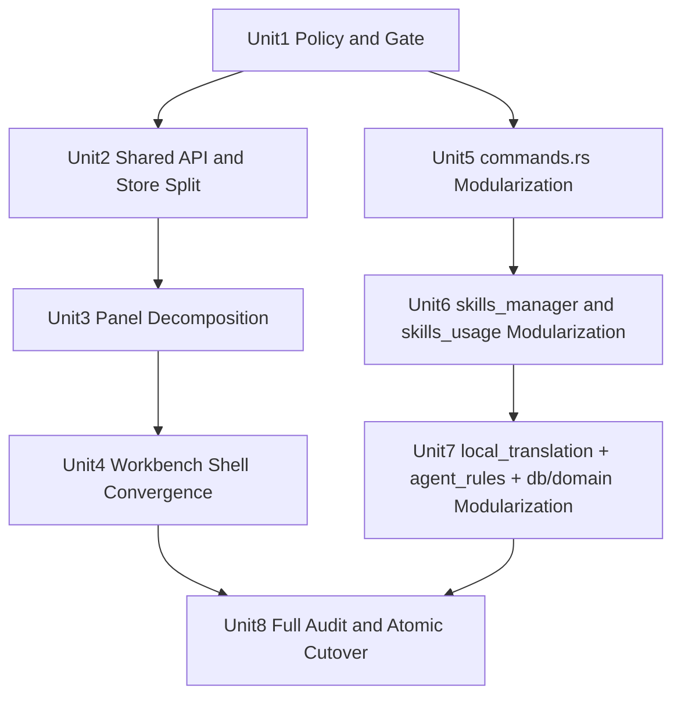

# refactor: Codebase Line Governance And Community-Practice Decomposition

## Overview

围绕 `docs/brainstorms/2026-04-19-codebase-line-governance-requirements.md`，本计划将一次性完成业务源码超长文件治理，并把“社区最佳实践的拆分/抽取规则”转化为可执行门禁、可审计标准和分阶段重构单元。目标不是只做行数压缩，而是同步完成职责收敛、依赖降耦、测试防回归。

## Problem Frame

当前业务源码（`src/**`、`src-tauri/src/**`）存在明显超长文件聚集：
- `>=500` 行文件：13 个
- `>1000` 行文件：6 个
- 重点热点：`src/app/WorkbenchApp.tsx`、`src-tauri/src/control_plane/commands.rs`、`src-tauri/src/control_plane/skills_manager.rs`

历史已有 Workbench 拆分实践和计划，但未完成“全仓达标 + 强制门禁 + 社区规范检查”的闭环（see origin: `docs/brainstorms/2026-04-19-codebase-line-governance-requirements.md`）。

## Requirements Trace

- R1-R4: 仅覆盖业务源码，落实 `500/1000` 双阈值和 allowlist 策略。
- R5-R6: 在合并前门禁阻断 `>1000` 或“非 allowlist 且 >500”。
- R7-R9: 一次性全仓达标，冻结窗口内原子切换，允许破坏式契约收敛。
- R10-R12: 允许小幅行为优化但禁止功能扩张，必须保持核心链路回归可验证。
- R13-R16: 拆分/抽取遵循社区最佳实践，避免伪拆分，并把对齐证据写入评审与测试。

## Scope Boundaries

- 不处理测试文件、文档文件、锁文件、构建产物、自动生成目录的行数限制。
- 不做大版本产品能力扩展和信息架构重做。
- 不保留旧契约兼容层（允许同窗口内破坏式收敛）。

### Deferred to Separate Tasks

- 更大粒度 UI/交互 redesign（超出“小幅行为优化”边界）。
- 新业务域能力（如全新面板、全新命令族）引入。
- 多仓同步治理策略（本计划仅覆盖当前仓库）。

## Context & Research

### Relevant Code and Patterns

- 前端壳层与模块化落点：
  - `src/app/WorkbenchApp.tsx`
  - `src/features/prompts/module/usePromptsModuleController.ts`
  - `src/features/skills/module/useSkillsModuleController.ts`
  - `src/features/settings/module/useSettingsModuleController.ts`
- 前端热点大文件：
  - `src/features/skills/components/SkillsOperationsPanel.tsx`
  - `src/features/settings/components/DataSettingsPanel.tsx`
  - `src/shared/stores/skillsStore.ts`
  - `src/shared/stores/agentRulesStore.ts`
  - `src/shared/services/api.ts`
- Rust/Tauri 热点大文件：
  - `src-tauri/src/control_plane/commands.rs`
  - `src-tauri/src/control_plane/skills_manager.rs`
  - `src-tauri/src/control_plane/local_agent_translation.rs`
  - `src-tauri/src/control_plane/agent_rules_v2.rs`
  - `src-tauri/src/control_plane/skills_usage.rs`
  - `src-tauri/src/db.rs`
  - `src-tauri/src/domain/models.rs`
- 关键回归测试基线：
  - `src/app/WorkbenchApp.skills-operations.test.tsx`
  - `src/app/WorkbenchApp.prompts.test.tsx`
  - `src/app/WorkbenchApp.settings.test.tsx`
  - `src/app/WorkbenchApp.agents.test.tsx`
  - `src/features/skills/components/__tests__/SkillsOperationsPanel.test.tsx`
  - `src/shared/stores/__tests__/skillsStore.operations.test.ts`
  - `src/shared/stores/__tests__/skillsStore.manager.test.ts`
  - `src/shared/stores/__tests__/skillsStore.usage.test.ts`

### Institutional Learnings

- `docs/solutions/best-practices/workbenchapp-modularization-best-practice-2026-04-14.md` 已验证“壳层化 + 模块控制器 + 渐进迁移 + 测试护栏”可行。
- `docs/plans/2026-04-14-002-refactor-workbenchapp-modularization-completion-plan.md` 已给出“避免伪拆分”的明确经验：必须同时检查状态所有权和副作用归属，而不是只看文件搬运。

### External References

- React 官方规则（组件和 Hooks 纯度）：
  - https://react.dev/reference/rules/components-and-hooks-must-be-pure
- React 官方指南（复用逻辑与自定义 Hooks）：
  - https://react.dev/learn/reusing-logic-with-custom-hooks
- Rust 官方指南（按文件拆分模块）：
  - https://doc.rust-lang.org/book/ch07-05-separating-modules-into-different-files.html
- Tauri 官方文档（前端调用 Rust 命令）：
  - https://v2.tauri.app/develop/calling-rust/

## Alternative Approaches Considered

- 方案 A：仅加行数门禁，不做结构治理  
  - 放弃原因：会导致冻结窗口内大量阻断，但无法降低复杂度和回归风险。
- 方案 B：一次性重写 Workbench 与 control_plane  
  - 放弃原因：迁移风险过高，难以在冻结窗口内稳定落地。
- 方案 C：按模块分层抽取 + 同步门禁（本计划）  
  - 选择原因：满足一次性达标，同时保留可回滚、可验证的执行路径。

## Key Technical Decisions

- 决策 1：使用“政策文件 + allowlist + CI 门禁脚本”三件套承载 R1-R6。  
  理由：把规则从口头约束变为机器可执行约束。
- 决策 2：前端按“Feature Module + Controller Hook + Presentational Component”拆分。  
  理由：对齐 React 社区“职责单一 + 逻辑复用”最佳实践，并沿用仓内已验证模式。
- 决策 3：Rust/Tauri 按“命令入口层 / 领域服务层 / 存储访问层”拆分。  
  理由：降低 `control_plane` 超大文件耦合，对齐 Rust 模块化实践。
- 决策 4：把 `#[cfg(test)]` 大块测试从生产文件下沉到专门测试文件（必要时迁至 `src-tauri/tests/`）。  
  理由：避免测试代码反向推高生产文件行数，保持治理口径一致。
- 决策 5：冻结窗口内执行原子切换，不引入兼容双轨。  
  理由：你已明确接受破坏式契约调整，优先降低长期维护成本。

## Open Questions

### Resolved During Planning

- [Affects R3] allowlist 规则：每条记录必须包含 `path`、`maxLines<=1000`、`owner`、`reason`、`reviewBy`（到期复审日期）。
- [Affects R5] 门禁位置：CI 必选；本地检查作为辅助脚本，不作为唯一信任来源。
- [Affects R7] 拆分顺序：先“门禁与基线”，再“前端公共层和热点组件”，再“Workbench 壳层”，最后“Rust control_plane/db/domain”。
- [Affects R13-R16] 社区最佳实践检查清单：前端/后端分别定义必审项，并在 PR 模板中固化检查项。

### Deferred to Implementation

- allowlist 初始条目的最小集合（哪些文件在首轮保留到 `<=1000`）需结合实际拆分进度最终确认。
- 部分 Rust 子模块命名在重构中可按冲突和可读性微调（不改变分层原则）。

## Output Structure

```text
config/
  line-governance.allowlist.json

docs/
  standards/
    code-decomposition-community-practices.md
  ops/
    codebase-line-governance-freeze-window.md
    codebase-line-governance-cutover-checklist.md
  reports/
    2026-04-19-line-governance-baseline.md

.github/
  scripts/
    check_line_limits.mjs
  scripts/tests/
    check_line_limits_contract_test.sh
  workflows/
    line-governance.yml

src/shared/services/
  api/
    workspaceApi.ts
    runtimeApi.ts
    targetApi.ts
    promptApi.ts
    skillsApi.ts
    skillsManagerApi.ts
    skillsUsageApi.ts
    agentRulesApi.ts
    securityApi.ts
    index.ts

src/shared/stores/
  skillsStore/
    index.ts
    selectors.ts
    actions/
      operationsActions.ts
      managerActions.ts
      usageActions.ts
  agentRulesStore/
    index.ts
    normalizers.ts
    actions.ts

src/features/skills/components/
  operations/
    UsageFilters.tsx
    OperationsTable.tsx
    DistributionActions.tsx

src/features/settings/components/
  data-settings/
    TargetsSection.tsx
    AgentConnectionsSection.tsx
    CreateTargetDialog.tsx
    CreateAgentDialog.tsx

src/app/workbench/hooks/
  useWorkbenchPromptsController.ts
  useWorkbenchSkillsController.ts
  useWorkbenchAgentsController.ts
  useWorkbenchSettingsController.ts

src-tauri/src/control_plane/
  commands/
    mod.rs
    workspace_commands.rs
    target_commands.rs
    skills_commands.rs
    prompt_commands.rs
    distribution_commands.rs
    audit_security_commands.rs
  skills_manager/
    mod.rs
    api.rs
    batch_ops.rs
    diff_worker.rs
    snapshot.rs
    rules.rs
    fs_ops.rs
  local_agent_translation/
    mod.rs
    profile.rs
    config.rs
    prompt_translation.rs
    executor.rs
    validation.rs
  skills_usage/
    mod.rs
    api.rs
    parser.rs
    extractor.rs
    persistence.rs
    jobs.rs
  agent_rules_v2/
    mod.rs
    api.rs
    publish.rs
    apply.rs
    normalize.rs

src-tauri/src/db/
  mod.rs
  migrations.rs
  query_helpers.rs

src-tauri/src/domain/models/
  mod.rs
  workspace.rs
  prompts.rs
  skills.rs
  agent_rules.rs
```

## High-Level Technical Design

> *This illustrates the intended approach and is directional guidance for review, not implementation specification. The implementing agent should treat it as context, not code to reproduce.*



## Implementation Units

- [x] **Unit 1: 建立治理政策、allowlist 与门禁脚本**

**Goal:** 把行数治理与社区实践要求转化为机器可执行规则和评审标准。

**Requirements:** R1, R2, R3, R4, R5, R6, R13, R16

**Dependencies:** None

**Files:**
- Create: `config/line-governance.allowlist.json`
- Create: `docs/standards/code-decomposition-community-practices.md`
- Create: `docs/ops/codebase-line-governance-freeze-window.md`
- Create: `.github/scripts/check_line_limits.mjs`
- Create: `.github/scripts/tests/check_line_limits_contract_test.sh`
- Create: `.github/workflows/line-governance.yml`
- Modify: `package.json`

**Approach:**
- 定义 allowlist 数据结构和复审字段，限制上限为 1000。
- 门禁脚本统一统计口径：仅检查 `src/**` 与 `src-tauri/src/**` 的业务源码文件。
- 评审标准文档按前端/后端分别列出“必须满足”的社区最佳实践检查项。

**Patterns to follow:**
- `.github/workflows/release.yml` 的 workflow 组织方式。
- `.github/scripts/tests/release_*_contract_test.sh` 的契约测试风格。

**Test scenarios:**
- Happy path: 文件 `<=500` 时脚本通过。
- Edge case: allowlist 命中且 `<=1000` 时脚本通过。
- Error path: 文件 `>1000` 或非 allowlist 且 `>500` 时脚本阻断。
- Integration: PR 流程可读到 allowlist 并在 CI 中稳定执行。

**Verification:**
- 新增门禁可在 CI 产生确定性通过/失败结果，且失败信息可定位到具体文件。

- [x] **Unit 2: 前端共享服务层与 Store 拆分**

**Goal:** 拆解 `api.ts`、`skillsStore.ts`、`agentRulesStore.ts`，明确领域边界与依赖方向。

**Requirements:** R1, R2, R10, R12, R14, R16

**Dependencies:** Unit 1

**Files:**
- Create: `src/shared/services/api/*.ts`（按领域拆分）
- Modify: `src/shared/services/api.ts`
- Create: `src/shared/stores/skillsStore/*`
- Modify: `src/shared/stores/skillsStore.ts`
- Create: `src/shared/stores/agentRulesStore/*`
- Modify: `src/shared/stores/agentRulesStore.ts`
- Test: `src/shared/stores/__tests__/skillsStore.operations.test.ts`
- Test: `src/shared/stores/__tests__/skillsStore.manager.test.ts`
- Test: `src/shared/stores/__tests__/skillsStore.usage.test.ts`

**Approach:**
- 将“纯转换逻辑、状态派生、异步 action”拆分到独立文件，保留单一职责。
- 主入口文件可保留薄层 re-export 以降低迁移噪音。
- 保证 Store 对 UI 的导出契约稳定，先控结构再控行为。

**Execution note:** 先锁定 store 行为测试再迁移 action/selector，避免重构时语义漂移。

**Patterns to follow:**
- `src/features/prompts/module/usePromptsModuleController.ts` 的 controller 组织方式。

**Test scenarios:**
- Happy path: manager/operations/usage action 在拆分后行为与旧版一致。
- Edge case: 空数据、过滤条件、分页边界下 selector 结果稳定。
- Error path: 后端调用失败时错误状态与提示语义不变。
- Integration: Store 与 panel/controller 组合后可完成完整刷新链路。

**Verification:**
- 三组 store 测试全部通过，且相关文件行数下降到阈值内。

- [x] **Unit 3: SkillsOperationsPanel 与 DataSettingsPanel 组件分层**

**Goal:** 消除超长面板组件，建立“容器 + 子组件 + 局部 hook”结构。

**Requirements:** R2, R10, R11, R12, R14, R16

**Dependencies:** Unit 2

**Files:**
- Create: `src/features/skills/components/operations/*.tsx`
- Modify: `src/features/skills/components/SkillsOperationsPanel.tsx`
- Create: `src/features/settings/components/data-settings/*.tsx`
- Modify: `src/features/settings/components/DataSettingsPanel.tsx`
- Test: `src/features/skills/components/__tests__/SkillsOperationsPanel.test.tsx`
- Test: `src/app/WorkbenchApp.skills-operations.test.tsx`
- Test: `src/app/WorkbenchApp.settings.test.tsx`

**Approach:**
- 将过滤器、表格展示、分发动作从 `SkillsOperationsPanel` 抽成独立子组件。
- 将目标目录与 Agent 连接管理拆成独立 section 与 dialog，`DataSettingsPanel` 只保留编排。

**Patterns to follow:**
- `src/features/prompts/components/*` 的“展示组件 + dialog”边界。
- `src/features/settings/module/SettingsModule.tsx` 的模块装配方式。

**Test scenarios:**
- Happy path: 列表刷新、过滤、批量动作、配置保存路径可用。
- Edge case: 空态、筛选无结果、分页边界、目录超上限时 UI 行为正确。
- Error path: 操作失败后错误反馈与可重试行为保持可用。
- Integration: Workbench 进入 Skills/Settings 后主链路与治理前一致。

**Verification:**
- 两个面板文件行数降至阈值内，且原有测试通过。

- [x] **Unit 4: WorkbenchApp 壳层收敛到编排职责**

**Goal:** 将 `WorkbenchApp.tsx` 收敛为壳层编排文件，迁出模块专属状态与副作用。

**Requirements:** R2, R7, R10, R11, R12, R14, R16

**Dependencies:** Unit 2, Unit 3

**Files:**
- Create: `src/app/workbench/hooks/useWorkbenchPromptsController.ts`
- Create: `src/app/workbench/hooks/useWorkbenchSkillsController.ts`
- Create: `src/app/workbench/hooks/useWorkbenchAgentsController.ts`
- Create: `src/app/workbench/hooks/useWorkbenchSettingsController.ts`
- Modify: `src/app/WorkbenchApp.tsx`
- Modify: `src/features/*/module/use*ModuleController.ts`（必要时）
- Test: `src/app/WorkbenchApp.prompts.test.tsx`
- Test: `src/app/WorkbenchApp.skills-operations.test.tsx`
- Test: `src/app/WorkbenchApp.agents.test.tsx`
- Test: `src/app/WorkbenchApp.settings.test.tsx`

**Approach:**
- 迁移模块局部 state/effect/handler 到各自 controller hook。
- `WorkbenchApp` 保留：路由切换、全局布局、少量跨模块共享状态注入。

**Execution note:** 遵循 characterization-first，禁止“先删状态再补接线”。

**Patterns to follow:**
- `docs/solutions/best-practices/workbenchapp-modularization-best-practice-2026-04-14.md`

**Test scenarios:**
- Happy path: 四大模块切换、常用动作与对话框流转正常。
- Edge case: 模块间来回切换后状态不串扰。
- Error path: 异步失败后的 toast 与 UI 可恢复性不回退。
- Integration: 壳层到模块 controller 的数据透传无断链。

**Verification:**
- `WorkbenchApp.tsx` 降到阈值内，壳层职责清晰且回归通过。

- [x] **Unit 5: commands.rs 命令入口模块化**

**Goal:** 将 `commands.rs` 拆为按命令域组织的模块，减小变更爆炸半径。

**Requirements:** R2, R7, R9, R12, R15, R16

**Dependencies:** Unit 1

**Files:**
- Create: `src-tauri/src/control_plane/commands/mod.rs`
- Create: `src-tauri/src/control_plane/commands/workspace_commands.rs`
- Create: `src-tauri/src/control_plane/commands/target_commands.rs`
- Create: `src-tauri/src/control_plane/commands/skills_commands.rs`
- Create: `src-tauri/src/control_plane/commands/prompt_commands.rs`
- Create: `src-tauri/src/control_plane/commands/distribution_commands.rs`
- Create: `src-tauri/src/control_plane/commands/audit_security_commands.rs`
- Modify: `src-tauri/src/control_plane/mod.rs`
- Modify: `src-tauri/src/lib.rs`
- Test: `src-tauri/src/control_plane/commands/mod.rs`（模块级单测）
- Test: `src-tauri/tests/commands_contract_test.rs`

**Approach:**
- 按命令域拆分文件，保持 `#[tauri::command]` 函数签名不变。
- 通过 `mod.rs` 统一 re-export，确保 `lib.rs` 注册面可维护。

**Patterns to follow:**
- `src-tauri/src/control_plane/mod.rs` 现有模块入口组织方式。
- Rust 模块拆分官方实践（see external refs）。

**Test scenarios:**
- Happy path: 命令注册后可正常被前端 invoke。
- Edge case: 同名 helper 在不同命令域下不冲突。
- Error path: 参数校验与错误类型映射保持一致。
- Integration: 前端 tauriClient 关键调用链路全通。

**Verification:**
- `commands.rs` 不再是超长聚合文件，命令域边界清晰。

- [x] **Unit 6: skills_manager 与 skills_usage 模块化**

**Goal:** 拆分扫描/规则/批处理/异步任务与解析持久化逻辑，降低耦合复杂度。

**Requirements:** R2, R7, R9, R12, R15, R16

**Dependencies:** Unit 5

**Files:**
- Create: `src-tauri/src/control_plane/skills_manager/*.rs`
- Modify: `src-tauri/src/control_plane/skills_manager.rs`
- Create: `src-tauri/src/control_plane/skills_usage/*.rs`
- Modify: `src-tauri/src/control_plane/skills_usage.rs`
- Modify: `src-tauri/src/control_plane/mod.rs`
- Modify: `src-tauri/src/lib.rs`
- Test: `src-tauri/src/control_plane/skills_manager.rs`
- Test: `src-tauri/src/control_plane/skills_usage.rs`
- Test: `src-tauri/tests/skills_manager_contract_test.rs`
- Test: `src-tauri/tests/skills_usage_contract_test.rs`

**Approach:**
- `skills_manager` 拆为：API 层、diff worker、batch ops、rules、fs helper。
- `skills_usage` 拆为：API 层、parser/extractor、persistence、job 管理。

**Patterns to follow:**
- `skills_manager` 现有 diff job 与 snapshot 组织方式。
- `skills_usage` 现有 checkpoint/persist_events 流程。

**Test scenarios:**
- Happy path: manager sync 与 usage sync 主链路保持可用。
- Edge case: 任务并发、重复触发、空数据输入保持幂等。
- Error path: 解析失败/文件异常不阻断整体流程，错误可追溯。
- Integration: UI 发起刷新后，后端任务与进度查询一致。

**Verification:**
- 两个文件行数降到阈值，且核心测试覆盖不退化。

- [x] **Unit 7: local_agent_translation、agent_rules_v2、db/domain 结构拆分**

**Goal:** 完成剩余 Rust 超长文件拆分，统一分层边界和模型组织。

**Requirements:** R2, R7, R9, R10, R12, R15, R16

**Dependencies:** Unit 5, Unit 6

**Files:**
- Create: `src-tauri/src/control_plane/local_agent_translation/*.rs`
- Modify: `src-tauri/src/control_plane/local_agent_translation.rs`
- Create: `src-tauri/src/control_plane/agent_rules_v2/*.rs`
- Modify: `src-tauri/src/control_plane/agent_rules_v2.rs`
- Create: `src-tauri/src/db/*.rs`
- Modify: `src-tauri/src/db.rs`
- Create: `src-tauri/src/domain/models/*.rs`
- Modify: `src-tauri/src/domain/models.rs`
- Modify: `src-tauri/src/control_plane/mod.rs`
- Test: `src-tauri/src/control_plane/local_agent_translation.rs`
- Test: `src-tauri/src/control_plane/agent_rules_v2.rs`
- Test: `src-tauri/tests/db_migration_contract_test.rs`

**Approach:**
- 翻译链路拆为 profile/config/executor/validation，隔离执行细节与参数规范。
- agent rules 拆为 publish/apply/normalize，统一错误语义。
- db 与 domain 按迁移/查询/helper 与业务模型分文件，减少单文件膨胀。

**Patterns to follow:**
- `src-tauri/src/execution_plane/skills.rs` 的执行与数据分层方式。

**Test scenarios:**
- Happy path: 本地翻译、规则发布/回滚、DB 启动迁移链路正常。
- Edge case: 默认配置初始化、空版本/空规则、重启幂等稳定。
- Error path: 执行超时/非法配置/脏数据时错误分类可用。
- Integration: 前端相关页面调用命令后返回结构与关键字段稳定。

**Verification:**
- 目标 Rust 文件降到阈值内，分层边界可读且可测试。

- [x] **Unit 8: 全仓达标审计与冻结窗口原子切换**

**Goal:** 在冻结窗口内完成全仓规则达标、门禁强制启用与切换验收闭环。

**Requirements:** R3, R4, R5, R6, R7, R8, R9, R12, R16

**Dependencies:** Unit 1, Unit 4, Unit 5, Unit 6, Unit 7

**Files:**
- Create: `docs/reports/2026-04-19-line-governance-baseline.md`
- Create: `docs/ops/codebase-line-governance-cutover-checklist.md`
- Create: `docs/solutions/best-practices/codebase-line-governance-best-practice-2026-04-19.md`
- Modify: `.github/workflows/line-governance.yml`

**Approach:**
- 冻结窗口开始前生成基线与目标清单，切换后生成最终合规报告。
- 将 line-governance workflow 设为强制检查项，阻断不合规合并。
- 输出可复用 best-practice 文档，沉淀“非伪拆分”评审样例。

**Test expectation:** none -- 本单元以流程、门禁和文档验收为主，功能验证由前置单元测试与契约测试覆盖。

**Verification:**
- 合并策略生效后，新增改动无法绕过行数门禁；治理结果可审计可复盘。

## System-Wide Impact

- **Interaction graph:** `WorkbenchApp shell -> feature module controllers -> stores/apis -> tauri command groups -> db/domain`.
- **Error propagation:** 前端 action 错误提示语义与 Rust `AppError` 映射需保持一致，避免拆分后出现“错误吞没”。
- **State lifecycle risks:** Store 切片拆分后需防止跨 slice 更新顺序导致的 UI 瞬态不一致。
- **API surface parity:** `src/shared/services/tauriClient.ts` 与 `src-tauri/src/lib.rs` 注册清单需持续一致。
- **Integration coverage:** 仅单测不足以覆盖“页面触发 -> 命令调用 -> DB 写读 -> UI 回显”全链路，需要保留端到端冒烟回归。
- **Unchanged invariants:** 业务能力范围不扩张（R11）；治理目标是结构重构与行数合规，不改业务边界。

## Success Metrics

- 业务源码零 `>1000` 文件。
- 非 allowlist 业务源码零 `>500` 文件。
- allowlist 项目均具备 owner 与复审日期。
- 核心回归测试集通过率不低于治理前基线。
- PR 审查记录可追溯社区最佳实践对齐证据（R13-R16）。

## Risk Analysis & Mitigation

| Risk | Likelihood | Impact | Mitigation |
|------|-----------|--------|------------|
| 冻结窗口内改动量过大导致切换延期 | Med | High | 先完成 Unit1 门禁与清单，再按前后端分层推进，严格按依赖顺序合并 |
| 行数下降但复杂度不降（伪拆分） | Med | High | 强制使用社区实践清单审查“职责、依赖方向、状态归属、测试证据” |
| Rust 模块拆分引发命令注册漏项 | Med | High | 建立命令契约测试，校验 `lib.rs` 注册与前端调用映射 |
| 小幅行为优化超范围 | Low | Med | PR 模板显式标注“行为变更点与非目标”，超界即回滚到独立任务 |
| allowlist 被滥用成为长期豁免 | Med | Med | 每条 allowlist 记录必须包含 `reviewBy`，到期自动触发复审 |

## Documentation / Operational Notes

- 在冻结窗口开始前发布治理公告，明确只接收本计划相关变更。
- 每完成一个单元更新治理报告，记录剩余超长文件和风险项。
- 切换完成后把 line-governance workflow 设为必过状态检查。

## Sources & References

- **Origin document:** `docs/brainstorms/2026-04-19-codebase-line-governance-requirements.md`
- Related plans:
  - `docs/plans/2026-04-14-001-refactor-workbench-prompts-module-extraction-plan.md`
  - `docs/plans/2026-04-14-002-refactor-workbenchapp-modularization-completion-plan.md`
- Institutional learning:
  - `docs/solutions/best-practices/workbenchapp-modularization-best-practice-2026-04-14.md`
- External docs:
  - https://react.dev/reference/rules/components-and-hooks-must-be-pure
  - https://react.dev/learn/reusing-logic-with-custom-hooks
  - https://doc.rust-lang.org/book/ch07-05-separating-modules-into-different-files.html
  - https://v2.tauri.app/develop/calling-rust/
