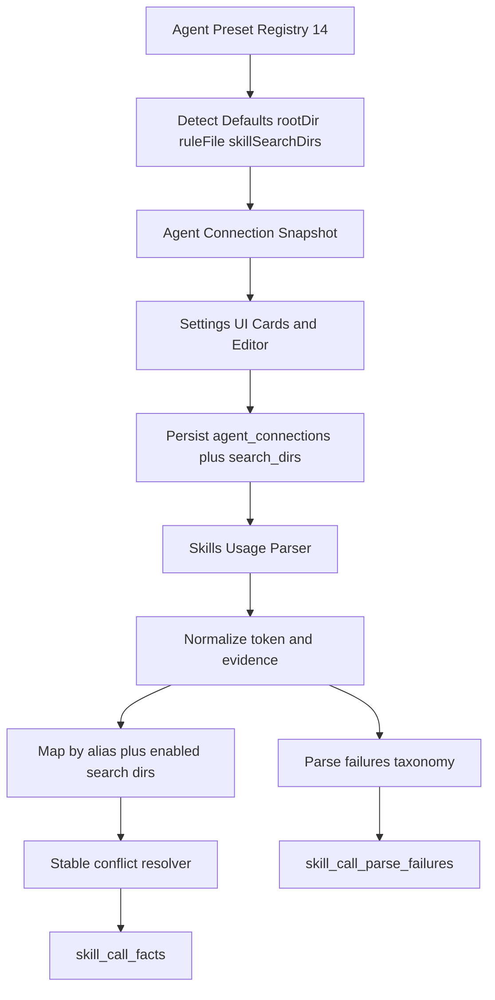
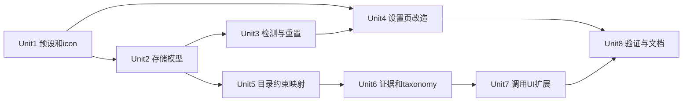

# feat: Skills 调用分析与 Agent 预置化实施计划

## Overview

本计划将 AgentNexus 的 Skills 调用分析从“手工 Agent 配置 + 弱解释映射”升级为“内置 Agent 卡片 + 自动推断配置 + 可解释证据判定”：

- 内置 14 个 Agent 预设，不再要求用户手工命名 Agent
- 默认仅启用 `codex`、`claude`、`gemini`
- Agent 配置升级为 `rootDir + ruleFile + skillSearchDirs[]`
- 调用判定升级为 `observed / inferred` 双层证据与标准化失败 taxonomy
- 映射优先使用“当前 Agent 启用的搜索目录集合”，并保持冲突下稳定排序

## Problem Frame

现状的三类关键缺口（see origin: `docs/brainstorms/2026-04-20-skills-usage-agent-presets-and-call-detection-requirements.md`）：

1. Agent 配置仍以手工文本录入为主，用户要自行命名和填路径，易错且成本高。
2. 调用分析未把 `skillSearchDirs[]` 作为一等输入，映射对目录上下文不敏感，稳定性差。
3. “Skill 被调用”判定仍偏启发式，`skill-not-mapped` 失败不可操作，排障效率低。

## Requirements Trace

- R1-R4: 14 预设、icon 对齐、免命名主流程、默认仅启用 codex/claude/gemini
- R5-R7: 预设自动推断 `rootDir/ruleFile/skillSearchDirs[]`，支持手工覆盖并可恢复默认/重新检测，展示检测状态与路径来源
- R8-R11: Agent 级多目录配置（增删启停）、映射优先使用启用目录集合、多目录冲突稳定排序、无有效目录时显式报错
- R12-R15: 调用事实以证据事件定义，区分强弱证据，输出 `observed/inferred + confidence`，纯文本提及不计调用
- R16-R18: 标准化失败 taxonomy、token 清洗、调用事实幂等去重

## Scope Boundaries

- 不引入云端遥测或远端日志聚合，仍基于本地会话数据。
- 不要求本阶段覆盖所有未知第三方 Agent 日志格式；优先保证内置预设、默认主路径和现有 codex/claude 分析链路稳定。
- 不扩展为自动修复会话日志，仅做识别、归因、统计与可解释输出。

### Deferred to Separate Tasks

- 新增更多 Agent 专有日志 adapter（在获得真实样本后分批落地）。
- 调用失败可视化看板（taxonomy 聚合趋势、按目录维度 drill-down）。

## Context & Research

### Relevant Code and Patterns

- Agent 连接后端模型与 API：`src-tauri/src/control_plane/agent_rules_v2.rs`, `src-tauri/src/control_plane/agent_rules_v2/api.rs`, `src-tauri/src/control_plane/agent_rules_v2/normalize.rs`
- Agent 连接存储与默认初始化：`src-tauri/src/db.rs`
- 调用分析解析与持久化：`src-tauri/src/control_plane/skills_usage/parser.rs`, `src-tauri/src/control_plane/skills_usage/persistence.rs`, `src-tauri/src/control_plane/skills_usage/jobs.rs`, `src-tauri/src/control_plane/skills_usage/api.rs`
- 前端 Agent 配置交互：`src/app/workbench/hooks/useWorkbenchAgentConnections.ts`, `src/features/settings/components/DataSettingsPanel.tsx`, `src/features/settings/components/data-settings/CreateAgentDialog.tsx`, `src/features/settings/components/data-settings/AgentConnectionsSection.tsx`
- 前端契约与状态层：`src/shared/types/workspace.ts`, `src/shared/services/api/agentConnectionApi.ts`, `src/shared/stores/settingsStore.ts`, `src/shared/types/skillsUsage.ts`, `src/shared/stores/skillsStore/actions/usageActions.ts`
- 现有测试锚点：`src/app/WorkbenchApp.settings.test.tsx`, `src/shared/stores/__tests__/skillsStore.usage.test.ts`, `src/features/skills/components/__tests__/SkillUsageTimelineDialog.test.tsx`, `src-tauri/src/control_plane/skills_usage/tests.rs`

### Institutional Learnings

- 同仓 `ce:plan` 任务默认交付“可执行计划并落盘 docs/plans”，优先先固化实施路径再进 `ce:work`。
- 近期 skills usage 已切换到事实表链路（`skill_call_facts`/`skill_call_sync_checkpoints`/`skill_call_parse_failures`），本次改造应延续该主链并做增量扩展，而非回退到旧 metrics 语义。

## Key Technical Decisions

- 决策1：引入“内置 Agent 预设注册表（registry）”并将 Agent 配置主入口改为预设卡片选择，移除手工命名新增路径。
  - 理由：满足 R1/R3，降低配置歧义与拼写漂移。
- 决策2：默认激活集合固定为 `codex`、`claude`、`gemini`，其余预设仅展示可添加状态。
  - 理由：满足 R4，兼顾开箱可用与认知负担控制。
- 决策3：`skillSearchDirs[]` 升级为 Agent 配置一等字段，采用“目录项（path + enabled + priority + source）”数据模型。
  - 理由：满足 R8-R11，支持启停与稳定排序。
- 决策4：映射冲突采用稳定多级排序：`alias匹配质量 > 目录优先级 > source(manual>inferred) > skill_id`。
  - 理由：满足 R10，避免同 token 在不同运行漂移。
- 决策5：调用证据统一输出 `evidenceSource(observed|inferred)` 与 `confidence`，仅强/可解释证据进入事实表。
  - 理由：满足 R12-R15，提升可解释性与信号质量。
- 决策6：`skill-not-mapped` 拆分为标准 taxonomy，并保留排障上下文（token、目录集、alias 命中摘要）。
  - 理由：满足 R16，支持可操作修复。

## Open Questions

### Resolved During Planning

- [Affects R5] `ruleFile` 默认策略：
  - `claude -> CLAUDE.md`
  - 其余预设默认 `AGENTS.md`
  - 允许用户覆盖并标记来源为 `manual`
- [Affects R5] 自动推断优先级：
  - `重新检测` 先走“平台候选路径存在性检查”，命中即设为 inferred
  - 无命中回退预设默认路径
- [Affects R10] 多目录冲突最终排序：
  - 先比 alias 匹配质量（identity exact > name exact > basename/变体）
  - 再比目录 priority（升序）
  - 再比目录来源（manual > inferred）
  - 最后以 `skill_id` 字典序稳定收敛
- [Affects R16] 失败 taxonomy 最小集合：
  - `token-invalid`
  - `token-empty-or-noise`
  - `search-dirs-empty`
  - `search-dirs-no-match`
  - `alias-conflict`
  - `alias-not-found`
  - `json-parse-failed`
  - `agent-format-unsupported`

### Deferred to Implementation

- Gemini 与其余非 codex/claude 平台的日志格式采样阈值和 fallback 细则，需结合真实本机数据微调。
- detection 状态文案的多语言细粒度（是否区分 missing/permission-denied/invalid），在 UI 验证阶段收敛最终词汇。

## Output Structure

```text
src/assets/platforms/
  claude.png
  copilot.png
  cursor.png
  windsurf.png
  kiro.png
  gemini.png
  trae.png
  opencode.png
  codex.png
  roo.png
  amp.png
  openclaw.png
  qoder.png
  codebuddy-light.svg
  codebuddy-dark.svg

src/features/settings/components/data-settings/
  agentPresets.ts
  PlatformPresetIcon.tsx
  AgentPresetGrid.tsx
  AgentSkillSearchDirsEditor.tsx
```

## High-Level Technical Design

> *This illustrates the intended approach and is directional guidance for review, not implementation specification. The implementing agent should treat it as context, not code to reproduce.*



## Implementation Units

- [x] **Unit 1: 内置 Agent 预设注册表与 icon 资产接入**

**Goal:** 在前后端建立统一的 14 平台预设元数据。

**Requirements:** R1, R2, R4, R5

**Dependencies:** None

**Files:**
- Create: `src/features/settings/components/data-settings/agentPresets.ts`
- Create: `src/features/settings/components/data-settings/PlatformPresetIcon.tsx`
- Create: `src/assets/platforms/claude.png`
- Create: `src/assets/platforms/copilot.png`
- Create: `src/assets/platforms/cursor.png`
- Create: `src/assets/platforms/windsurf.png`
- Create: `src/assets/platforms/kiro.png`
- Create: `src/assets/platforms/gemini.png`
- Create: `src/assets/platforms/trae.png`
- Create: `src/assets/platforms/opencode.png`
- Create: `src/assets/platforms/codex.png`
- Create: `src/assets/platforms/roo.png`
- Create: `src/assets/platforms/amp.png`
- Create: `src/assets/platforms/openclaw.png`
- Create: `src/assets/platforms/qoder.png`
- Create: `src/assets/platforms/codebuddy-light.svg`
- Create: `src/assets/platforms/codebuddy-dark.svg`
- Test: `src/app/WorkbenchApp.settings.test.tsx`

**Approach:**
- 定义预设 registry：`id/name/defaultEnabled/defaultRootDir/defaultRuleFile/defaultSkillSearchDirs/candidateRoots`。
- registry 为唯一事实来源，前端卡片展示与后端默认推断共用同一 platform id 集合。
- icon 命名与平台 id 一致，避免 UI 层额外映射漂移。

**Execution note:** 先补 registry 与 icon 渲染测试，再替换设置页入口，避免 UI 改造过程中 platform id 漏配。

**Patterns to follow:**
- `src/app/workbench/utils.ts` 现有默认路径与 agent 排序函数（将迁移为 registry 驱动）

**Test scenarios:**
- Happy path: 14 预设完整渲染且 icon 显示正确。
- Edge case: `codebuddy` 在浅/深色模式使用对应 light/dark 资产。
- Error path: 单个 icon 资源缺失时 fallback 图标可见且不阻断列表渲染。
- Integration: 默认激活集合仅为 codex/claude/gemini，其他预设初始不启用。

**Verification:**
- 设置页可稳定展示 14 个预设卡片，默认“已启用”仅 3 个平台。

- [x] **Unit 2: Agent 连接存储模型升级（支持 skillSearchDirs 与来源信息）**

**Goal:** 将 Agent 连接持久化模型扩展为可表达多目录、路径来源和检测状态。

**Requirements:** R5, R6, R7, R8, R11

**Dependencies:** Unit 1

**Files:**
- Modify: `src-tauri/src/db.rs`
- Modify: `src-tauri/src/domain/models.rs`
- Modify: `src-tauri/src/control_plane/agent_rules_v2.rs`
- Modify: `src-tauri/src/control_plane/agent_rules_v2/api.rs`
- Modify: `src-tauri/src/control_plane/agent_rules_v2/normalize.rs`
- Test: `src-tauri/src/control_plane/agent_rules_v2.rs`
- Test: `src-tauri/src/db.rs`

**Approach:**
- 新增 `agent_connection_search_dirs`（或等价规范化结构）承载目录项：`path/enabled/priority/source`。
- `agent_connections` 补充字段：`root_dir_source`、`rule_file_source`、`detected_at`（或等价 provenance 字段）。
- migration 保证幂等：历史数据迁移为单目录 inferred 项，空目录不自动启用分析。

**Technical design:** *(directional guidance)*

```text
on workspace bootstrap:
  ensure preset rows exist
  enable only defaultEnabled presets
  infer and persist defaults for root/rule/search_dirs (source=inferred)
```

**Patterns to follow:**
- `src-tauri/src/db.rs` 现有 `run_*_migration_once` 迁移组织方式
- `src-tauri/src/control_plane/agent_rules_v2/api.rs` 现有 upsert/toggle/list 结构

**Test scenarios:**
- Happy path: 新 workspace 首次加载时生成 14 预设连接，默认仅 3 个 enabled。
- Edge case: 历史 workspace 升级后保留用户原手工 root/rule，并补齐 search_dirs。
- Error path: enabled=true 且无有效 search dir 时返回显式校验错误。
- Integration: list 接口可同时返回配置值、来源信息、检测状态。

**Verification:**
- 后端存储层可完整表达 `rootDir/ruleFile/skillSearchDirs[]` 与来源、检测状态。

- [x] **Unit 3: Agent 检测与重置能力（重新检测 / 恢复默认）**

**Goal:** 提供可操作的“重新检测”和“恢复默认”能力，并将结果写回连接配置。

**Requirements:** R5, R6, R7

**Dependencies:** Unit 2

**Files:**
- Modify: `src-tauri/src/control_plane/agent_rules_v2/api.rs`
- Modify: `src-tauri/src/control_plane/agent_rules_v2/normalize.rs`
- Modify: `src/shared/types/workspace.ts`
- Modify: `src/shared/services/api/agentConnectionApi.ts`
- Modify: `src/shared/services/tauriClient.ts`
- Test: `src-tauri/src/control_plane/agent_rules_v2.rs`
- Test: `src/app/WorkbenchApp.settings.test.tsx`

**Approach:**
- 新增连接操作命令：
  - `agent_connection_redetect`
  - `agent_connection_restore_defaults`
- `redetect` 采用候选路径存在性优先；`restore_defaults` 直接回退 registry 默认值。
- list DTO 增加 `detectionStatus/pathSource`，用于 UI 标识“推断/手工覆盖”。

**Patterns to follow:**
- `agent_connection_upsert/toggle` 的输入校验与错误返回模式

**Test scenarios:**
- Happy path: `redetect` 命中现有目录时更新配置并标记 inferred 来源。
- Happy path: `restore_defaults` 将手工覆盖值回退到预设默认并更新来源。
- Edge case: 未命中任何候选目录时返回 `undetected` 状态但不覆盖手工有效值。
- Error path: 目录存在但权限不足时状态为 `permission_denied`（或等价状态码）。
- Integration: UI 刷新后可看到状态变化与来源切换。

**Verification:**
- 用户可在设置页执行“重新检测/恢复默认”，结果状态可见且可持久化。

- [x] **Unit 4: 设置页交互改造为预设卡片 + 多目录编辑**

**Goal:** 用“内置预设卡片 + 编辑弹窗”替代手工命名新增流程，并提供多目录增删启停。

**Requirements:** R3, R4, R6, R7, R8, R11

**Dependencies:** Unit 1, Unit 2, Unit 3

**Files:**
- Modify: `src/features/settings/components/DataSettingsPanel.tsx`
- Modify: `src/features/settings/components/data-settings/AgentConnectionsSection.tsx`
- Modify: `src/features/settings/components/data-settings/CreateAgentDialog.tsx`
- Modify: `src/features/settings/components/data-settings/types.ts`
- Create: `src/features/settings/components/data-settings/AgentPresetGrid.tsx`
- Create: `src/features/settings/components/data-settings/AgentSkillSearchDirsEditor.tsx`
- Modify: `src/app/workbench/hooks/useWorkbenchAgentConnections.ts`
- Modify: `src/app/workbench/hooks/useWorkbenchSkillSettingsActions/agentConnectionActions.ts`
- Modify: `src/shared/stores/settingsStore.ts`
- Test: `src/app/WorkbenchApp.settings.test.tsx`

**Approach:**
- “新增 Agent”改为“从预设中添加/启用”，不再出现名称输入框。
- 编辑弹窗增加 `skillSearchDirs[]` 管理：新增、删除、启停、优先级调整。
- 连接卡片展示检测状态徽标与路径来源（inferred/manual）。
- 默认只显示 3 个已启用卡片，其余在“可添加平台”区域展示。

**Execution note:** 先实现卡片渲染与启用逻辑，再切换旧对话框字段，避免出现混合模式状态漂移。

**Patterns to follow:**
- `src/features/settings/components/TargetsSection` 的列表 + 弹窗操作结构
- `src/features/skills/components/operations` 区域的状态 tag 呈现样式

**Test scenarios:**
- Happy path: 进入基础设置可见 14 平台卡片，默认仅 3 平台显示已启用状态。
- Happy path: 用户添加任意非默认预设后，进入可编辑态且无需输入名称。
- Edge case: 禁用某平台后再次启用，保留上次手工覆盖路径与目录开关。
- Error path: 尝试保存“无有效 skillSearchDirs”时显示校验错误。
- Integration: 触发 `redetect/restore_defaults` 后卡片状态与编辑器内容同步更新。

**Verification:**
- 设置页主流程完全实现“免命名 + 预设选择 + 多目录编辑 + 状态可视化”。

- [x] **Unit 5: 调用映射按 Agent 启用目录集合收敛并稳定排序**

**Goal:** 改造 usage 映射逻辑，优先使用当前 Agent 的启用目录集合并确保冲突稳定。

**Requirements:** R9, R10, R11, R18

**Dependencies:** Unit 2

**Files:**
- Modify: `src-tauri/src/control_plane/skills_usage/mod.rs`
- Modify: `src-tauri/src/control_plane/skills_usage/persistence.rs`
- Modify: `src-tauri/src/control_plane/skills_usage/parser.rs`
- Modify: `src-tauri/src/control_plane/skills_usage/jobs.rs`
- Test: `src-tauri/src/control_plane/skills_usage/tests.rs`

**Approach:**
- 构建 `agent -> enabled search dirs` 运行时索引，并在映射阶段作为强约束过滤条件。
- alias entry 扩展来源路径信息（skill local/source path），用于目录命中判断。
- 多目录命中时应用稳定排序策略，确保同 token 重跑结果一致。
- 当 agent 无有效启用目录时，记录标准失败并跳过写入 facts。

**Technical design:** *(directional guidance)*

```text
resolve_skill(token, agent):
  candidates = alias_index[token_variants]
  scoped = candidates.filter(path_in_enabled_dirs(agent))
  if scoped.empty -> failure(search-dirs-no-match or search-dirs-empty)
  return stable_sort(scoped).first()
```

**Patterns to follow:**
- `normalize_skill_alias_candidates` 现有 token 归一化入口
- `count_insert_projection + dedupe_key` 现有幂等策略

**Test scenarios:**
- Happy path: 同 token 在多个目录命中时，总是选中同一 skill。
- Edge case: 禁用目录后，映射结果实时切换到下一个优先级目录。
- Edge case: 目录列表顺序变化后，冲突选择随 priority 规则稳定变化。
- Error path: 无目录可用时不写 facts，并输出 `search-dirs-empty`。
- Integration: 重复解析同会话不重复计数，目录变更只影响后续新事件映射。

**Verification:**
- 使用启用目录集合的映射结果可复现且不漂移。

- [x] **Unit 6: 证据分层判定与失败 taxonomy 标准化**

**Goal:** 将“Skill 被调用”判定升级为证据事件模型，并输出可排障失败分类。

**Requirements:** R12, R13, R14, R15, R16, R17

**Dependencies:** Unit 5

**Files:**
- Modify: `src-tauri/src/control_plane/skills_usage/parser.rs`
- Modify: `src-tauri/src/control_plane/skills_usage/persistence.rs`
- Modify: `src-tauri/src/control_plane/skills_usage/api.rs`
- Modify: `src-tauri/src/db.rs`
- Modify: `src/shared/types/skillsUsage.ts`
- Test: `src-tauri/src/control_plane/skills_usage/tests.rs`
- Test: `src/shared/stores/__tests__/skillsStore.usage.test.ts`

**Approach:**
- 引入证据字段：`evidenceSource(observed|inferred)`、`evidenceKind`、`confidence`。
- 强证据（显式 use-skill、SKILL.md 路径引用、可识别工具输出）计入调用；普通文本提及不计调用。
- `sanitize_skill_token` 增强噪声清洗（括号、引号、转义残留、尾部符号）。
- `skill-not-mapped` 分解为标准 taxonomy 并写入 `skill_call_parse_failures`。

**Execution note:** 先补 parser 单元测试覆盖 token 清洗与分类，再调整入库字段，避免行为回归。

**Patterns to follow:**
- 现有 `ParsedSkillCall` 和 `build_parse_failure_summary` 测试组织方式

**Test scenarios:**
- Happy path: 强证据事件写入 facts，`evidenceSource=observed` 且高 confidence。
- Happy path: 弱但可解释证据写入 `inferred`，confidence 低于 observed。
- Edge case: 仅普通文本提及 skill 名称，不产生调用事件。
- Error path: token 噪声输入产出 `token-invalid`/`token-empty-or-noise`。
- Integration: 失败摘要可聚合 taxonomy top reasons，错误可读性可用于 UI 提示。

**Verification:**
- 调用判定结果可解释，失败分类具备可操作语义。

- [x] **Unit 7: 调用记录 UI 与筛选模型扩展（observed/inferred 可见）**

**Goal:** 在调用记录与统计视图暴露证据来源、置信度与失败可排障信息。

**Requirements:** R13, R16, R17

**Dependencies:** Unit 6

**Files:**
- Modify: `src/features/skills/components/SkillUsageTimelineDialog.tsx`
- Modify: `src/features/skills/components/__tests__/SkillUsageTimelineDialog.test.tsx`
- Modify: `src/features/skills/components/operations/UsageFilters.tsx`
- Modify: `src/shared/stores/skillsStore/actions/usageActions.ts`
- Modify: `src/shared/stores/skillsStore/selectors.ts`
- Test: `src/shared/stores/__tests__/skillsStore.usage.test.ts`

**Approach:**
- 时间轴项新增证据标签（observed/inferred）与稳定置信度展示。
- 刷新后错误信息优先展示 taxonomy 摘要而非笼统 `skill-not-mapped`。
- 维持现有非阻塞刷新交互与进度条，避免引入额外等待步骤。

**Patterns to follow:**
- `SkillUsageTimelineDialog` 现有 Tag 呈现结构
- `usageActions` 现有 sync polling 模型

**Test scenarios:**
- Happy path: 调用记录中可见 evidence 标签与 confidence 数值。
- Edge case: `completed_with_errors` 场景显示 taxonomy 摘要并仍展示已成功记录。
- Error path: 查询失败时保留上次成功数据并展示可重试错误提示。
- Integration: 列表与详情筛选条件一致时，统计与时间轴口径一致。

**Verification:**
- UI 可直接解释“为何判定为调用/为何映射失败”。

- [x] **Unit 8: 端到端回归与文档收敛**

**Goal:** 完成关键回归验证并更新文档，确保后续进入 `ce:work` 时可直接执行。

**Requirements:** R1-R18

**Dependencies:** Unit 1-7

**Files:**
- Modify: `docs/brainstorms/2026-04-20-skills-usage-agent-presets-and-call-detection-requirements.md`
- Create: `docs/ops/skills-usage-agent-presets-rollout-checklist.md`
- Modify: `docs/plans/2026-04-20-001-feat-skills-usage-agent-presets-and-call-detection-plan.md`
- Test: `src/app/WorkbenchApp.settings.test.tsx`
- Test: `src/shared/stores/__tests__/skillsStore.usage.test.ts`
- Test: `src-tauri/src/control_plane/skills_usage/tests.rs`
- Test: `src-tauri/src/control_plane/agent_rules_v2.rs`

**Approach:**
- 汇总验收 checklist：默认启用集、免命名、icon 对齐、多目录映射稳定性、taxonomy 可解释性、幂等去重。
- 明确发布前 smoke 覆盖：设置页、usage 刷新、timeline 展示、失败分类可见。
- 保留“未覆盖日志格式”的边界说明，避免误判为全平台格式已支持。

**Patterns to follow:**
- `docs/ops/*checklist*.md` 既有运维清单格式

**Test scenarios:**
- Happy path: 新建 workspace 后直接可用默认 3 平台并完成一次 usage 分析。
- Edge case: 用户启用额外平台但未配置有效目录时，收到明确校验错误。
- Error path: 解析失败不阻断整体任务，统计无重复膨胀。
- Integration: 完整链路满足 requirements 成功标准并与 scope 边界一致。

**Verification:**
- 验收清单可逐条对照 R1-R18，进入实施阶段无需再补规划层定义。

## Implementation Dependency Graph



## System-Wide Impact

- **Interaction graph:** `Preset Registry -> Agent Config Persist -> Usage Parser -> Facts/Failures -> Stats/Timeline UI`
- **Error propagation:** 配置校验错误在设置页即时提示；解析错误写 `skill_call_parse_failures` 并通过 job summary 回传，不阻断整体同步。
- **State lifecycle risks:** 目录优先级变更、手工覆盖与重检测切换、历史数据迁移幂等需要明确状态机。
- **API surface parity:** 新增连接检测/重置能力与 `skillSearchDirs[]` 契约；保持现有调用同步命令名不变，扩展结果字段。
- **Integration coverage:** 必测“默认启用集”“免命名流”“多目录稳定映射”“taxonomy 可解释”“重复解析幂等”。
- **Unchanged invariants:** 不改变本地 session 驱动分析模式；不引入云端采集；不改动分发链路的核心行为语义。

## Risks & Dependencies

| Risk | Mitigation |
|------|------------|
| 14 预设一次性引入导致 UI/状态复杂度上升 | registry 单一事实源 + 默认启用最小集 + 卡片分区（已启用/可添加） |
| 多目录冲突规则实现不一致导致映射漂移 | 固化稳定排序算法并在 parser tests 做固定样本断言 |
| 失败 taxonomy 过细导致 UI 负担 | 先落地最小可操作集合，UI 展示聚合摘要，明细保留在 failure 表 |
| 历史 workspace 迁移破坏已有手工配置 | migration 以“保留用户值优先，仅补缺省字段”为原则 |
| 非 codex/claude 平台日志格式不稳定 | 明确 `agent-format-unsupported` 边界并在文档声明分阶段扩展 |

## Alternative Approaches Considered

- 方案A：保留手工新增 Agent，仅补自动填默认值。
  - 放弃原因：仍需用户输入名称，无法满足 R3 的免命名目标。
- 方案B：继续只用 alias 名称映射，不引入 `skillSearchDirs[]` 约束。
  - 放弃原因：无法满足 R9/R10 的目录上下文与稳定冲突排序要求。
- 方案C：把所有文本提及都算作弱调用。
  - 放弃原因：违背 R15，噪声过大且不可解释。

## Success Metrics

- 设置页新增 Agent 主流程不再出现名称输入字段。
- 新 workspace 默认启用平台严格等于 `codex`、`claude`、`gemini`。
- 多目录冲突样本重跑 10 次映射结果一致。
- `skill-not-mapped` 错误可分解为标准 taxonomy，且摘要可读可操作。
- 同一会话重复同步不产生重复计数（dedupe 保持稳定）。

## Documentation / Operational Notes

- 本计划完成后进入 `ce:work` 时，优先按 Unit 依赖顺序执行，避免“先改 parser 后改存储契约”的反向依赖返工。
- 发布说明需明确：本轮是“预设与判定能力升级”，不是“14 平台日志格式全覆盖”。

## Sources & References

- **Origin document:** [docs/brainstorms/2026-04-20-skills-usage-agent-presets-and-call-detection-requirements.md](docs/brainstorms/2026-04-20-skills-usage-agent-presets-and-call-detection-requirements.md)
- Related code:
  - `src-tauri/src/control_plane/agent_rules_v2/api.rs`
  - `src-tauri/src/control_plane/skills_usage/parser.rs`
  - `src/app/workbench/hooks/useWorkbenchAgentConnections.ts`
  - `src/features/settings/components/DataSettingsPanel.tsx`
  - `src/shared/stores/settingsStore.ts`
