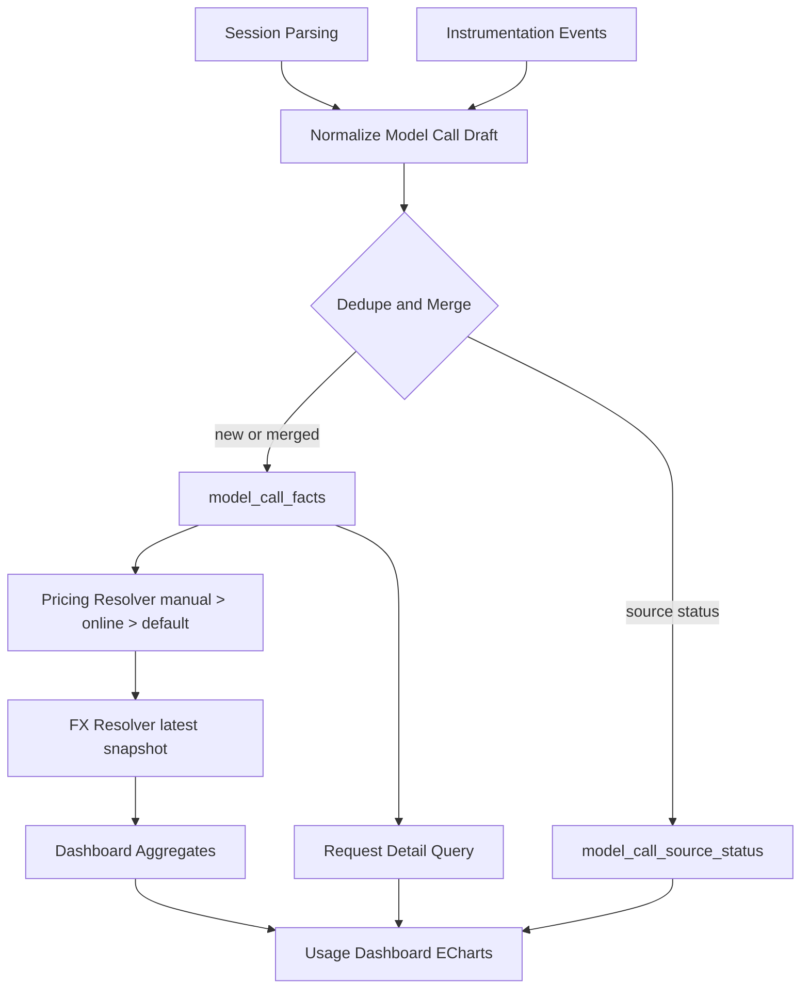
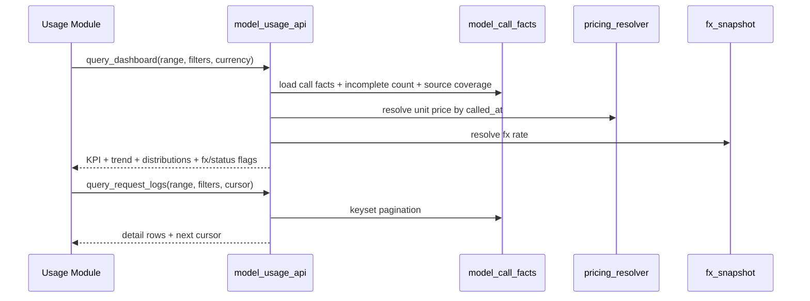

# feat: 模型使用与成本看板实施计划

## Overview

本计划为 AgentNexus 新增左侧独立“模型使用与成本看板”模块，目标是在一期交付中形成可解释、可追溯、可筛选的模型调用事实与成本视图：

- 覆盖 14 个预设 Agent 的模型调用口径；
- 使用 `session 解析 + 埋点事件` 双来源融合，并具备幂等去重；
- 严格执行“无 model/token 不估算”；
- 以“默认单价 + 在线同步 + 手动覆盖”计算成本；
- 支持 USD/CNY 双币种及汇率过期标记；
- 图表统一使用 Apache ECharts，并提供请求级明细筛选。

## Problem Frame

现有 AgentNexus 的使用统计以 Skill 调用为中心，缺少模型维度的请求、Token、成本统一事实层。导致：

1. 不能直接回答“哪个模型成本最高/增长最快/失败异常”；
2. 定价与汇率口径缺少统一策略，跨时间对比不可解释；
3. 缺少请求级明细回溯，异常定位成本高。

本计划以 `docs/brainstorms/2026-04-21-model-usage-cost-dashboard-requirements.md` 为唯一产品输入，技术方案只做实现收敛，不重定义产品行为。

## Requirements Trace

- R1-R3（入口与范围）：
  - 新增左侧独立模块入口；
  - 覆盖 14 预设 Agent；
  - 默认 30 天，支持 7/30/90 天。
- R4-R7（数据来源与融合）：
  - 双来源事实融合；
  - 统一字段口径；
  - 幂等去重；
  - 单源失败不阻断，展示来源覆盖状态。
- R8-R9（缺失数据口径）：
  - 不做 model/token 估算；
  - 显式展示“数据不完整”计数。
- R10-R16（定价、汇率、币种）：
  - 默认单价 + 在线同步 + 手动覆盖；
  - 同步失败回退默认；
  - 每日自动 + 手动同步；
  - USD/CNY 双币种；
  - 汇率失败回退快照并标记过期。
- R17-R20（指标与图表）：
  - 核心指标 + 成本/Token/模型分布/状态分布；
  - 图表库强制 Apache ECharts；
  - 时间与筛选联动口径一致。
- R21-R23（请求明细）：
  - 明细日志表；
  - `agent/model/status/时间` 筛选；
  - 列字段完整。

## Scope Boundaries

- 不引入云端集中遥测平台，保持本地融合。
- 不做缺失 `model/token` 的智能补算。
- 不在本阶段加入预算告警、阈值通知、自动优化建议。

### Deferred to Separate Tasks

- 预算阈值告警与策略自动化。
- 面向团队协作的跨设备成本看板同步能力。
- 更多外部价格源的多租户治理（当前只落地单价格源接入框架）。

## Context & Research

### Relevant Code and Patterns

- 壳层模块切换与左侧导航：
  - `src/features/shell/types.ts`
  - `src/features/shell/Sidebar.tsx`
  - `src/app/workbench/hooks/WorkbenchAppContent.tsx`
  - `src/shared/stores/shellStore.ts`
- Tauri 命令注册与控制面组织：
  - `src-tauri/src/lib.rs`
  - `src-tauri/src/control_plane/mod.rs`
  - `src-tauri/src/control_plane/commands/mod.rs`
- 现有事实同步与作业模式（可直接借鉴）：
  - `src-tauri/src/control_plane/skills_usage/mod.rs`
  - `src-tauri/src/control_plane/skills_usage/api.rs`
  - `src-tauri/src/control_plane/skills_usage/parser.rs`
  - `src-tauri/src/control_plane/skills_usage/persistence.rs`
  - `src-tauri/src/control_plane/skills_usage/jobs.rs`
- 现有迁移与 schema 演进模式：
  - `src-tauri/src/db.rs`
  - `src-tauri/src/db/schema.rs`
- 前端 API 契约与类型收口：
  - `src/shared/services/tauriClient.ts`
  - `src/shared/services/api/coreApi.ts`
  - `src/shared/types/index.ts`

### Institutional Learnings

- `docs/solutions/best-practices/workbenchapp-modularization-best-practice-2026-04-14.md`：
  - 壳层薄、模块厚，新能力应通过 module/controller 下沉，不向 `WorkbenchAppContent` 回灌复杂逻辑。
- `docs/solutions/best-practices/codebase-line-governance-best-practice-2026-04-19.md`：
  - Rust 侧按 `api/domain(parser)/persistence/jobs` 拆分，避免新增长文件。

## Key Technical Decisions

- 决策1：新增独立主模块 `usage`，不挂在 Skills 子视图。
  - 理由：满足 R1，避免把模型成本域耦合进 Skill 运营域。
- 决策2：复用 `skills_usage` 的“后台作业 + 进度轮询 + 幂等落库”骨架，新建 `model_usage` 控制面模块。
  - 理由：减少新架构引入，降低实现复杂度。
- 决策3：统一事实主表按“请求”建模，`source` 保留来源信息，`is_complete` 标记是否具备计费字段。
  - 理由：满足 R5、R8、R9，并保障明细可追溯。
- 决策4：去重采用“强键优先、弱键补位”的双层规则，并在冲突时做字段完整性合并。
  - 理由：满足 R6，同时控制同秒多请求与重试误合并风险。
- 决策5：定价解析严格按 `manual override > online snapshot > builtin default`。
  - 理由：满足 R10-R14，并保证同步失败可回退。
- 决策6：汇率使用“最新成功快照”，获取失败时继续使用并标记 `fxStale=true`。
  - 理由：满足 R15-R16，优先保证可用性和可解释性。
- 决策7：明细采用 keyset 分页（`timestamp + id`），并设定 180 天保留策略（按天清理）。
  - 理由：回答 deferred 问题并平衡排障效率与本地存储成本。
- 决策8：图表层只引入 Apache ECharts，不引入 Recharts 兼容层。
  - 理由：满足 R18，避免双图库成本。

## Open Questions

### Resolved During Planning

- [Affects R6] 双来源去重键与冲突规则：
  - 强键：优先使用 `requestId/traceId`（若存在）。
  - 弱键：`workspaceId + agent + provider + sessionId + eventRef + model + timestamp_ms + input/outputTokens + status` 的 hash。
  - 重试识别：保留 `attemptKey`（来源字段中的 attempt/retry 序号；缺失则回落 eventRef）。
  - 冲突处理：`ON CONFLICT(dedupe_key)` 时执行字段完整性合并（优先非空 `model/tokens/status`），并更新来源覆盖标记。
- [Affects R10-R14] 在线价格源字段映射、版本化与生效时间：
  - 统一映射到 `normalized_model_key`；
  - 每次同步落 `pricing_snapshot_version` 与 `effective_from`；
  - 查询按请求时间取 `effective_from <= called_at` 的最近快照。
- [Affects R21-R23] 明细保留周期与分页策略：
  - 保留周期：180 天；
  - 分页策略：keyset 分页，避免高 offset 性能衰减；
  - 排序主键：`timestamp DESC, id DESC`。

### Deferred to Implementation

- 在线价格源首选提供方与限流参数（需结合实际可用性配置）。
- 长尾模型名归一化映射表的首版覆盖范围（先覆盖主流模型，逐步扩展）。
- 各 Agent 埋点事件中的 requestId 缺失场景兼容细节（依赖真实样本调优）。

## Output Structure

```text
src/features/usage/
  module/
    UsageModule.tsx
  components/
    UsageDashboard.tsx
    UsageKpiCards.tsx
    UsageFiltersBar.tsx
    SourceCoverageBar.tsx
    PricingPanel.tsx
    RequestDetailTable.tsx
    charts/
      CostTrendChart.tsx
      TokenTrendChart.tsx
      ModelCostDistributionChart.tsx
      StatusDistributionChart.tsx
  hooks/
    useUsageDashboardController.ts
  utils/
    usageFormat.ts

src-tauri/src/control_plane/model_usage/
  mod.rs
  api.rs
  jobs.rs
  parser.rs
  persistence.rs
  pricing.rs
  tests.rs

src/shared/types/
  modelUsage.ts
```

## 模块技术方案（从顶至下，从宏观到微观，从整体到局部，从抽象到具象）

### 宏观（L0：业务闭环）

目标闭环：`采集 -> 融合 -> 计费 -> 汇率 -> 聚合 -> 展示 -> 回溯`。  
产品只消费“真实可计费请求”，不对缺失字段做推测补算。

### 中观（L1-L2：架构分层）

1. 采集层
   - Session 解析器；
   - 埋点事件解析器；
   - 来源健康状态监测。
2. 融合层
   - 统一事实标准化；
   - 幂等去重与冲突合并；
   - 不完整数据标记。
3. 计费层
   - 三层定价解析器；
   - 汇率快照解析器；
   - 按请求时间点计算 USD/CNY。
4. 查询层
   - KPI 聚合；
   - 趋势与分布数据集；
   - 明细筛选与分页。
5. 展示层
   - 独立模块入口；
   - ECharts 图表矩阵；
   - 明细日志与来源覆盖可视化。

### 微观（L3：核心模块职责）

- `model_usage/parser`：来源事件标准化，输出统一事实草稿。
- `model_usage/persistence`：去重写入、健康状态写入、聚合查询。
- `model_usage/pricing`：价格快照/覆盖管理与成本计算。
- `usage dashboard controller`：统一过滤器状态，驱动 KPI/图表/明细一致刷新。

### 具象（L4：关键流程与可验收产物）





## Phased Delivery（分阶段可验收）

### Phase 1：独立入口与事实采集基座

- 覆盖 Unit 1 + Unit 2。
- 验收标准：
  - 左侧可进入独立 Usage 模块（R1）；
  - 双来源同步任务可运行并产出统一事实（R4、R5）；
  - 同批重复同步不膨胀（R6）；
  - 单来源失败时仍有可用统计且显示来源状态（R7）。

### Phase 2：定价与汇率可解释计算

- 覆盖 Unit 3。
- 验收标准：
  - 三层定价优先级生效（R10-R14）；
  - USD/CNY 双币展示可返回（R15）；
  - 汇率失败时使用快照并标记过期（R16）。

### Phase 3：看板可视化与请求回溯

- 覆盖 Unit 4 + Unit 5。
- 验收标准：
  - KPI 与四类图表齐备且用 ECharts（R17-R20）；
  - 明细筛选字段齐全（R21-R23）；
  - `model/token` 缺失数据不计费且不完整计数可见（R8、R9）。

### Phase 4：回归收口与稳定性验证

- 覆盖 Unit 6。
- 验收标准：
  - 壳层模块切换、命令契约、关键失败路径回归通过；
  - 迁移后旧数据可读，且不破坏现有 Skills Usage 链路。

## Implementation Units

- [x] **Unit 1: 左侧独立模块入口与壳层编排接线**

**Goal:** 新增 `usage` 主模块入口并完成 Workbench 壳层接线，不把模型看板塞进 Skills 子视图。

**Requirements:** R1, R3

**Dependencies:** None

**Files:**
- Modify: `src/features/shell/types.ts`
- Modify: `src/features/shell/Sidebar.tsx`
- Modify: `src/shared/stores/shellStore.ts`
- Modify: `src/app/workbench/hooks/WorkbenchAppContent.tsx`
- Create: `src/features/usage/module/UsageModule.tsx`
- Create: `src/app/workbench/hooks/useWorkbenchUsageController.tsx`
- Test: `src/app/WorkbenchApp.usage.test.tsx`
- Test: `src/shared/stores/shellStore.test.ts`

**Approach:**
- 扩展 `MainModule` 增加 `usage`；
- 左侧新增按钮，保持现有模块顺序稳定；
- `WorkbenchAppContent` 按模块分发 `usageModuleController.module`；
- 保持 settings 按钮行为不变，避免回归。

**Patterns to follow:**
- `src/app/workbench/hooks/useWorkbenchSkillsController.tsx`
- `src/features/skills/module/SkillsModule.tsx`

**Test scenarios:**
- Happy path: 点击侧边栏 Usage 按钮进入新模块，页面渲染成功。
- Edge case: 切换模块后再刷新，`activeModule` 持久化值仍为 `usage`。
- Integration: 从 Usage 切回 Skills/Agents/Settings，不影响原有交互与状态重置。

**Verification:**
- 用户可从左侧独立入口访问模型看板，且不影响现有模块切换行为。

- [x] **Unit 2: 双来源融合事实层与幂等去重**

**Goal:** 新增 `model_usage` 控制面模块，构建双来源事实融合、幂等去重、来源覆盖状态。

**Requirements:** R2, R4, R5, R6, R7, R8, R9

**Dependencies:** Unit 1

**Files:**
- Create: `src-tauri/src/control_plane/model_usage/mod.rs`
- Create: `src-tauri/src/control_plane/model_usage/api.rs`
- Create: `src-tauri/src/control_plane/model_usage/jobs.rs`
- Create: `src-tauri/src/control_plane/model_usage/parser.rs`
- Create: `src-tauri/src/control_plane/model_usage/persistence.rs`
- Modify: `src-tauri/src/control_plane/mod.rs`
- Modify: `src-tauri/src/lib.rs`
- Modify: `src-tauri/src/domain/models.rs`
- Modify: `src-tauri/src/db/schema.rs`
- Modify: `src-tauri/src/db.rs`
- Test: `src-tauri/src/control_plane/model_usage/tests.rs`

**Approach:**
- 建立 `model_call_facts`（统一事实）与 `model_call_source_status`（来源覆盖状态）；
- 解析 session 与埋点事件后先标准化再去重写入；
- `model` 或 `tokens` 缺失时标记 `is_complete=false`，仅参与“请求数与不完整计数”，不参与计费。

**Execution note:** 先完成去重与冲突合并测试，再接入后台同步作业和 API 暴露。

**Technical design:** *(directional guidance)*

```text
for each normalized_event:
  dedupe_key = strong_key(request_id/trace_id) or fallback_key(session+event+model+tokens+timestamp)
  insert model_call_facts on conflict do update:
    merge non-empty fields
    merge source coverage flags
    keep earliest called_at and latest updated_at
```

**Patterns to follow:**
- `src-tauri/src/control_plane/skills_usage/jobs.rs`
- `src-tauri/src/control_plane/skills_usage/persistence.rs`

**Test scenarios:**
- Happy path: session 与埋点同一请求只计一次，来源标记为双来源覆盖。
- Edge case: 同秒多请求（不同 eventRef/attempt）不被误合并。
- Error path: session 来源故障时，埋点来源仍可写入并产生可用统计。
- Integration: 重复执行同步作业后，事实总量稳定且无重复计费记录。

**Verification:**
- 双来源事实表稳定落库，且幂等同步不造成统计膨胀。

- [x] **Unit 3: 三层定价与汇率快照解析器**

**Goal:** 落地默认单价、在线同步、手动覆盖与 USD/CNY 汇率回退策略。

**Requirements:** R10, R11, R12, R13, R14, R15, R16

**Dependencies:** Unit 2

**Files:**
- Create: `src-tauri/src/control_plane/model_usage/pricing.rs`
- Modify: `src-tauri/src/control_plane/model_usage/api.rs`
- Modify: `src-tauri/src/control_plane/model_usage/persistence.rs`
- Modify: `src-tauri/src/domain/models.rs`
- Modify: `src-tauri/src/db/schema.rs`
- Modify: `src-tauri/src/db.rs`
- Modify: `src-tauri/src/lib.rs`
- Test: `src-tauri/src/control_plane/model_usage/tests.rs`

**Approach:**
- 默认单价表以内置常量维护；
- 在线同步落库到价格快照表，记录 `snapshot_version/effective_from`；
- 手动覆盖按 workspace 存储并最高优先；
- 汇率表保留最近成功快照，获取失败时回退并返回 `fxStale=true`。

**Patterns to follow:**
- `src-tauri/src/db.rs` 的 `run_*_migration_once` 迁移策略

**Test scenarios:**
- Happy path: 手动覆盖后成本计算立即使用覆盖单价。
- Edge case: 请求时间早于最新价格快照时，按有效时间选择旧快照。
- Error path: 在线同步失败自动回退默认单价并返回来源标记。
- Error path: 汇率接口失败时使用最近快照并标记 `fxStale=true`。
- Integration: USD 与 CNY 在同一请求集合上可稳定换算且口径一致。

**Verification:**
- 成本计算链路在价格源/汇率源故障时仍保持可用且可解释。

- [x] **Unit 4: 聚合查询与明细分页接口**

**Goal:** 提供 KPI、趋势、分布、来源覆盖、不完整计数与请求明细查询接口。

**Requirements:** R17, R19, R20, R21, R22, R23, R9

**Dependencies:** Unit 2, Unit 3

**Files:**
- Modify: `src-tauri/src/control_plane/model_usage/api.rs`
- Modify: `src-tauri/src/control_plane/model_usage/persistence.rs`
- Modify: `src-tauri/src/domain/models.rs`
- Test: `src-tauri/src/control_plane/model_usage/tests.rs`

**Approach:**
- 新增 `query_dashboard` 与 `query_request_logs` 两类接口；
- `query_dashboard` 一次返回 KPI + 图表数据集 + 来源覆盖 + 不完整计数，确保口径单一；
- 明细使用 keyset 分页，筛选支持 `agent/model/status/时间`；
- 聚合与明细共享同一过滤器结构，防止口径漂移。

**Patterns to follow:**
- `src-tauri/src/control_plane/skills_usage/api.rs` 的查询输入归一化方式

**Test scenarios:**
- Happy path: 7/30/90 天切换时 KPI 与趋势同步变化。
- Edge case: 仅包含不完整记录时，总成本为 0 且不完整计数正确。
- Error path: 非法筛选值返回可读错误而非空白成功。
- Integration: KPI、图表、明细在同一筛选条件下结果一致。

**Verification:**
- 前端可通过两类 API 完成完整看板与明细展示，且筛选口径一致。

- [x] **Unit 5: 前端 Usage 看板（ECharts + 过滤器 + 明细表）**

**Goal:** 实现独立 Usage 页面，展示 KPI、图表、来源覆盖、定价面板与请求明细。

**Requirements:** R1, R3, R8, R9, R15, R17, R18, R19, R20, R21, R22, R23

**Dependencies:** Unit 1, Unit 4

**Files:**
- Modify: `package.json`
- Create: `src/shared/types/modelUsage.ts`
- Modify: `src/shared/types/index.ts`
- Modify: `src/shared/services/tauriClient.ts`
- Modify: `src/shared/services/api/coreApi.ts`
- Modify: `src/shared/services/api/index.ts`
- Create: `src/features/usage/components/UsageDashboard.tsx`
- Create: `src/features/usage/components/UsageKpiCards.tsx`
- Create: `src/features/usage/components/UsageFiltersBar.tsx`
- Create: `src/features/usage/components/SourceCoverageBar.tsx`
- Create: `src/features/usage/components/PricingPanel.tsx`
- Create: `src/features/usage/components/RequestDetailTable.tsx`
- Create: `src/features/usage/components/charts/CostTrendChart.tsx`
- Create: `src/features/usage/components/charts/TokenTrendChart.tsx`
- Create: `src/features/usage/components/charts/ModelCostDistributionChart.tsx`
- Create: `src/features/usage/components/charts/StatusDistributionChart.tsx`
- Create: `src/features/usage/hooks/useUsageDashboardController.ts`
- Create: `src/features/usage/utils/usageFormat.ts`
- Test: `src/features/usage/module/UsageModule.test.tsx`
- Test: `src/features/usage/components/__tests__/UsageDashboard.test.tsx`
- Test: `src/app/WorkbenchApp.usage.test.tsx`

**Approach:**
- 图表统一使用 Apache ECharts；
- 控制器统一管理时间范围、筛选条件、币种、分页 cursor；
- 明细表与 KPI 共享查询参数，不再各自拼口径；
- 显示来源覆盖状态、同步失败状态、不完整计数与汇率过期状态。

**Test scenarios:**
- Happy path: 默认 30 天进入页面即可看到 KPI 与四类图表。
- Edge case: 切换币种后图表与明细成本字段统一刷新为新币种。
- Error path: 价格同步失败时显示 fallback 标识而非页面空白。
- Integration: 筛选 `agent/model/status` 后，KPI、图表、明细同时按同口径更新。
- Integration: 图表实现依赖 ECharts（无 Recharts 依赖）。

**Verification:**
- 用户可在独立模块内完成“看全局 -> 看趋势 -> 看明细 -> 定位异常”的闭环。

- [x] **Unit 6: 回归验证与迁移稳定性收口**

**Goal:** 确保新增模型看板不破坏现有模块、命令契约与旧数据可读性。

**Requirements:** R1-R23（全覆盖回归）

**Dependencies:** Unit 1, Unit 2, Unit 3, Unit 4, Unit 5

**Files:**
- Modify: `src/app/WorkbenchApp.settings.test.tsx`
- Modify: `src/app/WorkbenchApp.skills-operations.test.tsx`
- Modify: `src/shared/services/tauriClient.test.ts`
- Modify: `src-tauri/src/control_plane/model_usage/tests.rs`
- Modify: `src-tauri/src/db.rs` (补充迁移测试段落或等价验证入口)

**Approach:**
- 覆盖“模块切换 + 命令输入输出 + 迁移幂等 + 失败回退”关键路径；
- 验证新增表结构不会影响 `skills_usage` 与现有 settings/skills/agents 模块行为。

**Patterns to follow:**
- `src/shared/stores/__tests__/skillsStore.usage.test.ts`
- `src/app/WorkbenchApp.settings.test.tsx`

**Test scenarios:**
- Happy path: 迁移后旧 workspace 可直接查询 usage 看板数据。
- Edge case: 迁移重复执行不重复建表/不破坏数据。
- Error path: 模型看板命令失败时错误可读且不影响其他模块加载。
- Integration: `skills_usage_*` 命令与页面行为保持原样。

**Verification:**
- 新增模型看板能力与既有系统稳定共存，关键回归无破坏。

## System-Wide Impact

- **Interaction graph:** `Sidebar/Workbench -> usage controller -> model_usage_api -> model_call_facts/pricing/fx tables`
- **Error propagation:** 价格源与汇率源错误在 API 结果中显式返回状态字段，不以空数据吞错。
- **State lifecycle risks:** 同步作业并发、重复同步、去重冲突、价格快照切换窗口一致性。
- **API surface parity:** 新增 `model_usage_*` 命令，不改动已有 `skills_usage_*` 契约。
- **Integration coverage:** 双来源融合、价格回退、汇率回退、筛选口径一致性。
- **Unchanged invariants:** 现有 Prompts/Skills/Agents/Settings 模块行为与命令保持不变。

## Risks & Dependencies

| Risk | Mitigation |
|------|------------|
| 双来源缺少稳定 requestId 导致误合并风险 | 强键优先+弱键回退+attemptKey；冲突时记录覆盖标记并保留审计字段 |
| 在线价格源字段波动引发映射失效 | 映射层显式版本化，未知模型回退默认单价并打标 |
| 汇率异常导致成本展示抖动 | 使用最近成功快照并显示 `fxStale` |
| 明细量增长导致查询慢 | 180 天保留策略 + keyset 分页 + 复合索引 |
| 新模块接线扩散导致壳层复杂度反弹 | 使用独立 `usage module/controller`，壳层仅保留模块分发 |

## Documentation / Operational Notes

- 需要在使用说明中补充：
  - 成本口径仅针对完整记录；
  - 价格来源优先级与 fallback 规则；
  - 汇率过期标记语义；
  - 手动同步价格源的触发入口与失败提示语义。
- 需要在内部运维说明中补充：
  - 每日自动价格同步执行窗口；
  - 事实表与明细保留策略（180 天）；
  - 迁移键与回滚检查点。

## Sources & References

- **Origin document:** [docs/brainstorms/2026-04-21-model-usage-cost-dashboard-requirements.md](../brainstorms/2026-04-21-model-usage-cost-dashboard-requirements.md)
- Related AgentNexus code:
  - `src/features/shell/Sidebar.tsx`
  - `src/app/workbench/hooks/WorkbenchAppContent.tsx`
  - `src-tauri/src/control_plane/skills_usage/mod.rs`
  - `src-tauri/src/db.rs`

