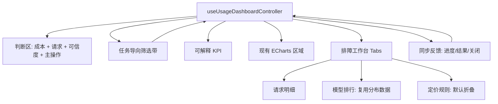

# refactor: 优化模型使用与成本看板 UX

## Overview

本计划优化 AgentNexus 模型使用与成本看板的信息架构和交互路径，在不改变模型使用数据口径、不新增后端能力、不引入新依赖的前提下，把页面从“功能平铺”调整为“先判断、再定位、再排障”的使用路径。

核心改动集中在 `src/features/usage`：

- 首屏形成成本与数据可信度判断区。
- 筛选从表单网格改成任务导向筛选带。
- KPI 区分主指标与解释指标。
- 请求明细优先，定价规则降级到次级区域。
- 同步状态改成可关闭的用户可理解反馈。

## Problem Frame

当前模型看板已具备数据、筛选、图表、定价和请求明细能力，但页面把过滤器、同步按钮、KPI、来源、图表、定价表和明细表顺序平铺。用户进入页面后仍要自己判断统计是否可信、成本是否异常、数据不完整意味着什么、下一步该同步还是排障（see origin: `docs/brainstorms/2026-04-29-model-usage-cost-dashboard-ux-requirements.md`）。

本计划只调整前端信息架构和交互表现。模型使用事实、计费、汇率、双来源融合、缺失数据不估算等口径继续由原模型看板需求定义（see origin: `docs/brainstorms/2026-04-21-model-usage-cost-dashboard-requirements.md`）。

## Requirements Trace

- R1-R4: 首屏判断区必须优先呈现成本、请求、异常、数据可信度和主操作。
- R5-R7: 筛选必须按“定义口径”和“定位异常”组织，并保持 KPI、图表、明细同口径刷新。
- R8-R10: KPI 必须区分主指标与解释指标，明确不完整记录和汇率状态。
- R11-R15: 请求明细必须优先服务排障，定价规则默认降级，模型排行不得扩大数据采集范围。
- R16-R19: 同步反馈必须可理解、可关闭，并不影响后续刷新和再次同步。
- R20-R22: 延续现有设计系统，确保窄屏可用、控件可访问、行为可测试。

## Scope Boundaries

- 不改变模型使用数据口径，不调整双来源融合、去重、计费、汇率、定价解析规则。
- 不新增后端数据源、后端聚合字段或持久化结构。
- 不新增预算告警、成本预测、自动优化建议。
- 不引入 Recharts、Framer Motion、accordion 依赖或新的 UI 框架。
- 不重做全站视觉系统，不拆新路由。

### Deferred to Separate Tasks

- 图表区“成本趋势主图 + 辅助洞察”单独作为后续图表信息架构优化，不纳入本首轮。
- 更复杂的明细全文搜索、跨日志检索、请求详情抽屉可在后续排障体验迭代中单独规划。

## Context & Research

### Relevant Code and Patterns

- Usage 页面主体：`src/features/usage/components/UsageDashboard.tsx`
- 筛选区：`src/features/usage/components/UsageFiltersBar.tsx`
- KPI 卡片：`src/features/usage/components/UsageKpiCards.tsx`
- 来源覆盖：`src/features/usage/components/SourceCoverageBar.tsx`
- 请求明细：`src/features/usage/components/RequestDetailTable.tsx`
- 定价规则：`src/features/usage/components/PricingPanel.tsx`
- 控制器状态与刷新链路：`src/features/usage/hooks/useUsageDashboardController.ts`
- 当前测试入口：`src/features/usage/components/__tests__/UsageDashboard.test.tsx`
- 可复用 UI：`src/shared/ui/button.tsx`, `src/shared/ui/badge.tsx`, `src/shared/ui/card.tsx`, `src/shared/ui/select.tsx`, `src/shared/ui/tabs.tsx`
- 空态模式：`src/features/common/components/EmptyState.tsx`

### Institutional Learnings

- `docs/solutions/best-practices/workbenchapp-modularization-best-practice-2026-04-14.md`: 壳层薄、模块厚，新能力应下沉到 feature module/controller，不把复杂逻辑回灌到 Workbench 壳层。
- `docs/solutions/best-practices/codebase-line-governance-best-practice-2026-04-19.md`: 前端按 controller hook / 展示组件分层，保持接口契约稳定，结构调整必须同步测试。

### External References

- 本计划跳过外部研究。该改动是既有 React/Tailwind/Tauri 前端页面的信息架构重排，本地组件已经足够。

## Key Technical Decisions

- 使用现有 `dashboard.trends.statusDistribution` 派生成功/失败/未知状态摘要，不新增后端 summary 字段。
- 保留 `useUsageDashboardController` 作为单一筛选和刷新状态源，筛选组件只触发状态变更，不自行加载数据。
- 下半区采用现有 `Tabs` 组件承载“请求明细 / 模型排行”，定价规则使用页面内 closed-by-default 面板降级，不新增 accordion 依赖。
- 同步反馈使用 `ModelUsageSyncJobSnapshot` 现有字段展示进度、插入、合并、解析失败和错误信息；首轮不新增复制错误详情按钮。
- 视觉风格延续现有 Tailwind + shared UI 组件，使用轻量状态 chips、badge、卡片层级和响应式 flex/grid，不引入新动效库。

## Open Questions

### Resolved During Planning

- 成功率/失败率如何呈现：首轮从 `statusDistribution` 派生状态摘要，不新增后端字段。
- 下半区形态如何选择：使用现有 `Tabs` 加 closed-by-default 定价面板，避免引入新 UI 依赖。
- 同步失败是否需要复制按钮：首轮不做复制按钮，只提供可读错误与可关闭反馈；如后续错误文本过长再单独优化。

### Deferred to Implementation

- 具体状态摘要文案和 badge 颜色可在实现中按现有颜色语义微调。
- 模型排行字段展示粒度可根据 `modelCostDistribution` 可用字段最终确定，但不得新增数据采集口径。
- 窄屏下首屏判断区的具体断点排布由实现时按现有 Tailwind 习惯调整。

## High-Level Technical Design

> *This illustrates the intended approach and is directional guidance for review, not implementation specification. The implementing agent should treat it as context, not code to reproduce.*

## Implementation Units

- [x] **Unit 1: 建立 Usage UX 派生视图模型与测试基线**

**Goal:** 在不改变 API 契约的前提下，把页面需要的状态摘要、可信度标识、同步摘要等派生逻辑集中收口，降低展示组件重复计算。

**Requirements:** R1-R3, R6-R10, R16-R18, R22

**Dependencies:** None

**Files:**
- Modify: `src/features/usage/hooks/useUsageDashboardController.ts`
- Modify: `src/features/usage/utils/usageFormat.ts`
- Test: `src/features/usage/components/__tests__/UsageDashboard.test.tsx`

**Approach:**
- 在 controller 层或轻量 helper 中派生 status summary、trust flags、sync summary、range label。
- 保留原有 `dashboard/logs/syncJob` 输出，新增派生数据只服务展示，不改变 API 入参和返回。
- 同步摘要仅使用现有 `processedFiles/totalFiles/insertedEvents/mergedEvents/parseFailures/currentSource/errorMessage` 字段。

**Execution note:** 先补 characterization 测试，锁定当前加载、同步触发和筛选刷新调用口径，再重排 UI。

**Patterns to follow:**
- `src/features/usage/hooks/useUsageDashboardController.ts` 中已有单一状态源模式。
- `src/features/usage/utils/usageFormat.ts` 中已有格式化 helper。

**Test scenarios:**
- Happy path: dashboard 返回 success/failed/unknown 分布时，页面可展示对应状态摘要。
- Edge case: `statusDistribution` 缺少某个状态时，该状态按 0 处理，不显示 NaN 或 undefined。
- Edge case: `sourceCoverage` 为空时，可信度区域显示“暂无来源覆盖”或等价空态，不阻塞页面。
- Error path: 同步任务存在 `errorMessage` 时，派生同步摘要包含失败提示。
- Integration: 初始加载仍同时调用 dashboard 和 request logs 查询，筛选参数来源不变。

**Verification:**
- 派生数据不要求后端新增字段。
- 现有加载与同步触发测试继续通过，并新增覆盖状态摘要和同步摘要。

- [x] **Unit 2: 重构首屏判断区与任务导向筛选带**

**Goal:** 将 `SectionTitle + grid filters` 重排为首屏判断区，用户无需滚动即可看到成本、请求、异常、可信度和主操作。

**Requirements:** R1-R7, R20-R22

**Dependencies:** Unit 1

**Files:**
- Modify: `src/features/usage/components/UsageDashboard.tsx`
- Modify: `src/features/usage/components/UsageFiltersBar.tsx`
- Modify: `src/features/usage/components/SourceCoverageBar.tsx`
- Test: `src/features/usage/components/__tests__/UsageDashboard.test.tsx`

**Approach:**
- 保留 `SectionTitle` 的语义，但首屏新增一个面向判断的 header/card 区域。
- 将“同步调用”和“刷新”放在主操作区域；同步价格从首屏主路径移出，跟定价规则区域关联。
- 筛选带拆成“口径筛选”和“异常定位筛选”两组，继续由同一 controller 状态驱动。
- 来源覆盖从独立平铺条变为可信度 chips，突出 failed/stale/incomplete 等需要用户注意的状态。

**Patterns to follow:**
- AgentNexus 现有 `Button`, `Badge`, `Select` 组件。

**Test scenarios:**
- Happy path: 首屏展示总成本、请求数、Token、时间范围、币种和同步调用按钮。
- Happy path: 点击“同步调用”仍调用 `modelUsageApi.syncStart({ workspaceId })`。
- Happy path: 修改状态筛选后，dashboard 和 logs 查询都使用相同 status 参数。
- Edge case: 窄屏容器下筛选和主操作以换行方式保留可读文本，不依赖横向固定 8 列。
- Error path: dashboard 加载失败时，错误提示仍可见，且不遮挡主操作。

**Verification:**
- 用户首屏可理解当前范围、成本、请求规模、可信度和主操作。
- 旧的同步价格按钮不再和同步调用、刷新同级抢占首屏。

- [x] **Unit 3: 改造 KPI 为主指标 + 解释指标**

**Goal:** 让 KPI 从同权重数字卡变成成本/请求/Token/状态为主，不完整记录、可计费记录、汇率状态作为解释信息。

**Requirements:** R8-R10, R20-R22

**Dependencies:** Unit 1

**Files:**
- Modify: `src/features/usage/components/UsageKpiCards.tsx`
- Test: `src/features/usage/components/__tests__/UsageDashboard.test.tsx`

**Approach:**
- 将 `requestCount/displayCost/totalTokens/status summary` 作为主卡。
- 将 `billableRequestCount/incompleteCount/fxRateUsdCny/fxStale/fxFetchedAt` 作为说明行或 warning strip。
- 不完整记录文案必须直接说明“缺 model 或 token，不参与成本估算”。
- 汇率过期时使用明显但不过度抢眼的状态标识，解释当前成本展示仍使用最近快照。

**Patterns to follow:**
- AgentNexus 当前 Card/CardContent 样式。

**Test scenarios:**
- Happy path: 成本卡显示当前币种金额，并包含 USD/CNY 换算说明。
- Happy path: Token 卡显示 input/output 组成。
- Edge case: `incompleteCount > 0` 时显示“不参与成本估算”的解释文案。
- Edge case: `fxStale=true` 时显示汇率过期提示。
- Edge case: `requestCount=0` 时主指标正常显示 0，不出现空白或异常格式。

**Verification:**
- 用户能区分“核心结果”和“解释条件”。
- 不完整记录不会被展示为和成本同级的主指标。

- [x] **Unit 4: 重组明细排障工作台与定价次级入口**

**Goal:** 将下半区改为排障优先：请求明细默认可见，模型排行可辅助定位，定价规则默认折叠且仍可在页面内修改。

**Requirements:** R11-R15, R20-R22

**Dependencies:** Unit 2, Unit 3

**Files:**
- Modify: `src/features/usage/components/UsageDashboard.tsx`
- Modify: `src/features/usage/components/RequestDetailTable.tsx`
- Modify: `src/features/usage/components/PricingPanel.tsx`
- Test: `src/features/usage/components/__tests__/UsageDashboard.test.tsx`
- Test: `src/features/usage/components/__tests__/RequestDetailTable.test.tsx`

**Approach:**
- 使用现有 `Tabs` 组件组织“请求明细”和“模型排行”；模型排行复用 `dashboard.trends.modelCostDistribution`。
- 定价规则改为 closed-by-default 面板；展开后仍复用现有 `PricingPanel` 保存覆盖逻辑。
- 请求明细列拆分 input/output tokens，并增加 status/source/isComplete 的可扫描标识。
- 空态给出下一步建议：同步调用、放宽筛选、检查来源状态。
- `syncPricing` 入口移动到定价区域，避免干扰首屏主路径。

**Patterns to follow:**
- `src/shared/ui/tabs.tsx` 的现有 Tabs API。
- `src/features/common/components/EmptyState.tsx` 的空态结构。

**Test scenarios:**
- Happy path: 默认展示请求明细 tab，而不是定价规则。
- Happy path: 明细行展示 Agent、模型、状态、来源、input/output token、成本和完整性。
- Happy path: 点击定价规则展开后可看到 provider/model 输入和保存覆盖入口。
- Edge case: 明细为空时显示带行动建议的空态。
- Edge case: 模型排行无数据时显示轻量空态，不影响请求明细。
- Integration: 保存定价覆盖后仍调用既有 `upsertPricingOverride` 并刷新 dashboard。

**Verification:**
- 用户从概览到明细的主路径不被定价表打断。
- 定价能力仍留在页面内，且默认不抢占注意力。

- [x] **Unit 5: 同步反馈、响应式与回归收口**

**Goal:** 将同步状态从技术状态条升级为可关闭反馈，并补齐页面级回归测试，确保 UX 重排不破坏现有使用链路。

**Requirements:** R16-R22

**Dependencies:** Unit 1, Unit 2, Unit 4

**Files:**
- Modify: `src/features/usage/components/UsageDashboard.tsx`
- Test: `src/features/usage/components/__tests__/UsageDashboard.test.tsx`

**Approach:**
- 同步进行中显示当前来源、处理进度和解析失败数。
- 同步完成、部分失败、失败都进入可关闭反馈态；关闭反馈只影响 UI，不清空可继续使用的 dashboard/logs 数据。
- 错误提示优先使用用户可理解文案，原始错误可作为补充文本展示。
- 补齐窄屏可用性相关断言，至少确保关键按钮和状态文本存在且可访问。

**Patterns to follow:**
- `docs/solutions/ui-bugs/skills-operations-and-agent-preset-ordering-fixes-2026-04-20.md` 中“状态条可关闭”的经验。
- `src/features/skills/components/operations/UsageFilters.tsx` 中 usage sync 进度展示思路。

**Test scenarios:**
- Happy path: 同步 running 时展示当前来源和 `processedFiles/totalFiles`。
- Happy path: 同步 completed 后展示 inserted/merged/parseFailures 摘要，并可关闭。
- Error path: 同步 failed 后展示错误提示，关闭后不影响再次点击同步调用。
- Error path: 轮询失败时展示“同步进度轮询失败”或等价提示。
- Integration: 同步完成后仍触发 dashboard/logs 刷新。

**Verification:**
- 同步反馈不再是不可关闭的技术状态条。
- 页面级测试覆盖主路径、筛选口径、明细空态、定价展开和同步反馈。

## System-Wide Impact

- **Interaction graph:** Sidebar -> UsageModule -> UsageDashboard -> useUsageDashboardController -> modelUsageApi；本计划只调整 UsageModule 内部展示和事件接线。
- **Error propagation:** 后端/API 错误仍通过 controller 的 `error` 状态进入页面；同步任务错误通过 sync feedback 展示。
- **State lifecycle risks:** 新增的可关闭反馈状态必须只影响提示可见性，不应清空 `syncJob` 之外的 dashboard/logs 数据。
- **API surface parity:** 不修改 `model_usage_*` 命令、不修改前端 API 类型、不新增后端字段。
- **Integration coverage:** 需要覆盖 dashboard 查询、logs 查询、syncStart、syncProgress、syncPricing、upsertPricingOverride 与 UI 的关键联动。
- **Unchanged invariants:** ECharts 图表组件继续使用现有数据；模型成本、汇率、不完整记录口径不变。

## Risks & Dependencies

| Risk | Mitigation |
|------|------------|
| UI 重排后用户找不到同步价格入口 | 将同步价格和定价规则绑定在同一 closed-by-default 区域，标题文案明确“定价规则”。 |
| 状态摘要从分布数据派生导致与后端口径不一致 | 只从同一 `queryDashboard` payload 派生，不另查数据、不缓存独立口径。 |
| 明细 tab 和定价折叠增加组件状态复杂度 | 状态局部放在 `UsageDashboard` 或子组件中，不上提到 Workbench 壳层。 |
| 测试只断言文本，无法发现口径错位 | 在测试中断言筛选变更后的 `queryDashboard` 与 `queryRequestLogs` 参数一致。 |
| 首屏内容过多导致窄屏拥挤 | 使用 flex wrap / responsive grid，定价和低频解释内容不放首屏主操作区。 |

## Documentation / Operational Notes

- 不需要更新用户手册或发布 SOP。
- 若实现中最终新增独立小组件，可在计划执行时补充组件级测试，但不得扩大到后端实现。
- 完成后建议保留本计划作为 UX 重排评审依据，避免后续把预算告警、预测等非首轮范围混入同一改动。

## Sources & References

- **Origin document:** `docs/brainstorms/2026-04-29-model-usage-cost-dashboard-ux-requirements.md`
- Related requirements: `docs/brainstorms/2026-04-21-model-usage-cost-dashboard-requirements.md`
- Ideation: `docs/ideation/2026-04-29-model-usage-cost-dashboard-ux-ideation.md`
- Related code: `src/features/usage/components/UsageDashboard.tsx`
- Related code: `src/features/usage/hooks/useUsageDashboardController.ts`
- Related code: `src/shared/ui/tabs.tsx`
- Related learning: `docs/solutions/best-practices/workbenchapp-modularization-best-practice-2026-04-14.md`
- Related learning: `docs/solutions/best-practices/codebase-line-governance-best-practice-2026-04-19.md`
