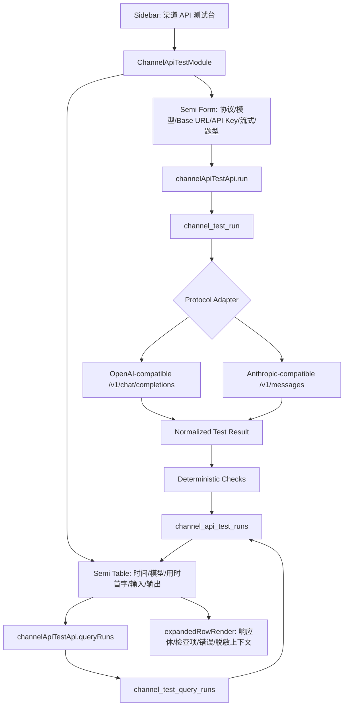

# feat: 新增渠道 API 测试台

## Overview

本计划新增一个左侧独立模块“渠道 API 测试台”，用于手动测试 OpenAI-compatible 与 Anthropic-compatible 渠道。用户输入本次测试的协议、模型、Base URL、API Key、流式开关和内置题型后，系统发起真实 API 请求，记录首字/首响应时间、总耗时、输入/输出规模、响应体检查结果，并用 Semi UI 表格、展开行和分页展示历史记录。

计划重点是建立一个独立、可验证、不过度平台化的测试台：

- 前端新增 `channel-test` feature module，使用 Semi UI 的表单、表格、分页、标签和展开行。
- Tauri/Rust 新增 `channel_test` control-plane 模块，负责 HTTP 请求、协议适配、计时、确定性检查和持久化。
- 测试记录使用独立表，不混入现有 `model_call_facts`，避免污染模型使用与成本看板口径。
- API Key 只用于本次请求，不写入历史记录；表格和详情只展示脱敏后的请求摘要。

## Problem Frame

AgentNexus 当前已有“模型使用与成本看板”，但它分析的是历史调用事实；用户现在需要的是主动测试某个渠道是否可用、是否首字慢、是否输出异常、响应体是否符合协议预期（see origin: `docs/brainstorms/2026-05-02-channel-api-testbench-requirements.md`）。

这个能力不应被做成完整渠道管理平台。首期只解决“手动输入一次渠道参数，运行内置题库，得到可排障的表格结果”这个闭环。

## Assumptions

- “渠道”在本计划中指模型 API 渠道，不指现有分发目标或 Agent 规则目标。
- API Key 首期不持久化，也不写入测试记录；用户每次测试在表单输入，后续如需保存渠道配置应单独规划。
- OpenAI-compatible 首期以 Chat Completions 协议为目标，默认拼接到 `/v1/chat/completions`；不引入 Responses API、Assistants、Realtime 或批处理。
- Anthropic-compatible 首期以 Messages API 为目标，默认拼接到 `/v1/messages`；不扩展 Bedrock、Vertex 或厂商私有差异。
- “首字”对流式请求表示首个可见文本 delta 的时间；非流式请求明确显示为“首响应”，不伪装成真实 token 首字。
- 分页按页码/页大小查询，适配 Semi Table 受控分页；本地 SQLite 历史表首期不做清理策略。

## Requirements Trace

- R1-R3: 新增左侧独立模块，并在该模块内引入 Semi UI 作为主要组件来源。
- R4-R7: 支持协议选择、模型/Base URL/API Key、本次测试流式开关，并默认脱敏敏感字段。
- R8-R11: 内置题库固定为小请求、中等请求、大请求、连续追问型，用户手动选择本次题型。
- R12-R17: 用表格展示时间、模型、用时/首字、输入、输出；支持展开详情、分页、历史保留和非流式首响应降级说明。
- R18-R20: 响应体分析只做确定性检查，不做 AI 自动评分。
- R21-R23: 测试记录关闭应用后仍可查看，按时间倒序分页；不做趋势图、告警、导出或审计。

## Scope Boundaries

- 不做完整渠道配置管理，不保存全局渠道。
- 不做定时巡检、告警、自动重试、趋势图、批量导出、审计日志。
- 不做 Gemini、Azure OpenAI 专有字段、Bedrock、Vertex、WebSocket、Realtime 等额外协议适配。
- 不做可编辑题库、题库市场或复杂评分算法。
- 不估算 token 或成本；只有渠道真实返回 usage 时才展示 usage，否则展示字符数并标明来源。
- 不把主动测试记录写入 `model_call_facts` 或现有模型使用与成本看板。

## Context & Research

### Relevant Code and Patterns

- 左侧模块类型在 `src/features/shell/types.ts`，当前 `MainModule` 包含 `prompts | skills | usage | agents | settings`。
- 左侧入口在 `src/features/shell/Sidebar.tsx`，已有 `usage` 独立模块接入模式。
- Workbench 中央区域在 `src/app/workbench/hooks/WorkbenchAppContent.tsx` 按 `activeModule` 分发模块，需要新增 `channel-test` 分支。
- 现有用量模块入口在 `src/app/workbench/hooks/useWorkbenchUsageController.tsx` 和 `src/features/usage/module/UsageModule.tsx`，可作为“壳层只接模块”的参考。
- 前端 Tauri 命令类型集中在 `src/shared/services/tauriClient.ts`，API façade 集中在 `src/shared/services/api/coreApi.ts` 与 `src/shared/services/api/index.ts`。
- 共享类型通过 `src/shared/types/index.ts` re-export，新增测试台类型应保持同样出口。
- Rust 命令注册集中在 `src-tauri/src/lib.rs` 的 `tauri::generate_handler!`，领域模块在 `src-tauri/src/control_plane/mod.rs` 导出。
- 数据库初始化在 `src-tauri/src/db.rs`，模型用量表迁移使用 `src-tauri/src/db/model_usage_migrations.rs` 的 `migration_meta` 一次性迁移模式。
- 现有 Rust control-plane 模块按 `api.rs / query.rs / persistence.rs / tests.rs` 拆分，`src-tauri/src/control_plane/model_usage/mod.rs` 是可复用结构参考。
- 当前 `src-tauri/Cargo.toml` 没有 HTTP client 依赖；实现真实 API 请求需要新增 Rust HTTP client 依赖。
- 当前 `package.json` 已使用 React 19，尚未引入 Semi UI。

### Institutional Learnings

- `docs/solutions/best-practices/workbenchapp-modularization-best-practice-2026-04-14.md`: Workbench 应保持壳层薄、模块厚，新增能力下沉到 feature module/controller，不把复杂逻辑回灌到 Workbench 壳层。
- `docs/solutions/best-practices/codebase-line-governance-best-practice-2026-04-19.md`: 前端按 controller hook / 展示组件分层，Rust control-plane 按 command API / domain logic / persistence helper 分层，并同步补对口测试。
- 既有 AgentNexus 模型使用看板上下文表明，主动测试数据与历史用量事实应保持分离，避免成本/用量口径被临时测试污染。

### External References

- OpenAI Chat Completions API 支持 `stream` 和 `stream_options.include_usage`；流式 Chat Completions 返回 data-only SSE chunks，文本增量在 `choices[0].delta` 中。参考：https://platform.openai.com/docs/api-reference/chat/create 与 https://platform.openai.com/docs/guides/streaming-responses?api-mode=chat
- Anthropic Messages API 示例使用 `x-api-key`、`anthropic-version`、`content-type`、`model`、`max_tokens` 和 `messages`；流式 Messages 使用 SSE，关键事件包括 `message_start`、`content_block_delta`、`message_delta`、`message_stop`，并要求对未知事件保持兼容。参考：https://docs.anthropic.com/en/api/messages-examples 与 https://docs.anthropic.com/en/docs/build-with-claude/streaming
- Semi Design 在 React 19 下使用 `@douyinfe/semi-ui-19`；Table 支持受控分页与 `expandedRowRender` 展开行。参考：https://semi.design/en-US/start/getting-started 与 https://semi.design/en-US/show/table

## Key Technical Decisions

- **Semi UI 仅先用于测试台模块。** 本次不抽全局 shared UI 封装，避免为了一个模块重塑全站组件层。若后续多个模块复用 Semi，再单独抽 shared adapter。
- **API 请求放在 Tauri/Rust 侧执行。** 前端 WebView 直接请求第三方 API 容易遇到 CORS，也会扩大密钥暴露面；Rust 侧更适合统一脱敏、计时、错误归一和持久化。
- **API Key 不持久化。** 测试记录只保存脱敏后的 `baseUrl`、协议、模型、题型、耗时、规模、响应摘要、检查项和错误摘要。
- **新增独立 `channel_test` 数据域。** 不复用 `model_call_facts`，因为后者是历史调用事实和成本分析口径，主动测试记录语义不同。
- **协议适配最小化。** OpenAI-compatible 只覆盖 Chat Completions 的 messages 请求和 SSE delta；Anthropic-compatible 只覆盖 Messages 请求和 SSE content block delta。
- **分页使用 page/pageSize/total。** Semi Table 受控分页天然适配远端分页；本地 SQLite 使用 `LIMIT/OFFSET` 足够支撑首期，不提前引入 cursor 复杂度。
- **响应体检查使用规则。** 检查空响应、HTTP/协议错误、错误 JSON、finish/stop reason、model 字段、usage 字段、截断和题型期望格式；不引入第二个模型评分。

## High-Level Technical Design

> 这是方向性设计，用来校验边界和数据流，不是实现代码。

## Data Model Direction

新增测试记录字段按“可扫表 + 可排障 + 不泄密”组织：

| 字段 | 用途 |
|---|---|
| `id`, `workspaceId`, `startedAt`, `completedAt` | 历史记录与排序 |
| `protocol`, `model`, `baseUrlDisplay` | 表格与脱敏排障 |
| `category`, `caseId`, `stream` | 题库与流式标识 |
| `status`, `errorReason`, `httpStatus` | 成功/失败和错误归因 |
| `totalDurationMs`, `firstTokenMs`, `firstMetricKind` | 用时/首字或首响应 |
| `inputSize`, `inputSizeSource`, `outputSize`, `outputSizeSource` | 输入/输出规模和口径 |
| `responseText`, `responseJsonExcerpt`, `rawErrorExcerpt` | 展开行排障片段 |
| `roundsJson` | 连续追问型每轮耗时、首字、输入/输出规模、错误摘要 |
| `checksJson` | 确定性检查结果列表 |
| `usageJson` | 渠道真实返回 usage；缺失则为空 |
| `createdAt` | 本地写入时间 |

敏感字段不入库：`apiKey`、`Authorization` 原值、完整请求 headers。

## Implementation Units

- [x] **Unit 1: 引入 Semi UI 并接入左侧独立模块**

**Goal:** 建立“渠道 API 测试台”主入口和空模块骨架，Semi UI 只在该模块使用。

**Requirements:** R1-R3

**Dependencies:** None

**Files:**
- Modify: `package.json`
- Modify: `pnpm-lock.yaml`
- Modify: `src/features/shell/types.ts`
- Modify: `src/features/shell/Sidebar.tsx`
- Modify: `src/features/shell/Sidebar.test.tsx`
- Modify: `src/app/workbench/hooks/WorkbenchAppContent.tsx`
- Add: `src/app/workbench/hooks/useWorkbenchChannelTestController.tsx`
- Add: `src/features/channel-test/module/ChannelApiTestModule.tsx`
- Add: `src/features/channel-test/module/ChannelApiTestModule.test.tsx`
- Modify: `src/styles/globals.css`

**Approach:**
- 添加 `@douyinfe/semi-ui-19`，匹配当前 React 19。
- 在全局样式中接入 Semi 必要样式，避免在业务组件里重复 import。
- 新增 `MainModule` 值，例如 `channelTest`，并在 Sidebar 增加独立入口。
- Workbench 只新增一个 controller hook 和一个中心区域分支，复杂状态留在 `src/features/channel-test` 内。
- 初始模块只展示表单/表格容器空态，不接真实请求。

**Patterns to follow:**
- `src/app/workbench/hooks/useWorkbenchUsageController.tsx`
- `src/features/usage/module/UsageModule.tsx`
- `docs/solutions/best-practices/workbenchapp-modularization-best-practice-2026-04-14.md`

**Test scenarios:**
- Sidebar 中文环境显示“渠道 API 测试台”，点击后调用 `onChangeModule`。
- Workbench 在 `activeModule=channelTest` 时渲染测试台模块，不影响 prompts/skills/usage/agents/settings。
- 模块在 `workspaceId=null` 时显示不可运行空态或禁用态，不抛异常。
- Semi 样式接入后现有 shared UI 不因 import 顺序导致基础页面不可渲染。

**Verification:**
- 新模块可从左侧打开。
- 壳层改动只包含模块枚举、Sidebar、Workbench 分发和新 controller。

- [x] **Unit 2: 定义前端类型、API façade 和 Tauri 命令契约**

**Goal:** 建立测试台前后端契约，让 UI、Tauri invoke 和 Rust command 有一致的输入输出类型。

**Requirements:** R4-R7, R12-R18, R21-R22

**Dependencies:** Unit 1

**Files:**
- Add: `src/shared/types/channelApiTest.ts`
- Modify: `src/shared/types/index.ts`
- Modify: `src/shared/services/tauriClient.ts`
- Modify: `src/shared/services/api/coreApi.ts`
- Modify: `src/shared/services/api/index.ts`
- Modify: `src/shared/services/api/types.ts`
- Modify: `src/shared/services/tauriClient.test.ts`

**Approach:**
- 新增协议、题型、流式标识、运行状态、检查项、分页入参和结果类型。
- 新增两个命令契约：`channel_test_run` 和 `channel_test_query_runs`。
- `run` 入参包含 `workspaceId`、`protocol`、`model`、`baseUrl`、`apiKey`、`stream`、`category`、`caseId`，以及本次内置题型展开后的 `messages` 或固定追问 `rounds`。
- `queryRuns` 入参使用 `workspaceId`、`page`、`pageSize`，返回 `items` 和 `total`。
- 类型中显式区分 `firstMetricKind: "first_token" | "first_response"`。
- 历史结果类型包含可选 `rounds`，供连续追问型展开详情展示每轮耗时和首字。

**Patterns to follow:**
- `src/shared/types/modelUsage.ts`
- `src/shared/services/api/coreApi.ts`
- `src/shared/services/tauriClient.ts`

**Test scenarios:**
- `invokeCommand("channel_test_run", { input })` 可正确透传参数。
- `channelApiTestApi.queryRuns` 使用 `page/pageSize` 传参并返回分页结果。
- Tauri 错误仍通过 `TauriClientError` 映射，不新增第二套错误处理。

**Verification:**
- 前端契约集中、可类型检查。
- API Key 只在运行入参出现，不出现在历史记录返回类型中。

- [x] **Unit 3: 新增后端持久化、命令注册和分页查询**

**Goal:** 在 Rust/Tauri 侧建立独立测试记录表、命令注册和历史分页查询能力。

**Requirements:** R12-R17, R20-R22

**Dependencies:** Unit 2

**Files:**
- Add: `src-tauri/src/control_plane/channel_test/mod.rs`
- Add: `src-tauri/src/control_plane/channel_test/api.rs`
- Add: `src-tauri/src/control_plane/channel_test/persistence.rs`
- Add: `src-tauri/src/control_plane/channel_test/query.rs`
- Add: `src-tauri/src/control_plane/channel_test/checks.rs`
- Add: `src-tauri/src/control_plane/channel_test/tests.rs`
- Add: `src-tauri/src/db/channel_test_migrations.rs`
- Modify: `src-tauri/src/db.rs`
- Modify: `src-tauri/src/control_plane/mod.rs`
- Modify: `src-tauri/src/lib.rs`
- Modify: `src-tauri/src/domain/models.rs`

**Approach:**
- 使用 `migration_meta` 增加一次性迁移，创建 `channel_api_test_runs` 表与 `workspace_id, started_at DESC` 索引。
- `channel_test_query_runs` 校验 workspace 后按时间倒序返回 page/pageSize 数据和 total。
- `channel_test_run` 先校验 workspace 和入参，再调用协议执行器，最后无论成功失败都持久化一条脱敏记录；连续追问型作为一个测试 run 记录聚合结果，展开详情保存每轮明细。
- 错误结果也要有可排障记录，但 Tauri 命令返回应让前端能展示该条记录，而不是只抛异常。
- 连续追问型失败时仍保存已完成轮次和失败轮次摘要，整条 run 标记为 failed 或 partial failed。

**Patterns to follow:**
- `src-tauri/src/db/model_usage_migrations.rs`
- `src-tauri/src/control_plane/model_usage/api.rs`
- `src-tauri/src/control_plane/model_usage/query.rs`
- `src-tauri/src/control_plane/model_usage/persistence.rs`

**Test scenarios:**
- Migration 幂等执行，多次 bootstrap 不重复建表或报错。
- 查询默认按 `startedAt DESC, id DESC` 返回。
- page/pageSize 计算正确，total 为过滤后的总数。
- 成功记录不包含 API Key 原文。
- 失败记录持久化 `status=failed`、`errorReason`、`httpStatus` 或协议错误摘要。
- 连续追问型记录持久化 `roundsJson`，每轮都有耗时、首字/首响应、输入/输出规模和错误摘要。
- workspace 不存在时返回 `WORKSPACE_NOT_FOUND`，不写记录。

**Verification:**
- 后端命令能注册并被前端 invoke 类型覆盖。
- 历史记录关闭应用后可从 SQLite 查询恢复。

- [x] **Unit 4: 实现 OpenAI-compatible 与 Anthropic-compatible 协议适配**

**Goal:** 在 Rust 侧完成真实 HTTP 请求、流式解析、计时和协议响应归一。

**Requirements:** R4-R7, R15-R18, R20

**Dependencies:** Unit 3

**Files:**
- Modify: `src-tauri/Cargo.toml`
- Add: `src-tauri/src/control_plane/channel_test/http.rs`
- Add: `src-tauri/src/control_plane/channel_test/openai.rs`
- Add: `src-tauri/src/control_plane/channel_test/anthropic.rs`
- Modify: `src-tauri/src/control_plane/channel_test/mod.rs`
- Modify: `src-tauri/src/control_plane/channel_test/tests.rs`

**Approach:**
- 引入最小 HTTP client 依赖，优先选能支持 blocking/streaming body 的成熟 crate；避免新增复杂 async runtime，除非 Tauri 命令实现确实需要。
- OpenAI-compatible:
  - POST `{baseUrl}/v1/chat/completions`。
  - Headers 使用 `Authorization: Bearer <apiKey>` 与 `Content-Type: application/json`。
  - 非流式解析 `choices[].message.content`、`finish_reason`、`model`、`usage`。
  - 流式解析 data-only SSE，累计 `choices[0].delta.content`，首个非空 content 作为首字时间；遇到 `[DONE]` 结束。
- Anthropic-compatible:
  - POST `{baseUrl}/v1/messages`。
  - Headers 使用 `x-api-key`、`anthropic-version`、`Content-Type: application/json`。
  - 非流式解析 `content[].text`、`stop_reason`、`model`、`usage`。
  - 流式解析 SSE，累计 `content_block_delta.delta.text`，首个非空 text 作为首字时间；处理 `message_delta.usage` 和 `message_stop`。
- Base URL 归一只做末尾斜杠和路径拼接，不猜测复杂供应商路径；如果用户输入已包含 `/v1/chat/completions` 或 `/v1/messages`，实现阶段可选择拒绝或规范化，但必须保持简单、可解释。
- 超时使用一个固定合理默认值，不做用户可配的复杂策略；失败记录中保留超时错误摘要。
- 连续追问型由后端按固定 2-3 轮顺序执行，每轮把上一轮 assistant 输出追加到下一轮上下文中；表格展示聚合耗时和聚合输入/输出，展开行展示每轮指标。

**Patterns to follow:**
- `src-tauri/src/error.rs` 的 `AppError` 返回结构。
- `src-tauri/src/security.rs` 的 URL 校验习惯可参考，但本功能允许用户主动测试本地/私有 Base URL 时，不应套用“只允许公共 HTTPS skill source”的规则。

**Test scenarios:**
- OpenAI 非流式成功：提取文本、model、finish_reason、usage，总耗时和首响应时间存在。
- OpenAI 流式成功：从 delta 内容累计输出，首个非空 delta 产生 `firstMetricKind=first_token`。
- OpenAI 流式缺最终 usage：不估算 token，规模回退为字符数。
- Anthropic 非流式成功：提取 `content[].text`、`stop_reason`、usage。
- Anthropic 流式成功：跳过 ping，处理 `content_block_delta`，未知事件不失败。
- 连续追问型成功：按顺序执行多轮请求，记录累计耗时和每轮首字/首响应。
- 连续追问型中途失败：保留已完成轮次，失败轮次记录错误摘要，后续轮次不再继续。
- HTTP 401/403/429/5xx：记录 failed、HTTP 状态、错误摘要和脱敏上下文。
- 错误 JSON：检查项中标记 error JSON。
- API Key 不出现在任何持久化字段、错误文本或 debug context。

**Verification:**
- 两种协议、流式/非流式各有单测覆盖。
- 缺失 usage 时不出现估算 token 或成本。

- [x] **Unit 5: 建立内置题库与测试运行表单**

**Goal:** 用户可选择协议和四类内置题型，输入本次测试参数并触发运行。

**Requirements:** R4-R11, R16-R17

**Dependencies:** Unit 2, Unit 4

**Files:**
- Add: `src/features/channel-test/data/testCases.ts`
- Add: `src/features/channel-test/hooks/useChannelApiTestController.ts`
- Add: `src/features/channel-test/components/ChannelTestForm.tsx`
- Add: `src/features/channel-test/components/ChannelTestForm.test.tsx`
- Modify: `src/features/channel-test/module/ChannelApiTestModule.tsx`

**Approach:**
- 内置题库在前端固定声明，按 `small | medium | large | followup` 四类组织。
- 每个题型首期只保留必要的 1 个内置 case，避免题库管理复杂化。
- 普通题型发送单组 messages；连续追问型发送固定 2-3 轮 user prompts，由后端顺序执行并生成每轮指标。
- Semi Form 使用协议 Select、模型 Input、Base URL Input、API Key Password Input、流式 Switch、题型 Select、运行 Button。
- 表单校验只做必填和基本 URL 形态，不做复杂供应商规则。
- 运行期间按钮 loading/disabled，完成后刷新第一页历史。

**Patterns to follow:**
- `src/features/usage/hooks/useUsageDashboardController.ts` 的 controller 状态收口方式。
- `src/features/common/components/EmptyState.tsx` 的空态表达。

**Test scenarios:**
- 默认选择一个安全的小请求题型，但用户可切换到中等/大请求/连续追问。
- 协议、模型、Base URL、API Key 缺失时运行按钮不可提交或显示表单错误。
- 流式开关会进入 `channel_test_run` 入参。
- 连续追问型提交的 payload 包含固定轮次，且结果详情可展示每轮指标。
- 运行成功后调用历史刷新，并回到第一页。
- 运行失败但后端返回失败记录时，页面仍能在表格看到失败结果。
- API Key 输入框不会在结果区回显明文。

**Verification:**
- 用户能完成一次手动配置和发起测试。
- 首期没有题库编辑入口或“运行全部题型”强制路径。

- [x] **Unit 6: 用 Semi Table 展示历史、分页和展开详情**

**Goal:** 按用户截图形态展示结果表格，并支持分页和展开排障详情。

**Requirements:** R12-R23

**Dependencies:** Unit 3, Unit 5

**Files:**
- Add: `src/features/channel-test/components/ChannelTestResultsTable.tsx`
- Add: `src/features/channel-test/components/ChannelTestRunDetail.tsx`
- Add: `src/features/channel-test/components/ChannelTestResultsTable.test.tsx`
- Add: `src/features/channel-test/utils/format.ts`
- Modify: `src/features/channel-test/hooks/useChannelApiTestController.ts`
- Modify: `src/features/channel-test/module/ChannelApiTestModule.tsx`

**Approach:**
- Semi Table 列为：时间、模型、用时/首字、输入、输出。
- 模型列显示协议标签和流式标签；流式标签只反映本次请求开关。
- 用时/首字列同时展示总耗时和首字/首响应，非流式明确标注“首响应”。
- 输入/输出列按 usage 或字符数来源显示；缺 usage 时不展示 token 字样。
- `expandedRowRender` 展示请求摘要、响应体片段、检查项、错误摘要、脱敏 debug context。
- Semi Table 使用受控 pagination，前端状态为 `page/pageSize/total`，切页触发 `channel_test_query_runs`。

**Patterns to follow:**
- `src/features/usage/components/RequestDetailTable.tsx` 的表格字段口径可参考，但本模块用 Semi Table 重写。
- Semi Table `expandedRowRender` 与受控 pagination。

**Test scenarios:**
- 表格显示时间、模型、用时/首字、输入、输出五个核心列。
- 成功记录显示 success 状态，失败记录显示错误摘要。
- 流式记录显示“流”标签，非流式不显示或显示不同文案。
- 非流式记录的首字区域显示“首响应”，不是“首字”。
- usage 存在时展示真实 usage 来源；usage 缺失时展示字符数来源。
- 展开行显示检查项、响应体、错误信息和脱敏上下文。
- 连续追问型展开行显示每轮输入摘要、输出摘要、首字/首响应、耗时和错误状态。
- 展开行中不包含 API Key、Authorization 明文。
- 切换页码或 pageSize 会重新查询历史。
- 空历史时显示可行动空态，引导先运行一次测试。

**Verification:**
- 历史记录按时间倒序分页。
- 表格与展开行覆盖用户指定结果形态。

- [x] **Unit 7: 回归、文档和验收收口**

**Goal:** 收齐跨层测试和最小用户说明，确认功能边界没有污染现有模块。

**Requirements:** R1-R23

**Dependencies:** Unit 1-6

**Files:**
- Add: `docs/features/channel-api-testbench.md`
- Modify: `src/app/WorkbenchApp.agents.test.tsx` only if active module mocks need new union coverage
- Modify: `src/app/WorkbenchApp.prompts.test.tsx` only if active module mocks need new union coverage
- Modify: `src/app/WorkbenchApp.settings.test.tsx` only if active module mocks need new union coverage
- Modify: `src/app/WorkbenchApp.skills-operations.test.tsx` only if active module mocks need new union coverage

**Approach:**
- 写一页简短功能说明，明确 API Key 不持久化、只支持 OpenAI/Anthropic 两类协议、缺 usage 不估算 token/成本。
- 跑前端模块测试、Tauri 类型/单测、line governance 和 typecheck/build。
- 回归确认 Usage 看板未读取或展示测试台记录。
- 若 Workbench 测试 mock 因 `MainModule` 联合类型变化失败，只做最小 mock 更新。

**Test scenarios:**
- 旧 Usage Dashboard 查询仍只调用 `modelUsageApi`，不读取 `channel_test` 命令。
- 左侧模块切换仍能进入 prompts/skills/usage/agents/settings。
- 新模块测试覆盖表单、运行、分页、展开详情、脱敏。
- Rust 测试覆盖迁移、分页、协议归一和敏感信息过滤。

**Verification:**
- `npm run typecheck`
- `npm run test:run -- src/features/shell/Sidebar.test.tsx src/features/channel-test src/shared/services/tauriClient.test.ts`
- `npm run test:run -- src/features/usage/components/__tests__/UsageDashboard.test.tsx`
- `cargo test channel_test`
- `npm run check:line-governance:changed`

## System-Wide Impact

- **Navigation:** 新增一个左侧主模块，Settings 和 Usage 不新增子 Tab。
- **Frontend API:** 新增 `channelApiTestApi`，不改变既有 `modelUsageApi`。
- **Tauri Commands:** 新增 `channel_test_run` 和 `channel_test_query_runs`，不改变既有命令签名。
- **Database:** 新增独立表和 migration，不写入 `model_call_facts`。
- **Dependencies:** 新增 `@douyinfe/semi-ui-19`；Rust 新增 HTTP client 依赖。
- **Security:** API Key 仅用于本次执行，不持久化；所有展示和记录都走脱敏。
- **Network:** 测试请求由用户主动触发，失败不会影响应用启动和其他模块。

## Risks and Mitigations

- **密钥泄漏风险:** 不持久化 API Key；错误摘要、debug context 和响应片段写入前统一脱敏，并补单测。
- **协议兼容差异:** 首期只支持最小 OpenAI Chat Completions 和 Anthropic Messages 形态；非标准渠道失败时显示协议错误，不做猜测性适配。
- **流式解析复杂度:** 仅识别必要事件和文本 delta，未知事件跳过；OpenAI `[DONE]` 和 Anthropic `message_stop` 作为结束信号。
- **Semi UI 样式影响全局:** 仅在测试台使用 Semi 组件，接入后做基础页面渲染回归；不重写 shared UI。
- **历史表增长:** 首期按用户要求全量保留并分页；清理策略、导出、趋势图延后。
- **本地/私有 Base URL:** 用户主动测试场景可能需要内网地址；不直接复用 external skill source 的公共 HTTPS 限制，但错误展示必须清晰。

## Open Questions

### Resolved During Planning

- Semi UI 是否全局抽象：首期不抽，限定在测试台模块内使用。
- API Key 是否持久化：首期不持久化，只用于本次测试请求。
- 历史记录存储：独立 SQLite 表，全量保留，页码分页。
- 流式首字指标：流式为首个可见文本 delta；非流式为首响应时间并明确标注。

### Deferred to Implementation

- HTTP client 具体 crate 选择由实现时根据 blocking/streaming 支持和最小依赖原则确定。
- Base URL 已含完整 endpoint 的处理方式在实现时选择最简单策略，但必须用表单文案或错误提示解释清楚。
- 内置题库 prompt 文案可在实现时微调，但必须覆盖四类题型并保持题量克制。
- Semi UI 细节样式在实现时按现有 AgentNexus 视觉做轻量适配，不做全站视觉重构。

## Acceptance Criteria

- 用户能从左侧打开“渠道 API 测试台”独立模块。
- 用户能选择 OpenAI-compatible 或 Anthropic-compatible，输入模型、Base URL、API Key，选择流式和题型后发起测试。
- 用户能运行小请求、中等请求、大请求、连续追问型中的任一题型。
- 测试结果表格显示时间、模型、用时/首字、输入、输出，并支持分页。
- 展开行显示请求摘要、响应体片段、检查项、错误信息和脱敏排障上下文。
- 非流式记录明确显示首响应时间，不显示为真实首 token。
- 缺失 usage 时不估算 token 或成本，只显示可解释字符数或真实返回字段。
- 关闭并重开应用后仍能查看历史记录。
- 现有模型使用与成本看板不展示、不统计、不计费这些主动测试记录。

## Planning Confidence

Confidence: 82%

主要不确定性来自 Rust HTTP streaming 依赖选择和不同“兼容协议”供应商的边缘差异。产品范围、模块接入、数据隔离、分页表格和安全策略已经足够明确，可以进入实现。
