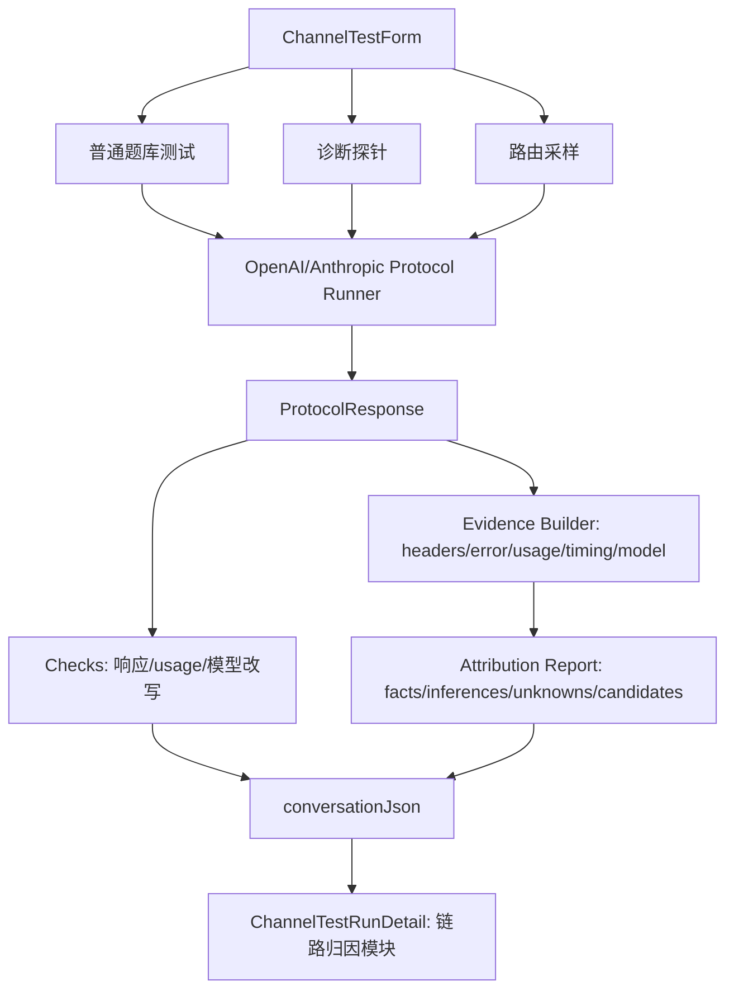

# feat: 增强渠道链路归因与模型改写检测

## Overview

本计划在现有“渠道 API 测试台”上增强链路归因能力：把当前基于 host/header 的“直连候选/反代候选”升级为证据分层报告，增加模型改写检测、上游候选归因、诊断探针和路由稳定性采样。

首期坚持“客户端证据优先”：只基于 AgentNexus 能观测到的请求、响应、响应头、错误体、usage、SSE 与耗时做推断，不接入 New API trace/log，也不接入上游账单或额度 API。计划目标是让用户看清“有什么证据、能推断到什么程度、哪些不能从客户端证明”，而不是给出无法验证的确定结论。

## Problem Frame

用户已经能用渠道测试台验证 OpenAI-compatible 与 Anthropic-compatible 渠道的可用性、首字、耗时和响应体。但在排查中转渠道时，还需要知道：这个渠道是否像反代或聚合路由，上游更像哪类 provider，是否存在多路由/号池分发迹象，以及中转是否可能偷偷改写请求模型（see origin: `docs/brainstorms/2026-05-02-channel-network-chain-attribution-requirements.md`）。

这类问题不能只靠一次请求的响应头断言。计划需要把产品口径和技术实现都约束在“事实、推断、不确定、客户端不可判断”四类证据层级内。

## Requirements Trace

- R1-R4: 将现有连接诊断升级为链路归因报告，展示可观测事实、推断强度、上游候选和不可判断项。
- R5-R8: 增加模型改写检测，比较请求模型和响应模型字段，并把结果纳入检查项和链路归因详情。
- R9-R11: 增加可选诊断探针模式，收集错误体、参数边界、stream 事件、usage 形态等上游指纹。
- R12-R14: 增加多次小请求采样，观察 request id、响应头、usage、响应模型和耗时分布是否分簇。
- R15-R18: 在展开详情中新增链路归因模块，继续脱敏敏感信息，并解释 AgentNexus 与中转后台口径差异。

## Scope Boundaries

- 不接入 New API 或其他中转服务的 trace/log 接口。
- 不接入上游账单、额度、官方控制台或第三方后台 API。
- 不证明真实账号池、真实额度来源或中转出口网络路径。
- 不做定时巡检、告警、导出、趋势图或后台任务队列。
- 不做 AI 自动评分，不用另一个模型判断回答质量或上游来源。
- 不把 provider 指纹规则做成远程规则市场；首期规则随应用版本维护。

### Deferred to Separate Tasks

- 中转协作追踪：需要 New API 或其他中转服务提供 trace/log，可单独规划。
- 上游账单/额度对账：需要外部账号权限和账单 API，可在协作追踪稳定后再规划。

## Context & Research

### Relevant Code and Patterns

- `src-tauri/src/control_plane/channel_test/api.rs` 当前在 `build_connection_diagnostics` 中根据 baseUrl host 和响应头生成 `connectionDiagnostics`，口径仍是 `official_direct_candidate`、`proxy_candidate`、`unknown`。
- `src-tauri/src/control_plane/channel_test/http.rs` 已采集 `server`、`via`、`x-cache`、`cf-ray`、`x-request-id`、ratelimit、`openai-processing-ms` 等响应头，可作为证据表基础。
- `src-tauri/src/control_plane/channel_test/checks.rs` 已有确定性检查框架，适合追加 `model_rewrite` 检查。
- `src-tauri/src/control_plane/channel_test/openai.rs` 和 `src-tauri/src/control_plane/channel_test/anthropic.rs` 已在流式和非流式路径提取响应 `model`、`usage`、`finishReason`、原始响应与 SSE 事件。
- `src/features/channel-test/components/ChannelTestRunDetail.tsx` 已展示耗时分解、连接路径诊断、对账说明和完整对话 JSON，是新增链路归因模块的主要落点。
- `src/features/channel-test/hooks/useChannelApiTestController.ts` 当前异步运行单次测试并刷新分页结果，可扩展出“普通测试 / 诊断探针 / 路由采样”三种用户动作。
- `src/shared/types/channelApiTest.ts` 当前结果类型没有链路归因结构；首期可以通过 `conversationJson` 存储和解析报告，同时补充前端类型，避免 UI 使用裸 `unknown`。
- `src-tauri/src/control_plane/channel_test/tests.rs` 已覆盖解析、持久化脱敏、查询分页和基础检查，是新增归因规则测试的直接位置。
- 当前仓库没有本目录 `AGENTS.md`；本次遵循用户在会话中提供的约束：中文回复、奥卡姆剃刀、手术式改动、先定义成功标准。

### Institutional Learnings

- AgentNexus 相关看板能力一贯要求“不估算，只统计真实数据”。链路归因应沿用同一原则：证据不足时显示“不确定”，不要制造确定性。
- 既有自建 relay/gateway 选型结论偏向 New API 作为二开基座，但本次首期用户选择不依赖 New API 改造。因此计划只预留协作追踪边界，不把中转侧改造放入本次实现。
- AgentNexus 既有模块化经验是“壳层薄、模块厚”：本次应把归因逻辑放在 `channel_test` 后端模块和 `channel-test` 前端模块内，不扩大 Workbench 壳层职责。

### External References

- OpenRouter provider routing 官方文档说明其支持多 provider 路由、BYOK fallback、价格/量化过滤和 provider-specific header 透传。这说明 OpenRouter 类渠道可能有真实路由层，首期应作为候选归因而不是简单“反代”标签：https://openrouter.ai/docs/guides/routing/provider-selection
- Amazon Bedrock Converse 官方文档显示其请求以 `modelId` 为核心，响应包含 `usage`、`metrics.latencyMs`、`stopReason`，流式事件包含 `messageStart`、`contentBlockDelta`、`metadata`。这些字段可作为 Bedrock 类指纹候选：https://docs.aws.amazon.com/bedrock/latest/userguide/conversation-inference-call.html
- Vertex AI OpenAI compatibility 官方文档显示其 OpenAI-compatible endpoint 使用 `aiplatform.googleapis.com/.../endpoints/openapi`，模型形态如 `google/gemini-*`，且只支持 Google Cloud Auth。这些可作为 Vertex 类指纹候选：https://docs.cloud.google.com/vertex-ai/generative-ai/docs/start/openai

## Key Technical Decisions

- **复用现有测试记录，不新建第二套结果表。** 首期归因报告和采样明细可以进入 `conversationJson`，模型改写进入 `checks`。这样避免为一个详情页能力新增迁移和查询复杂度。
- **新增归因报告结构，但不把所有字段提升为表格列。** 表格仍保持时间、模型、用时/首字、输入、输出；复杂证据在展开详情中展示，避免首屏噪音。
- **模型改写检测优先级高于 provider 猜测。** 请求模型和响应模型字段不一致是用户最直接关心的强证据，应先进入检查项；provider 候选只作为归因报告的一部分。
- **响应模型一致不是“未改写证明”。** UI 文案和检查状态必须区分“字段一致”和“已证明未改写”，避免中转回填模型字段时误导用户。
- **诊断探针独立于普通题库运行。** 普通题库继续服务质量/耗时测试；诊断探针服务链路归因，避免把两种目标混在一个题型选择里。
- **路由采样聚合为一条测试记录。** 多次小请求采样产生一个归因记录，详情中展示每次采样证据；不把 N 次采样写成 N 条普通历史记录，避免污染结果列表。
- **provider 规则以静态证据权重开始。** 首期维护在代码内或本地数据模块中，包含字段、权重、说明和最后校验来源；不做远程规则同步。

## Open Questions

### Resolved During Planning

- 诊断探针是否复用现有题库入口：不复用。作为链路归因模块的独立动作，避免用户把质量测试和链路诊断混淆。
- 多次采样如何入库：聚合为一条测试记录，采样明细进入 `conversationJson`，表格只显示聚合耗时和状态。
- 是否新增数据库字段：首期不新增字段；归因报告从 `conversationJson` 解析，模型改写异常进入已有 `checksJson`。

### Deferred to Implementation

- 首批 provider 规则的具体权重：实现时根据实际响应字段和测试样例微调，但必须保持“弱证据不能升格为证明”。
- 诊断探针的默认次数和超时：可从保守默认开始，实际交互和耗时体验在实现时调校。
- 是否需要补充更多脱敏关键词：实现时根据新增证据字段和测试覆盖发现遗漏后补充。

## High-Level Technical Design

> *This illustrates the intended approach and is directional guidance for review, not implementation specification. The implementing agent should treat it as context, not code to reproduce.*

## Implementation Units

- [x] **Unit 1: 定义链路归因与模型改写数据结构**

**Goal:** 建立前后端共享的归因报告形状，避免详情页继续依赖裸 JSON 和字符串标签。

**Requirements:** R1-R8, R15-R18

**Dependencies:** None

**Files:**
- Modify: `src/shared/types/channelApiTest.ts`
- Modify: `src-tauri/src/control_plane/channel_test/mod.rs`
- Add: `src-tauri/src/control_plane/channel_test/attribution.rs`
- Test: `src-tauri/src/control_plane/channel_test/tests.rs`

**Approach:**
- 定义链路归因报告的核心概念：证据项、证据等级、上游候选、模型改写结果、不可判断项、说明文案。
- Rust 侧新增 `attribution` 模块承载报告构建所需类型和纯函数，`api.rs` 只负责调用并写入 `conversationJson`。
- 前端类型补充 `ChannelChainAttributionReport`，详情页解析 `conversationJson.attributionReport` 时有明确字段。
- 保留旧 `connectionDiagnostics` 的兼容读取，避免历史记录展开时报错；新记录优先使用 `attributionReport`。

**Execution note:** 先补 Rust 纯函数测试，锁定模型字段一致、不一致、缺失三种状态，再接入 UI。

**Patterns to follow:**
- `src-tauri/src/control_plane/channel_test/checks.rs`
- `src-tauri/src/control_plane/channel_test/api.rs`
- `src/shared/types/channelApiTest.ts`

**Test scenarios:**
- Happy path: 请求模型 `gpt-4.1-mini`，响应模型 `gpt-4.1-mini` -> 模型改写结果为字段一致，说明不能证明未改写。
- Happy path: 请求模型 `claude-sonnet-4-5`，响应模型 `claude-haiku-*` -> 模型改写结果为疑似改写，证据等级为强推断或强证据。
- Edge case: 响应模型为空 -> 模型改写结果为无法判断，不应标记 pass。
- Edge case: 历史记录只有 `connectionDiagnostics` 没有 `attributionReport` -> 前端详情仍能展示兼容信息。

**Verification:**
- 新类型可被前端和 Rust 测试引用。
- `conversationJson` 中能同时承载归因报告和历史兼容字段。

- [x] **Unit 2: 构建证据分层与 provider 候选归因**

**Goal:** 把 baseUrl、响应头、错误体、usage、SSE/timing 和响应形态汇总成可解释的证据表与候选 provider 列表。

**Requirements:** R1-R4, R15-R17

**Dependencies:** Unit 1

**Files:**
- Modify: `src-tauri/src/control_plane/channel_test/api.rs`
- Modify: `src-tauri/src/control_plane/channel_test/http.rs`
- Modify: `src-tauri/src/control_plane/channel_test/attribution.rs`
- Test: `src-tauri/src/control_plane/channel_test/tests.rs`

**Approach:**
- 扩展响应头采集范围，但保持白名单，避免把所有 headers 原样入库。
- 归因报告按证据来源分组：host、headers、response shape、error shape、usage shape、timing shape。
- provider 候选只输出候选名、分数/置信度、命中证据和反证，不输出单个绝对结论。
- 首批规则保持保守：官方 API host 是强证据；OpenRouter provider routing 相关形态、Bedrock Converse 字段、Vertex OpenAI-compatible host/model 形态只能作为候选证据。
- 不可判断项固定列出：真实账号池、真实额度来源、中转出口网络路径、完整请求改写。

**Patterns to follow:**
- `src-tauri/src/control_plane/channel_test/http.rs`
- `src-tauri/src/control_plane/channel_test/api.rs`
- `docs/ideation/2026-05-02-channel-network-chain-attribution-ideation.md`

**Test scenarios:**
- Happy path: `api.openai.com` 且无代理头 -> 官方 API 候选高置信，但仍只描述客户端可见证据。
- Happy path: 非官方 host 且出现 `via`/`cf-ray` -> 中转/反代候选命中对应证据。
- Edge case: headers 为空、响应体合法 -> 报告仍生成，未知项清晰展示。
- Edge case: Bedrock 类响应形态包含 `usage.inputTokens/outputTokens` 和 `metrics.latencyMs` -> Bedrock 类候选加分但不宣称已证明。
- Error path: 非 JSON 错误体 -> 进入错误体摘要证据，不导致归因构建失败。

**Verification:**
- 新记录详情能看到证据表、候选 provider 和不可判断项。
- 没有任何分支把“候选”文案升格为“已证明”。

- [x] **Unit 3: 增加模型改写检查项**

**Goal:** 在现有确定性检查中加入请求模型与响应模型字段比较，并让异常在表格展开详情中可见。

**Requirements:** R5-R8

**Dependencies:** Unit 1

**Files:**
- Modify: `src-tauri/src/control_plane/channel_test/checks.rs`
- Modify: `src-tauri/src/control_plane/channel_test/api.rs`
- Test: `src-tauri/src/control_plane/channel_test/tests.rs`

**Approach:**
- `build_checks` 基于请求模型和 `ProtocolResponse.model` 增加 `model_rewrite` 检查。
- 响应模型不一致时 `status=warn` 或 `fail` 需要实现时结合现有成功判定评估；计划建议先用 `warn`，避免把可用但被路由的渠道直接判失败。
- 响应模型缺失时 `warn`，说明无法通过响应字段判断。
- 响应模型一致时 `pass` 或中性状态，但 detail 必须写明“字段一致不证明未改写”。
- 单次、连续追问、诊断探针和采样都复用同一检查逻辑。

**Patterns to follow:**
- `src-tauri/src/control_plane/channel_test/checks.rs`
- `src/features/channel-test/components/ChannelTestRunDetail.tsx`

**Test scenarios:**
- Happy path: 请求/响应模型一致 -> 检查项存在，detail 包含字段一致边界说明。
- Error path: 请求/响应模型不一致 -> 检查项标记异常，detail 展示两者值。
- Edge case: 响应模型为空 -> 检查项为 warn，detail 表示无法判断。
- Integration: `run_single` 构建的 `checks` 和 `conversationJson.attributionReport.modelRewrite` 对同一响应给出一致结论。

**Verification:**
- 展开详情“检查项”和“链路归因”均能看到模型改写检测。
- 结果状态不会因为响应模型缺失而错误地标记为成功无异常。

- [x] **Unit 4: 增加诊断探针运行模式**

**Goal:** 提供可选诊断探针，主动收集上游指纹，而不污染普通题库语义。

**Requirements:** R9-R11, R15-R18

**Dependencies:** Unit 1, Unit 2, Unit 3

**Files:**
- Modify: `src/shared/types/channelApiTest.ts`
- Modify: `src/features/channel-test/hooks/useChannelApiTestController.ts`
- Modify: `src/features/channel-test/components/ChannelTestForm.tsx`
- Modify: `src/features/channel-test/module/ChannelApiTestModule.tsx`
- Modify: `src-tauri/src/control_plane/channel_test/mod.rs`
- Modify: `src-tauri/src/control_plane/channel_test/api.rs`
- Add: `src-tauri/src/control_plane/channel_test/probes.rs`
- Test: `src/features/channel-test/components/ChannelTestForm.test.tsx`
- Test: `src-tauri/src/control_plane/channel_test/tests.rs`

**Approach:**
- 在表单附近新增“运行诊断探针”动作，和普通“运行测试”并列；探针复用当前协议、模型、Base URL、API Key、stream 配置。
- 探针首期保持低成本：至少包含一个正常小请求和一个可控边界请求；非法模型名等可能消耗较少但会产生错误指纹，需在 UI 上提示其用途。
- 探针结果聚合成一条测试记录，`caseId` 或 `conversationJson` 标记为 diagnostic probe，详情展示每个探针的请求意图和命中证据。
- 错误响应是预期信号时，不应简单把整条诊断记录判为失败；需要区分“探针执行成功但目标返回错误指纹”和“网络/鉴权/解析失败”。
- 所有探针请求和响应继续走现有脱敏逻辑。

**Patterns to follow:**
- `src/features/channel-test/hooks/useChannelApiTestController.ts`
- `src-tauri/src/control_plane/channel_test/api.rs`
- `src-tauri/src/control_plane/channel_test/openai.rs`
- `src-tauri/src/control_plane/channel_test/anthropic.rs`

**Test scenarios:**
- Happy path: 点击“运行诊断探针”时使用当前表单参数，不要求另填模型或 key。
- Happy path: 正常小请求成功、边界请求返回 provider 错误体 -> 诊断记录保存为可查看，归因报告包含错误体证据。
- Error path: API Key 无效导致所有探针 401/403 -> 诊断记录显示鉴权失败，不能误判 provider。
- Edge case: 用户未填写必要参数 -> 诊断按钮禁用或提示，与普通测试一致。
- Integration: 探针记录出现在分页列表中，展开后可看到探针明细和归因报告。

**Verification:**
- 普通题库测试入口不被诊断探针复杂度污染。
- 诊断探针能生成一条可排障历史记录。

- [x] **Unit 5: 增加路由稳定性采样**

**Goal:** 对同一渠道连续执行多次小请求，观察是否存在多路由、负载均衡或号池分发迹象。

**Requirements:** R12-R14, R15-R18

**Dependencies:** Unit 1, Unit 2, Unit 3

**Files:**
- Modify: `src/shared/types/channelApiTest.ts`
- Modify: `src/features/channel-test/hooks/useChannelApiTestController.ts`
- Modify: `src/features/channel-test/components/ChannelTestForm.tsx`
- Modify: `src-tauri/src/control_plane/channel_test/api.rs`
- Add: `src-tauri/src/control_plane/channel_test/sampling.rs`
- Test: `src/features/channel-test/components/ChannelTestForm.test.tsx`
- Test: `src-tauri/src/control_plane/channel_test/tests.rs`

**Approach:**
- 新增“运行路由采样”动作，默认执行少量小请求采样；默认次数作为实现时可调常量，不暴露复杂配置。
- 每次采样记录响应模型、关键响应头、request id、ratelimit、usage shape、首字、完成耗时和错误摘要。
- 后端聚合采样结果，识别响应头组合、request id/ratelimit、模型字段、耗时分布是否出现多个簇。
- 文案只使用“疑似多路由/负载均衡/号池分发”，并说明“这是行为推断，不是账号池证明”。
- 采样整体作为一条历史记录，详情中以表格展示每次采样证据。

**Patterns to follow:**
- `src-tauri/src/control_plane/channel_test/api.rs`
- `src-tauri/src/control_plane/channel_test/checks.rs`
- `src/features/channel-test/components/ChannelTestRunDetail.tsx`

**Test scenarios:**
- Happy path: 三次采样响应头和模型一致 -> 路由稳定性为稳定或未发现分簇。
- Happy path: 三次采样出现两个不同 request id/ratelimit/header 组合簇 -> 标记疑似多路由，并列出簇证据。
- Edge case: 部分采样失败 -> 聚合结果显示 partial，并保留成功和失败样本。
- Error path: 所有采样因网络错误失败 -> 不输出 provider 或号池推断，只展示失败原因。
- Integration: 采样记录展开后能回看每次采样的核心证据，而不是只有汇总结论。

**Verification:**
- 采样不会生成多条普通历史记录。
- UI 不把“疑似号池”说成“已证明号池”。

- [x] **Unit 6: 重做详情页链路归因展示**

**Goal:** 在展开详情中用表格/分组列表展示归因报告、模型改写检测、采样明细和不可判断项。

**Requirements:** R15-R18

**Dependencies:** Unit 1, Unit 2, Unit 3, Unit 4, Unit 5

**Files:**
- Modify: `src/features/channel-test/components/ChannelTestRunDetail.tsx`
- Add: `src/features/channel-test/components/ChannelAttributionPanel.tsx`
- Add: `src/features/channel-test/components/ChannelAttributionPanel.test.tsx`
- Modify: `src/features/channel-test/utils/format.ts`
- Test: `src/features/channel-test/components/ChannelTestResultsTable.test.tsx`

**Approach:**
- 新增 `ChannelAttributionPanel`，接收解析后的归因报告，负责展示候选 provider、置信度、证据表、模型改写、不可判断项。
- `ChannelTestRunDetail` 保持现有响应体、耗时分解、对账说明和完整 JSON，只替换旧“连接路径诊断”为新归因面板；历史记录没有新报告时降级展示旧诊断。
- 证据表按等级和来源分组：已观测事实、强推断、弱推断、不确定、客户端不可判断。
- 对“为什么和后台不同”的说明从单独文案升级为与证据项关联的解释：本地总耗时、首字、SSE、usage、响应模型字段都可能与中转后台口径不同。
- 所有文本保持克制，不使用“确认官方额度”“确认号池”等不可证明措辞。

**Patterns to follow:**
- `src/features/channel-test/components/ChannelTestRunDetail.tsx`
- `src/features/channel-test/components/ChannelTestResultsTable.tsx`
- `src/features/channel-test/utils/format.ts`

**Test scenarios:**
- Happy path: 有 `attributionReport` 的记录展示候选 provider、模型改写和证据表。
- Edge case: 只有旧 `connectionDiagnostics` 的历史记录仍能展示兼容诊断。
- Edge case: `conversationJson` 非法或为空 -> 详情页不崩溃，显示无归因数据。
- Error path: 归因报告包含敏感 header 名和值 -> UI 展示的是脱敏值。
- Integration: 诊断探针和路由采样记录展开后能显示 probe/sample 明细。

**Verification:**
- 展开详情能直接回答“有没有疑似改模型”和“哪些证据支持这个候选上游”。
- 表格首屏不新增复杂列，详情页承载复杂诊断。

- [x] **Unit 7: 补齐脱敏、兼容与回归验证**

**Goal:** 确保新增证据不会泄露 key，不破坏已有测试台运行和历史记录展开。

**Requirements:** R3, R10-R11, R17-R18

**Dependencies:** Unit 1-6

**Files:**
- Modify: `src-tauri/src/control_plane/channel_test/checks.rs`
- Modify: `src-tauri/src/control_plane/channel_test/http.rs`
- Modify: `src-tauri/src/control_plane/channel_test/tests.rs`
- Modify: `src/features/channel-test/components/ChannelAttributionPanel.test.tsx`
- Modify: `src/features/channel-test/components/ChannelTestResultsTable.test.tsx`

**Approach:**
- 统一使用后端脱敏函数处理错误体、响应摘要、证据值和完整 JSON 中会展示的敏感字段。
- 响应头仍用白名单采集；新增 header 需要明确理由。
- 对旧记录、无归因报告、新归因报告、诊断探针、路由采样五类记录做前端兼容测试。
- 确认普通测试、诊断探针、路由采样共享同一敏感字段处理路径。

**Patterns to follow:**
- `src-tauri/src/control_plane/channel_test/checks.rs`
- `src-tauri/src/control_plane/channel_test/http.rs`
- `src-tauri/src/control_plane/channel_test/tests.rs`

**Test scenarios:**
- Error path: 错误体包含 API Key、Authorization、x-api-key -> 存储和 UI 中均不可见原值。
- Error path: 响应头包含敏感 header -> 不被采集，或采集前被脱敏。
- Integration: 已有普通测试记录仍能通过分页查询和展开详情展示。
- Integration: `checks` 中模型改写异常不会破坏现有成功/失败状态语义。

**Verification:**
- 新增诊断能力不引入敏感信息泄露。
- 现有渠道 API 测试台核心路径仍可用。

## System-Wide Impact

- **Interaction graph:** 影响范围集中在 `channel_test` Rust control-plane、`channel-test` 前端模块和 shared 类型；Workbench 壳层不应新增复杂逻辑。
- **Error propagation:** 普通请求失败、探针预期错误、探针执行失败、采样部分失败需要区分，避免所有错误都变成同一类 failed。
- **State lifecycle risks:** 诊断探针和路由采样是多请求聚合，部分成功时必须保留已完成证据，不能只丢最后一个错误。
- **API surface parity:** Tauri 命令契约扩展后，`src/shared/services/api` 和 Rust command 输入必须同步；历史查询仍使用现有分页。
- **Integration coverage:** 需要覆盖后端归因报告生成 -> 持久化 -> 前端解析 -> 详情展示的跨层链路。
- **Unchanged invariants:** API Key 不入库；测试记录不进入 `model_call_facts`；缺失 usage 不估算 token 或成本；非流式首字仍按首响应口径展示。

## Risks & Dependencies

| Risk | Mitigation |
|------|------------|
| 用户把候选归因理解成证明 | UI 文案固定区分事实、推断、不确定、客户端不可判断；强制展示不可判断项 |
| provider 指纹规则过时 | 规则附带证据来源和保守权重；弱证据只影响候选，不产生确定结论 |
| 诊断探针消耗额度或触发错误 | 探针作为用户主动动作，文案说明用途；低成本请求优先 |
| 多次采样耗时过长 | 默认少量采样；聚合为一条记录；运行期间沿用异步 loading，不阻塞页面浏览历史 |
| 新增证据泄露敏感信息 | 后端统一脱敏，响应头白名单采集，增加脱敏回归测试 |
| 归因数据结构污染普通表格 | 复杂报告只放详情页，表格保持现有核心列 |

## Documentation / Operational Notes

- 更新或补充 `docs/features/channel-api-testbench.md`，说明链路归因的能力边界：客户端证据优先、不能证明真实号池/额度/出口网络。
- 在详情页文案中明确模型字段一致不等于证明未改写。
- 不需要数据迁移说明；首期计划复用现有 `conversationJson` 和 `checksJson`。

## Sources & References

- **Origin document:** [docs/brainstorms/2026-05-02-channel-network-chain-attribution-requirements.md](../brainstorms/2026-05-02-channel-network-chain-attribution-requirements.md)
- Related ideation: [docs/ideation/2026-05-02-channel-network-chain-attribution-ideation.md](../ideation/2026-05-02-channel-network-chain-attribution-ideation.md)
- Existing testbench plan: [docs/plans/2026-05-02-001-feat-channel-api-testbench-plan.md](2026-05-02-001-feat-channel-api-testbench-plan.md)
- Related code: `src-tauri/src/control_plane/channel_test/api.rs`
- Related code: `src-tauri/src/control_plane/channel_test/checks.rs`
- Related code: `src-tauri/src/control_plane/channel_test/http.rs`
- Related code: `src/features/channel-test/components/ChannelTestRunDetail.tsx`
- OpenRouter provider routing: https://openrouter.ai/docs/guides/routing/provider-selection
- Amazon Bedrock Converse API: https://docs.aws.amazon.com/bedrock/latest/userguide/conversation-inference-call.html
- Vertex AI OpenAI compatibility: https://docs.cloud.google.com/vertex-ai/generative-ai/docs/start/openai
