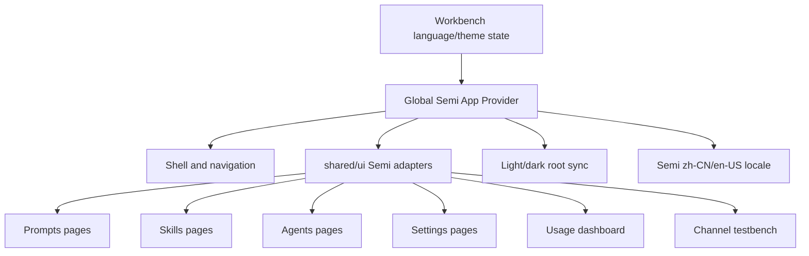

# refactor: 使用 Semi 统一页面交互、主题与多语言

## Overview

本计划把 AgentNexus 前端逐步收敛到已集成的 `@douyinfe/semi-ui-19` 组件体系。目标不是重做视觉设计，而是用最小必要改动统一页面级交互、表单、弹层、表格、空状态、日间/夜间模式和中英文文案。

计划按基础设施先行、页面逐一迁移的顺序推进：先建立全局 Semi Provider、主题与语言适配，再迁移壳层和各功能模块。每个模块迁移后都需要保留现有行为和测试可验证性，避免一次性大重写。

## Problem Frame

当前仓库已经引入 Semi base CSS，渠道测试台也局部使用了 Semi 的 `Button`、`Input`、`Select`、`Switch`、`Table`、`Modal`、`Tag` 和 `LocaleProvider`。但应用主干仍由 Tailwind 自建 `shared/ui` 和 Headless UI 组件承载，主题通过 `.dark` 与 CSS 变量维护，语言通过 `l(zh, en)` 传递。

这种混合状态带来三个问题：
- 同类交互在不同页面表现不一致，例如按钮、选择器、弹窗、抽屉、表格分页和空状态。
- Semi 的语言与主题目前只在渠道测试台局部接入，无法保证全应用一致。
- 后续页面继续新增功能时会在 Semi 与自建组件之间反复选择，增加维护成本。

## Assumptions

- Semi 已作为项目依赖存在，本计划不新增第二套 UI 库。
- 统一范围是前端页面和共享 UI，不改变 Tauri 后端 API、数据模型或业务语义。
- 现有 `l(zh, en)` 机制继续作为首期多语言入口，不引入完整 i18n 框架。
- Tailwind 可继续用于布局、间距和少量模块级样式；本计划不要求一次性删除 Tailwind。
- 迁移以稳定为先，允许在过渡期保留少量 `shared/ui` 兼容导出，但新增页面优先使用 Semi 或 Semi 封装。

## Requirements Trace

- R1. 全局 Semi Provider 覆盖应用，语言跟随现有 `zh-CN` / `en-US` 设置。
- R2. 日间/夜间模式同时作用于应用根样式和 Semi 组件，不再只依赖渠道测试台局部适配。
- R3. 统一基础交互组件：按钮、输入、选择器、开关、标签、卡片、弹窗、抽屉、表格、空状态、Toast。
- R4. 按页面模块逐一迁移，保持当前功能行为、状态流和快捷操作不变。
- R5. 所有用户可见新增或迁移文案继续支持中文和英文。
- R6. 每个迁移单元都有明确回归测试，覆盖交互、主题入口和语言入口。
- R7. 不为一次性场景引入复杂抽象；只封装跨页面重复使用的组件或 Provider。

## Scope Boundaries

- 不改业务流程、数据结构、后端命令、同步任务或存储格式。
- 不引入新的国际化框架、翻译文件生成流程或远程文案系统。
- 不重做信息架构、导航结构或页面功能范围。
- 不把图表库、Markdown 编辑器、diff viewer 等专用渲染器强行替换为 Semi。
- 不一次性删除所有 Tailwind 类名；只清理被迁移组件直接淘汰的本地样式。
- 不新增营销式页面或装饰性视觉资产。

### Deferred to Separate Tasks

- 完整 i18n 资源文件体系：可在本次 UI 统一稳定后单独规划。
- 彻底移除 Headless UI 和自建 `shared/ui`：需要等迁移完成并确认无消费者后再做清理计划。
- 视觉回归截图基线体系：本计划只要求实现阶段做关键页面人工或浏览器验证，不建立独立截图平台。

## Context & Research

### Relevant Code and Patterns

- `package.json` 已依赖 `@douyinfe/semi-ui-19`，当前版本约束为 `^2.96.0`。
- `src/main.tsx` 已引入 `@douyinfe/semi-ui-19/lib/es/_base/base.css`，但未提供全局 Semi Provider。
- `src/features/channel-test/module/ChannelApiTestModule.tsx` 局部使用 `LocaleProvider`，并按 `language` 在 `zh_CN` 和 `en_US` 间切换。
- `src/app/workbench/hooks/useWorkbenchAppContentState.ts` 维护 `language`、`theme`、`isZh` 和 `l(zh, en)`。
- `src/app/workbench/hooks/useWorkbenchLifecycleEffects.ts` 负责把语言写入 `document.documentElement.lang`，把主题写入根节点 `.dark`、`data-theme` 和 `body[theme-mode]`。
- `src/shared/ui/*` 提供当前自建基础组件，包含 `Button`、`Select`、`Dialog`、`Sheet`、`Toast` 等。
- `src/features/common/components/DataTable.tsx` 是自建表格模式，渠道测试台已使用 Semi `Table`。
- 主要页面模块落点包括 `src/features/prompts/`、`src/features/skills/`、`src/features/agents/`、`src/features/settings/`、`src/features/usage/`、`src/features/channel-test/` 和 `src/features/shell/`。

### Institutional Learnings

- `docs/solutions/best-practices/workbenchapp-modularization-best-practice-2026-04-14.md` 强调 Workbench 改造应按模块分段迁移，每段完成后用 typecheck 与目标测试切片防回归。
- 既有重构经验要求主壳层保持“接线与编排”，具体 UI 和状态逻辑下沉到 feature module，不应把 Semi 适配逻辑继续堆回 `WorkbenchAppContent`。

### External References

- Not used. 本计划依据仓库中已集成的 Semi 版本和现有局部用法制定；具体 API 细节留到实现阶段以本地类型和官方文档核对。

## Key Technical Decisions

- **全局 Provider 先行。** 先在应用根部统一接入 Semi 的语言与主题，再迁移页面，避免每个模块各自包 `LocaleProvider`。
- **保留 `l(zh, en)` 作为首期文案接口。** 这比引入 i18n 框架更简单，也符合当前代码模式；迁移只要求新增和修改文案都走现有语言入口。
- **把 `shared/ui` 从自建实现逐步改成 Semi 适配层。** 对已有消费者保持导出路径稳定，降低迁移面；新页面可以直接使用 Semi 或封装后的共享组件。
- **按页面模块迁移，不做全仓机械替换。** 每个模块只迁移用户可见交互和高复用组件，避免破坏复杂页面状态。
- **表格和弹层优先统一。** 表格、分页、弹窗、抽屉、确认操作是用户最容易感知差异的交互，应比纯文本布局更早迁移。
- **主题以 Semi 为组件层、现有 CSS 变量为壳层。** 迁移期间继续保留 `.dark` 与语义 CSS 变量，保证非 Semi 区域不失效。

## Open Questions

### Resolved During Planning

- 是否需要先做完整需求文档：不需要。用户目标已明确，且这是技术统一计划，不涉及新增产品行为。
- 是否立刻替换 Tailwind：不替换。Tailwind 继续用于布局和局部样式，Semi 负责交互组件一致性。
- 是否引入新 i18n 框架：不引入。首期继续使用 `l(zh, en)` 和现有 `language` 状态。

### Deferred to Implementation

- Semi 暗色模式的最终接入方式：实现时以本地 Semi 版本支持的主题 API 和 CSS 类为准，但必须由全局 Provider 或根适配统一控制。
- `shared/ui` 中哪些组件可以立即替换、哪些需要兼容包装：实现时按消费者复杂度逐个判断，不能为了统一牺牲现有行为。
- 每个页面的具体视觉细节：以现有信息密度和布局为准，迁移时只修正不一致和明显交互问题。

## High-Level Technical Design

> *This illustrates the intended approach and is directional guidance for review, not implementation specification. The implementing agent should treat it as context, not code to reproduce.*

## Implementation Units

- [x] **Unit 1: 建立全局 Semi Provider 与主题语言适配**

**Goal:** 让 Semi 的语言和主题由 Workbench 现有 `language`、`theme` 状态统一控制。

**Requirements:** R1, R2, R5

**Dependencies:** None

**Files:**
- Modify: `src/app/workbench/hooks/WorkbenchAppContent.tsx`
- Modify: `src/app/workbench/hooks/useWorkbenchLifecycleEffects.ts`
- Modify: `src/main.tsx`
- Create: `src/shared/ui/SemiAppProvider.tsx`
- Test: `src/app/WorkbenchApp.settings.test.tsx`
- Test: `src/features/channel-test/module/ChannelApiTestModule.test.tsx`

**Approach:**
- 新增一个薄的 `SemiAppProvider`，在 `WorkbenchAppContent` 取得 `language` 和 `theme` 后包住现有应用内容，集中选择 Semi locale 与主题模式。
- 将当前渠道测试台局部 `LocaleProvider` 迁到全局，模块内不再重复包 provider。
- 保留 `document.documentElement.lang`、`.dark`、`data-theme` 和 `body[theme-mode]` 同步逻辑，保证壳层和历史样式继续工作。
- Provider 只做适配，不持有业务状态，避免扩大 Workbench 壳层职责。

**Patterns to follow:**
- `src/features/channel-test/module/ChannelApiTestModule.tsx`
- `src/app/workbench/hooks/useWorkbenchAppContentState.ts`
- `src/app/workbench/hooks/useWorkbenchLifecycleEffects.ts`

**Test scenarios:**
- Happy path: 设置语言为 `zh-CN` 后，应用根语言为中文，Semi 组件使用中文 locale。
- Happy path: 设置语言为 `en-US` 后，应用根语言为英文，Semi 组件使用英文 locale。
- Happy path: 设置主题为 `dark` 后，根节点 `.dark`、`data-theme` 和 Semi 主题同步为夜间模式。
- Edge case: 渠道测试台不再局部包 `LocaleProvider` 时，表格分页和空状态仍按当前语言展示。

**Verification:**
- 全应用只有一个全局 Semi locale/theme 入口。
- 现有语言和主题设置仍能立即生效。

- [x] **Unit 2: 将共享基础 UI 收敛为 Semi 适配层**

**Goal:** 统一按钮、输入、选择器、标签、卡片、弹窗、抽屉、Toast 和空状态的默认交互，同时保持现有导入路径稳定。

**Requirements:** R3, R5, R7

**Dependencies:** Unit 1

**Files:**
- Modify: `src/shared/ui/button.tsx`
- Modify: `src/shared/ui/input.tsx`
- Modify: `src/shared/ui/textarea.tsx`
- Modify: `src/shared/ui/select.tsx`
- Modify: `src/shared/ui/tag.tsx`
- Modify: `src/shared/ui/card.tsx`
- Modify: `src/shared/ui/dialog.tsx`
- Modify: `src/shared/ui/sheet.tsx`
- Modify: `src/shared/ui/toast.tsx`
- Modify: `src/shared/ui/index.ts`
- Modify: `src/features/common/components/EmptyState.tsx`
- Test: `src/features/common/components/DataTable.test.tsx`
- Test: `src/app/WorkbenchApp.prompts.test.tsx`
- Test: `src/app/WorkbenchApp.settings.test.tsx`

**Approach:**
- 对高频共享组件先做最小兼容包装，把现有 props 映射到 Semi 组件能力。
- 对 `Dialog`、`Sheet`、`Toast` 这类行为组件，优先保持原有受控接口和回调语义，再替换底层实现。
- 对 `Card`、`Tag`、`EmptyState` 这类展示组件，迁移后减少自定义暗色覆盖。
- 不为所有 Semi API 做通用透传，只支持仓库当前消费者实际需要的属性。

**Execution note:** 先用现有测试锁住 Dialog、Sheet、Toast 和 Select 的关键行为，再替换底层实现。

**Patterns to follow:**
- `src/shared/ui/*`
- `src/features/channel-test/components/ChannelTestForm.tsx`
- `src/features/channel-test/components/ChannelTestCaseManager.tsx`

**Test scenarios:**
- Happy path: 现有 `Button`、`Input`、`Select` 消费者无需改导入路径即可正常渲染和触发事件。
- Happy path: `Dialog` 打开、关闭、取消和确认回调行为不变。
- Happy path: `Sheet` 在移动端侧栏和详情面板中仍能受控开关。
- Edge case: `Select` 当前值不存在于 options 时仍显示 placeholder 或空状态，不抛错。
- Error path: Toast destructive 样式仍能展示错误反馈并可关闭。

**Verification:**
- 共享 UI 的使用方不需要批量改业务状态代码。
- Semi 组件样式在日间和夜间模式下都能读清。

- [x] **Unit 3: 统一 Shell、导航与设置页**

**Goal:** 先迁移全局壳层和设置入口，让用户在导航、主题切换、语言切换和基础配置页中看到一致交互。

**Requirements:** R2, R3, R4, R5, R6

**Dependencies:** Unit 1, Unit 2

**Files:**
- Modify: `src/features/shell/AppShell.tsx`
- Modify: `src/features/shell/Sidebar.tsx`
- Modify: `src/features/shell/TopBar.tsx`
- Modify: `src/features/settings/module/SettingsModule.tsx`
- Modify: `src/features/settings/components/GeneralSettingsPanel.tsx`
- Modify: `src/features/settings/components/DataSettingsPanel.tsx`
- Modify: `src/features/settings/components/ModelSettingsPanel.tsx`
- Modify: `src/features/settings/components/AboutPanel.tsx`
- Modify: `src/features/settings/components/data-settings/AgentConnectionsSection.tsx`
- Modify: `src/features/settings/components/data-settings/AgentPresetGrid.tsx`
- Modify: `src/features/settings/components/data-settings/CreateAgentDialog.tsx`
- Modify: `src/features/settings/components/data-settings/CreateTargetDialog.tsx`
- Modify: `src/features/settings/components/data-settings/TargetsSection.tsx`
- Test: `src/features/shell/Sidebar.test.tsx`
- Test: `src/features/settings/module/SettingsModule.test.tsx`
- Test: `src/features/settings/components/ModelWorkbenchPanel.test.tsx`
- Test: `src/app/WorkbenchApp.settings.test.tsx`

**Approach:**
- Sidebar 的主导航、计数标记和设置按钮迁移到统一按钮/标签样式，保留现有模块切换语义。
- 设置页中的主题和语言选择使用 Semi Select 或共享适配 Select，作为全局 Provider 的主要回归入口。
- 数据设置、模型设置、关于页只迁移表单控件、按钮、弹窗和提示区域，不重排业务信息结构。
- 保留 macOS 拖拽区域和移动端侧栏行为，不把桌面壳层逻辑耦合进 Semi 组件。

**Patterns to follow:**
- `src/features/settings/components/GeneralSettingsPanel.tsx`
- `src/features/shell/AppShell.tsx`
- `src/features/shell/Sidebar.tsx`

**Test scenarios:**
- Happy path: 点击 Sidebar 各模块按钮仍切换到对应模块。
- Happy path: 在设置页切换日间/夜间模式，当前页面和 Semi 控件同步换肤。
- Happy path: 在设置页切换中文/英文，设置页、导航和 Semi 内置文案同步变化。
- Edge case: 移动端打开侧栏后选择模块，侧栏仍自动关闭。
- Integration: 设置页语言切换后进入渠道测试台，表格分页语言与应用语言一致。

**Verification:**
- Shell 和设置页不再混用明显不同的按钮、选择器、弹层样式。
- 主题和语言切换是全应用级，而不是模块局部效果。

- [x] **Unit 4: 迁移 Prompts、Skills、Agents 核心工作流页面**

**Goal:** 统一三类内容管理页面的列表、详情、编辑、版本、分发和确认交互。

**Requirements:** R3, R4, R5, R6

**Dependencies:** Unit 2, Unit 3

**Files:**
- Modify: `src/features/prompts/module/PromptsModule.tsx`
- Modify: `src/features/prompts/components/PromptCenter.tsx`
- Modify: `src/features/prompts/components/PromptDetail.tsx`
- Modify: `src/features/prompts/components/PromptResults.tsx`
- Modify: `src/features/prompts/components/PromptTranslationPanel.tsx`
- Modify: `src/features/prompts/dialogs/CreatePromptDialog.tsx`
- Modify: `src/features/prompts/dialogs/PromptRunDialog.tsx`
- Modify: `src/features/prompts/dialogs/PromptVersionDialog.tsx`
- Modify: `src/features/skills/module/SkillsModule.tsx`
- Modify: `src/features/skills/components/SkillDistributionDialog.tsx`
- Modify: `src/features/skills/components/SkillStatusPopover.tsx`
- Modify: `src/features/skills/components/SkillUsageTimelineDialog.tsx`
- Modify: `src/features/skills/components/SkillsCenter.tsx`
- Modify: `src/features/skills/components/SkillsConfigPanel.tsx`
- Modify: `src/features/skills/components/SkillsOperationsPanel.tsx`
- Modify: `src/features/skills/components/operations/DistributionActions.tsx`
- Modify: `src/features/skills/components/operations/OperationsTable.tsx`
- Modify: `src/features/skills/components/operations/UsageFilters.tsx`
- Modify: `src/features/agents/module/AgentsModule.tsx`
- Modify: `src/features/agents/components/AgentsCenter.tsx`
- Modify: `src/features/agents/dialogs/AgentDistributionDialog.tsx`
- Modify: `src/features/agents/dialogs/AgentMappingPreviewDialog.tsx`
- Modify: `src/features/agents/dialogs/AgentRuleEditorDialog.tsx`
- Modify: `src/features/agents/dialogs/AgentVersionDialog.tsx`
- Test: `src/features/prompts/module/PromptsModule.test.tsx`
- Test: `src/features/prompts/dialogs/PromptRunDialog.test.tsx`
- Test: `src/features/prompts/components/PromptTranslationPanel.test.tsx`
- Test: `src/features/skills/components/__tests__/SkillsOperationsPanel.test.tsx`
- Test: `src/features/skills/components/__tests__/SkillDistributionDialog.test.tsx`
- Test: `src/app/WorkbenchApp.prompts.test.tsx`
- Test: `src/app/WorkbenchApp.skills-operations.test.tsx`
- Test: `src/app/WorkbenchApp.agents.test.tsx`

**Approach:**
- 优先迁移用户操作密集区域：搜索、筛选、批量操作、详情编辑、确认弹窗、版本弹窗和分发弹窗。
- 保留 `RichTextEditor`、Markdown 预览、diff viewer 等专用组件，只统一其外层按钮、弹窗和状态提示。
- Prompts、Skills、Agents 使用同一组列表/详情/空状态/确认动作规范，减少页面之间的交互差异。
- 每个模块迁移后只清理因本单元改动产生的未使用 import 或样式。

**Patterns to follow:**
- `src/features/prompts/module/PromptsModule.tsx`
- `src/features/skills/components/SkillsOperationsPanel.tsx`
- `src/features/agents/module/AgentsModule.tsx`
- `docs/solutions/best-practices/workbenchapp-modularization-best-practice-2026-04-14.md`

**Test scenarios:**
- Happy path: Prompts 搜索、选择、编辑保存、运行弹窗和版本弹窗行为不变。
- Happy path: Skills 扫描、筛选、操作矩阵、分发弹窗和状态 Popover 行为不变。
- Happy path: Agents 规则列表、编辑、版本、映射预览和分发弹窗行为不变。
- Edge case: 空列表页面展示统一空状态，并保留原有下一步操作入口。
- Edge case: 中文和英文下长按钮文案不溢出关键容器。
- Integration: 批量操作后的 Toast、确认弹窗和列表刷新仍按原有顺序发生。

**Verification:**
- 三个核心管理模块的表单、弹层、按钮和状态提示体验一致。
- 既有模块级测试和 Workbench 集成测试覆盖主要回归路径。

- [x] **Unit 5: 迁移 Usage 看板与 Channel Testbench 数据密集页面**

**Goal:** 统一数据看板、表格、筛选、分页和详情展开交互，保留现有图表和渠道测试业务能力。

**Requirements:** R3, R4, R5, R6

**Dependencies:** Unit 1, Unit 2

**Files:**
- Modify: `src/features/usage/module/UsageModule.tsx`
- Modify: `src/features/usage/components/PricingPanel.tsx`
- Modify: `src/features/usage/components/RequestDetailTable.tsx`
- Modify: `src/features/usage/components/SourceCoverageBar.tsx`
- Modify: `src/features/usage/components/UsageDashboard.tsx`
- Modify: `src/features/usage/components/UsageFiltersBar.tsx`
- Modify: `src/features/usage/components/UsageKpiCards.tsx`
- Modify: `src/features/usage/components/charts/CostTrendChart.tsx`
- Modify: `src/features/usage/components/charts/ModelCostDistributionChart.tsx`
- Modify: `src/features/usage/components/charts/StatusDistributionChart.tsx`
- Modify: `src/features/usage/components/charts/TokenTrendChart.tsx`
- Modify: `src/features/channel-test/module/ChannelApiTestModule.tsx`
- Modify: `src/features/channel-test/components/ChannelAttributionPanel.tsx`
- Modify: `src/features/channel-test/components/ChannelTestCaseManager.tsx`
- Modify: `src/features/channel-test/components/ChannelTestForm.tsx`
- Modify: `src/features/channel-test/components/ChannelTestResultsTable.tsx`
- Modify: `src/features/channel-test/components/ChannelTestRunDetail.tsx`
- Modify: `src/features/channel-test/components/ReportBadge.tsx`
- Modify: `src/features/common/components/DataTable.tsx`
- Test: `src/features/usage/module/UsageModule.test.tsx`
- Test: `src/features/usage/components/__tests__/UsageDashboard.test.tsx`
- Test: `src/features/usage/components/__tests__/RequestDetailTable.test.tsx`
- Test: `src/features/channel-test/module/ChannelApiTestModule.test.tsx`
- Test: `src/features/channel-test/components/ChannelTestForm.test.tsx`
- Test: `src/features/channel-test/components/ChannelTestResultsTable.test.tsx`
- Test: `src/features/channel-test/components/ChannelTestCaseManager.test.tsx`

**Approach:**
- Usage 看板优先迁移筛选条、KPI 卡片、请求明细表和价格配置面板；ECharts 图表继续保留，只保证容器主题可读。
- Channel Testbench 移除局部 `LocaleProvider`，复用全局 Provider；继续使用 Semi Table/Form 相关组件。
- 若 `DataTable` 仍被多个页面使用，将其改为受控的 Semi Table 适配组件，而不是在每个页面重复写表格。
- 表格列宽、展开详情和分页语言要作为重点回归项。

**Patterns to follow:**
- `src/features/channel-test/components/ChannelTestResultsTable.tsx`
- `src/features/channel-test/components/ChannelTestCaseManager.tsx`
- `src/features/usage/components/RequestDetailTable.tsx`
- `src/features/common/components/DataTable.tsx`

**Test scenarios:**
- Happy path: Usage 筛选后请求明细表按原逻辑刷新，分页显示正确。
- Happy path: Usage 夜间模式下 KPI、筛选、表格和图表标题可读。
- Happy path: Channel Testbench 表单运行、诊断、采样和题库管理按钮行为不变。
- Edge case: 表格无数据时展示统一空状态，并保留原有引导文案。
- Edge case: 表格展开详情宽度不溢出主容器。
- Integration: 全局语言切换后 Usage 和 Channel Testbench 的分页、空状态和按钮文案一致更新。

**Verification:**
- 数据密集页面的表格、筛选和空状态统一到 Semi 体系。
- 图表和复杂详情内容没有因组件迁移变空或错位。

- [x] **Unit 6: 收口样式、文案和迁移守则**

**Goal:** 完成迁移后的样式清理、文案检查和后续开发规则，防止新页面重新分叉。

**Requirements:** R5, R6, R7

**Dependencies:** Unit 3, Unit 4, Unit 5

**Files:**
- Modify: `src/styles/globals.css`
- Modify: `src/shared/ui/index.ts`
- Modify: `docs/solutions/best-practices/workbenchapp-modularization-best-practice-2026-04-14.md`
- Create: `docs/solutions/best-practices/semi-ui-page-standardization-2026-05-02.md`
- Test: `src/app/WorkbenchApp.settings.test.tsx`
- Test: `src/app/WorkbenchApp.prompts.test.tsx`
- Test: `src/app/WorkbenchApp.agents.test.tsx`

**Approach:**
- 删除本次迁移后不再使用的局部 CSS 覆盖、import 和兼容代码。
- 保留仍有消费者的 `shared/ui` 导出，并在实践文档中说明新增页面优先使用 Semi 或共享适配层。
- 记录日间/夜间模式、多语言、表格、弹层和 Toast 的使用规则。
- 全仓检查用户可见新增文案，确保没有只写中文或只写英文的迁移遗漏。

**Patterns to follow:**
- `src/styles/globals.css`
- `docs/solutions/best-practices/workbenchapp-modularization-best-practice-2026-04-14.md`

**Test scenarios:**
- Happy path: 全局主题和语言入口在迁移后仍通过设置页控制。
- Edge case: 无消费者的旧样式删除后，渠道测试台展开表格不回归横向溢出。
- Integration: 主要 Workbench 测试切片通过，证明壳层、Prompts、Settings、Agents 仍可协同工作。
- Documentation: 新实践文档包含新增页面组件选择、主题、多语言和验证要求。

**Verification:**
- 迁移产生的废弃样式和 import 被清理。
- 后续开发者能从文档判断何时用 Semi、何时保留专用组件。

## System-Wide Impact

- **Interaction graph:** 共享 UI、Shell、Settings、Prompts、Skills、Agents、Usage 和 Channel Testbench 都会受影响；迁移必须按模块切片验证。
- **Error propagation:** 组件迁移不改变业务错误来源；错误仍通过现有 Toast、表单提示或模块错误区展示。
- **State lifecycle risks:** 主题和语言从局部变为全局 Provider 后，需要避免重复 Provider 导致 locale 或主题不一致。
- **API surface parity:** `shared/ui` 的公开导出是前端内部契约，迁移时要保持现有常用 props 兼容。
- **Integration coverage:** 设置页主题/语言切换后进入其他模块，是单元测试无法完全证明的跨层场景。
- **Unchanged invariants:** 后端命令、store 状态、模块路由、业务数据和测试台协议逻辑不变。

## Risks & Dependencies

| Risk | Mitigation |
|------|------------|
| 一次性替换过多组件导致行为回归 | 按 Provider、共享 UI、Shell/Settings、业务模块、数据页、收口六个单元迁移 |
| Semi 暗色模式与现有 `.dark` 样式冲突 | 根层统一同步主题，迁移期间保留语义 CSS 变量并逐步减少覆盖 |
| `shared/ui` 兼容包装过度泛化 | 只支持当前消费者实际使用的 props，不封装完整 Semi API |
| 表格迁移破坏列宽、展开详情或分页 | Usage、Channel Testbench 和 DataTable 单独列测试场景 |
| 多语言遗漏 | 每个单元把中文/英文切换列为验证项，新增文案继续走 `l(zh, en)` |
| 专用组件被误替换 | 明确保留 ECharts、Markdown editor、diff viewer、RichTextEditor 等专用渲染器 |

## Documentation / Operational Notes

- 迁移完成后新增一份 Semi 页面规范实践文档，记录组件选择、主题、多语言和测试要求。
- 实现阶段每完成一个模块迁移，应运行对应测试切片和 typecheck；计划不规定具体命令，执行者按仓库脚本选择。
- 若实现中发现某个页面迁移成本明显超过收益，应先保留现状并记录原因，不强行重写。

## Sources & References

- Related code: `package.json`
- Related code: `src/main.tsx`
- Related code: `src/app/workbench/hooks/useWorkbenchAppContentState.ts`
- Related code: `src/app/workbench/hooks/useWorkbenchLifecycleEffects.ts`
- Related code: `src/features/channel-test/module/ChannelApiTestModule.tsx`
- Related code: `src/shared/ui/*`
- Related code: `src/features/common/components/DataTable.tsx`
- Institutional learning: `docs/solutions/best-practices/workbenchapp-modularization-best-practice-2026-04-14.md`
